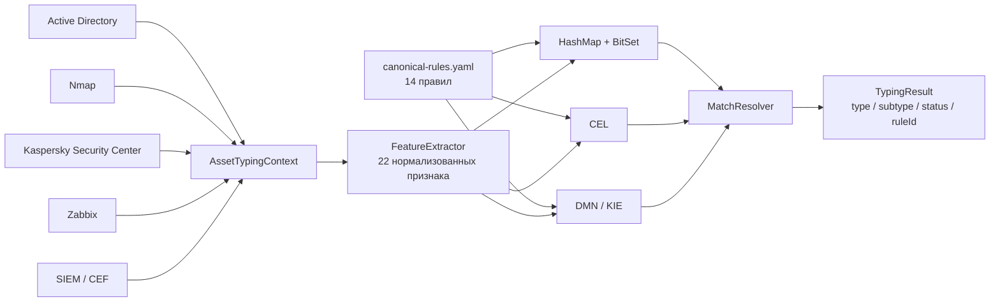
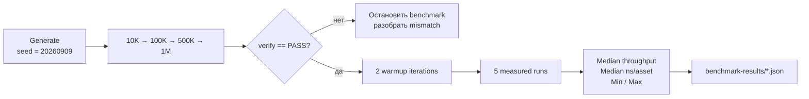

# ITAM Asset Typing Demo

Воспроизводимый эксперимент по автоматической типизации IT-активов и сравнению трёх способов исполнения **одной и той же логики классификации**:

1. **HashMap + BitSet** — собственный индексированный rule engine.
2. **CEL** — Common Expression Language с предварительной компиляцией выражений.
3. **DMN / Apache KIE** — Decision Model and Notation с исполняемой decision table.

> **Итог крупнейшего прогона, 1 000 000 активов:** все три движка дали идентичный результат без единого расхождения. Медианная производительность составила **294 569 активов/с** для HashMap+BitSet, **97 462 активов/с** для CEL и **40 773 активов/с** для DMN/KIE.

---

## Зачем нужен этот эксперимент

Задача автоматической типизации выглядит просто только до появления нескольких источников данных. Один и тот же объект может быть описан через признаки из Active Directory, Nmap, Kaspersky Security Center, Zabbix, SIEM и других систем. Из этих разнородных признаков необходимо детерминированно получить нормализованный результат, например:

- `DEVICE / SERVER`;
- `DEVICE / WORKSTATION`;
- `DEVICE / NETWORK_DEVICE`;
- `ACCOUNT / USER_ACCOUNT`;
- `ACCOUNT / SERVICE_ACCOUNT`;
- `SOFTWARE / SECURITY_SOFTWARE`;
- `SOFTWARE / APPLICATION_SOFTWARE`.

При этом одну и ту же бизнес-логику можно исполнять принципиально разными способами: написать специализированный высокопроизводительный классификатор, использовать expression engine или использовать стандартную decision table.

Без практического эксперимента невозможно корректно ответить на несколько вопросов одновременно:

- дают ли разные runtime-реализации **семантически одинаковый результат**;
- насколько различается время классификации одного актива;
- как меняется throughput при росте объёма с 10K до 1M записей;
- насколько велик фиксированный overhead загрузки и компиляции правил;
- где находится практический компромисс между специализированным runtime, декларативностью и стандартным rule engine.

### Цель

Поставить три подхода в максимально одинаковые условия и сравнить их не по субъективному впечатлению, а по двум проверяемым критериям:

1. **Correctness** — одинаково ли они классифицируют один и тот же набор активов по одному набору правил.
2. **Performance** — сколько времени требуется для выполнения этой классификации при росте объёма данных.

Эксперимент **не ставит целью заранее доказать превосходство конкретной технологии**. Его задача — получить воспроизводимые цифры и техническую основу для выбора способа реализации автоматической типизации.

---

## Что именно сравнивается

| Вариант | Модель исполнения | Подготовка правил | Runtime |
|---|---|---|---|
| **HashMap + BitSet** | индекс кандидатов + битовые маски признаков | правила преобразуются в `BitSet`, строится `feature -> candidate rules` | специализированный Java-код |
| **CEL** | вычисление скомпилированных выражений | каждое условие компилируется один раз, `Program` кэшируется | `dev.cel:cel:0.14.0` |
| **DMN / KIE** | DMN Decision Table с `COLLECT` | из canonical rules автоматически генерируется DMN-модель | Apache KIE DMN `10.2.0` |

Критически важно: это **не три разных набора бизнес-правил**. Все реализации получают правила из одного файла [`rules/canonical-rules.yaml`](rules/canonical-rules.yaml). В текущем ruleset — **14 правил**.

---

## Архитектура типизации



`AssetTypingContext` содержит:

- `assetId`;
- `sources`;
- `sourceObjectKinds`;
- `attributes`;
- `systemParameters`.

`FeatureExtractor` преобразует исходные атрибуты в фиксированный набор из **22 булевых признаков**: источник данных, тип исходного объекта, признаки ОС, server/workstation, service account, network device, security software и т. д.

Подробное описание реализации: [`docs/ARCHITECTURE.md`](docs/ARCHITECTURE.md).

---

## Единая семантика результата

После выполнения правил все три движка используют один `MatchResolver`:

1. удалить повторные совпадения одного `ruleId`;
2. оставить правила максимального `priority`;
3. разные типы на максимальном приоритете → `TYPE_CONFLICT`;
4. один тип, но разные подтипы → `SUBTYPE_CONFLICT`;
5. тип определён, подтип отсутствует → `AUTO_TYPE_ONLY`;
6. тип и подтип определены → `AUTO`;
7. совпадений нет → `NOT_CLASSIFIED`.

Таким образом, сравнивается именно **движок исполнения условий**, а не различающаяся логика разрешения конфликтов.

---

## Тестовые данные

Все данные **синтетические**. Реальные производственные данные, идентификаторы пользователей, адреса и секреты не используются.

Форматы и семантика полей приближены к типичным discovery/security-источникам:

| Источник | Используемый смысл данных |
|---|---|
| Active Directory | computer/user, ОС, учётная запись, service-account hints |
| Nmap | host, OS/device type, network-device hints |
| Kaspersky Security Center | host type, ОС, workstation/server, software inventory |
| Zabbix | host и inventory |
| SIEM / CEF | host/principal evidence |

Подробнее: [`data/SOURCES.md`](data/SOURCES.md).

### Профили генератора

Генератор использует фиксированный seed `20260909`, поэтому набор воспроизводим.

| Профиль | Доля |
|---|---:|
| Windows workstation | 26% |
| Windows server | 15% |
| Linux server | 13% |
| Network device | 11% |
| User account | 14% |
| Service account | 7% |
| Security software | 7% |
| Application software | 7% |

Каждая запись содержит также ожидаемые `type/subtype`, поэтому correctness проверяется не только сравнением движков между собой, но и относительно ground truth генератора.

---

## Протокол эксперимента



Для каждого размера выполняется:

1. детерминированная генерация набора;
2. `verify` для всех трёх движков;
3. benchmark запускается только после `PASS`;
4. 2 прогревочных итерации;
5. 5 измеряемых прогонов;
6. итогом считается медиана, дополнительно сохраняются min/max и каждый отдельный run.

Размер пакета:

- 10K → `batch=2000`;
- 100K → `batch=5000`;
- 500K → `batch=10000`;
- 1M → `batch=10000`.

Парсинг JSON не включается в timed section конкретного движка: один и тот же прочитанный batch последовательно передаётся всем трём реализациям. Результат каждого вызова участвует в checksum, чтобы JVM не могла устранить вычисление как неиспользуемое.

---

# Результаты эксперимента

## 1. Correctness

Все четыре контрольных размера успешно прошли differential verification.

| Набор | Проверено | Engine mismatches | Ground-truth mismatches | Hash BitSet = CEL = DMN | Результат |
|---:|---:|---:|---:|:---:|:---:|
| 10 000 | 10 000 | 0 | 0 | ✅ | **PASS** |
| 100 000 | 100 000 | 0 | 0 | ✅ | **PASS** |
| 500 000 | 500 000 | 0 | 0 | ✅ | **PASS** |
| 1 000 000 | 1 000 000 | 0 | 0 | ✅ | **PASS** |

На крупнейшем наборе из **1 000 000 записей**:

```text
engineMismatches      = 0
groundTruthMismatches = 0
hashBitset = hashCel = hashDmn
```

Это подтверждает эквивалентность трёх реализаций **в рамках текущего ruleset и тестового пространства генератора**.

Исходные отчёты:

- [`verify-10000.json`](benchmark-results/verify-10000.json)
- [`verify-100000.json`](benchmark-results/verify-100000.json)
- [`verify-500000.json`](benchmark-results/verify-500000.json)
- [`verify-1000000.json`](benchmark-results/verify-1000000.json)

---

## 2. Производительность

Производительность оценивается двумя взаимосвязанными показателями:

- **`assets/s`** — сколько активов движок способен классифицировать за одну секунду;
- **`ns/asset`** — сколько наносекунд в среднем занимает классификация одного актива.

`ns` означает **nanoseconds, наносекунды**. Одна наносекунда равна `10^-9` секунды. В таблицах ниже `ns/asset` — это не «стоимость» в денежном смысле, а **удельное время выполнения классификации одного актива**.

Оба показателя рассчитываются из одного и того же непосредственно измеренного времени выполнения:

```text
ns/asset = elapsedNs / numberOfAssets

assets/s = numberOfAssets × 1 000 000 000 / elapsedNs
```

То есть это два представления одного результата:

```text
меньше ns/asset = быстрее
больше assets/s = быстрее
```

### Почему используются оба показателя

`assets/s` показывает **пропускную способность**. Этот показатель удобен для практической оценки: какой объём активов алгоритм способен классифицировать за заданное время.

`ns/asset` показывает **удельное время одной классификации**. Он удобен для сравнения самих движков, потому что нормирует результат на один актив и позволяет видеть, во сколько раз одно выполнение правила тяжелее другого независимо от размера конкретного набора.

Например, для HashMap+BitSet на прогоне 1M медианное значение равно примерно `3 395 ns/asset`, то есть около `3.395 µs` на один актив. Для CEL это около `10.260 µs`, а для DMN/KIE — около `24.526 µs`.

### Пример расчёта

Если обработка `1 000 000` активов заняла `3 394 789 334 ns`, то:

```text
ns/asset =
3 394 789 334 / 1 000 000
≈ 3 394.79 ns/asset
```

а пропускная способность:

```text
assets/s =
1 000 000 × 1 000 000 000 / 3 394 789 334
≈ 294 569 assets/s
```

Полученные показатели математически взаимосвязаны и используются одновременно, чтобы показать результат и как **скорость потока**, и как **время одной операции**.

### Почему берётся медиана пяти прогонов

Один запуск JVM-бенчмарка может искажаться кратковременными факторами: планировщиком ОС, фоновой нагрузкой, JIT-компиляцией, сборкой мусора и состоянием CPU/cache.

Поэтому перед измерением выполняются **2 warm-up итерации**, после чего запускаются **5 measured runs**. В итоговую сравнительную таблицу берётся **медиана**, а не единичный или лучший результат.

Медиана менее чувствительна к случайному медленному или быстрому прогону и лучше отражает типичную производительность движка в данном тесте. Min/max при этом сохраняются в исходных JSON, чтобы разброс измерений оставался видимым.

> **Граница метрики:** `ns/asset` и `assets/s` в этом эксперименте отражают время **непосредственно классификации внутри rule engine**. В них не входят получение данных из AD/KSC/Zabbix/SIEM, сетевые задержки, чтение исходных систем, запись результата в БД и прочие этапы полного ITAM-конвейера. Это сделано специально, чтобы сравнивать именно три реализации алгоритма в одинаковых условиях.

### Медианная пропускная способность

| Размер | HashMap + BitSet | CEL | DMN / KIE | BitSet vs CEL | BitSet vs DMN |
|---:|---:|---:|---:|---:|---:|
| 10K | **277 940 assets/s** | 89 591 assets/s | 40 651 assets/s | **3.10×** | **6.84×** |
| 100K | **331 020 assets/s** | 103 507 assets/s | 44 008 assets/s | **3.20×** | **7.52×** |
| 500K | **298 634 assets/s** | 99 356 assets/s | 40 890 assets/s | **3.01×** | **7.30×** |
| 1M | **294 569 assets/s** | 97 462 assets/s | 40 773 assets/s | **3.02×** | **7.22×** |

### Время классификации одного актива

| Размер | HashMap + BitSet | CEL | DMN / KIE |
|---:|---:|---:|---:|
| 10K | **3 598 ns/asset** | 11 162 ns/asset | 24 600 ns/asset |
| 100K | **3 021 ns/asset** | 9 661 ns/asset | 22 723 ns/asset |
| 500K | **3 349 ns/asset** | 10 065 ns/asset | 24 456 ns/asset |
| 1M | **3 395 ns/asset** | 10 260 ns/asset | 24 526 ns/asset |

Для удобства те же значения на 1M можно представить в микросекундах:

| Движок | Время одного актива |
|---|---:|
| **HashMap + BitSet** | **≈ 3.395 µs** |
| CEL | ≈ 10.260 µs |
| DMN / KIE | ≈ 24.526 µs |

На 1M медианное чистое время классификации одного полного прохода эквивалентно примерно:

| Движок | Время на 1M |
|---|---:|
| **HashMap + BitSet** | **3.39 s** |
| CEL | 10.26 s |
| DMN / KIE | 24.53 s |

CEL на 1M примерно **2.39× быстрее DMN/KIE**, а HashMap+BitSet — примерно **3.02× быстрее CEL** и **7.22× быстрее DMN/KIE**.

Исходные benchmark-файлы:

- [`benchmark-10000.json`](benchmark-results/benchmark-10000.json)
- [`benchmark-100000.json`](benchmark-results/benchmark-100000.json)
- [`benchmark-500000.json`](benchmark-results/benchmark-500000.json)
- [`benchmark-1000000.json`](benchmark-results/benchmark-1000000.json)

---

## 3. Стабильность при масштабировании

После короткого 10K-прогона throughput стабилизируется и на 100K–1M остаётся в одном диапазоне:

- **HashMap + BitSet:** примерно 295K–331K assets/s;
- **CEL:** примерно 97K–104K assets/s;
- **DMN/KIE:** примерно 41K–44K assets/s.

На переходе 100K → 500K → 1M не наблюдается признаков алгоритмического обвала throughput. Это соответствует модели, в которой стоимость обработки растёт примерно линейно с количеством активов при фиксированном ruleset.

Важно: это вывод именно по измеренному диапазону и текущим 14 правилам, а не доказательство асимптотической сложности для произвольного числа правил.

---

## 4. Стоимость инициализации

Инициализация практически не зависит от размера набора данных и является фиксированным overhead перед обработкой:

| Компонент | Наблюдаемый диапазон |
|---|---:|
| **HashMap + BitSet** | **6.5–6.8 ms** |
| CEL | 297–304 ms |
| DMN / KIE | 376–391 ms |
| загрузка canonical ruleset | 79–87 ms |

Для долгоживущего фонового сервиса эта стоимость обычно амортизируется, но для коротких одноразовых запусков различие заметно.

---

## Интерпретация

### HashMap + BitSet

**Сильные стороны:**

- максимальный throughput во всех четырёх прогонах;
- минимальный startup overhead;
- предсказуемая стоимость исполнения;
- хорошо подходит для массовой фоновой типизации.

**Цена:** runtime наиболее специализирован и требует собственного кода исполнения/индексации.

### CEL

**Сильные стороны:**

- декларативные выражения;
- компиляция выполняется один раз, затем используется кэшированный `Program`;
- заметно быстрее DMN/KIE;
- производительность остаётся порядка 100K активов/с на измеренных объёмах.

**Цена:** примерно трёхкратное время классификации одного актива относительно BitSet в текущем эксперименте.

### DMN / KIE

**Сильные стороны:**

- стандарт DMN;
- правила можно представить в форме Decision Table;
- формализованная и переносимая модель решений;
- сгенерированную DMN-таблицу можно отдельно инспектировать.

**Цена:** самый высокий startup overhead и самое большое время классификации одного актива среди трёх измеренных вариантов.

---

## Вывод

Эксперимент показал две вещи одновременно:

1. **Семантическая эквивалентность достижима.** На наборах до 1M активов три разных runtime-подхода получили одинаковые результаты при нулевом числе расхождений.
2. **Время исполнения существенно различается.** При текущем ruleset специализированный HashMap+BitSet стабильно примерно в 3 раза быстрее CEL и более чем в 7 раз быстрее DMN/KIE.

Поэтому выбор реализации типизации нельзя сводить только к вопросу «какой формат правил удобнее». Необходимо отдельно учитывать:

- требуемый throughput;
- частоту и способ изменения правил;
- требования к формализованному представлению логики;
- допустимый runtime/startup overhead;
- необходимость внешнего стандарта decision model.

Для текущего экспериментального профиля **HashMap+BitSet является лидером по производительности**, **CEL — промежуточным вариантом**, а **DMN/KIE — наиболее тяжёлым, но стандартным decision-table runtime**.

---

## Ограничения эксперимента

Результаты необходимо интерпретировать в границах теста:

- данные синтетические;
- ruleset содержит 14 правил;
- генератор покрывает заданные профили активов, но не все возможные edge cases реальной инвентаризации;
- benchmark прикладной, а не JMH microbenchmark;
- порядок движков внутри measured run фиксирован;
- не измеряется полный end-to-end ITAM pipeline, включая ingestion, сетевой ввод-вывод, БД и сохранение результата;
- измеряется прежде всего время исполнения классификации на уже нормализованном контексте.

Если потребуется более строгая JVM-оценка, следующим этапом можно добавить JMH, fork-изоляцию, GC/allocation profiling и отдельное измерение scaling по количеству правил.

---

## Структура репозитория

```text
rules/canonical-rules.yaml          единый canonical ruleset
src/main/java/.../features/         нормализация признаков
src/main/java/.../engine/bitset/    HashMap + BitSet
src/main/java/.../engine/cel/       CEL
src/main/java/.../engine/dmn/       DMN / KIE
src/main/java/.../data/             генератор и reader
data/raw-samples/                    синтетические примеры источников
benchmark-results/                  реальные JSON-результаты эксперимента
docs/ARCHITECTURE.md                детали архитектуры
docs/TEST_PROTOCOL.md               протокол проверки
```

---

## Быстрый запуск

### Вариант 1 — сборка из исходников

Требуются Docker Desktop / Docker Engine и Git.

На Windows из PowerShell:

```powershell
.\scripts\run-quick-demo.ps1
```

### Вариант 2 — prebuilt Docker image

Если Docker Hub/Maven недоступны локально, можно использовать заранее собранный portable image. Инструкция: [`docs/PREBUILT_RUNTIME.md`](docs/PREBUILT_RUNTIME.md).

После загрузки образа команды `generate`, `verify`, `benchmark` и `export-dmn` выполняются без локальной сборки Java/Maven-проекта.

---

## Зависимости

Зафиксированы в [`pom.xml`](pom.xml):

- Java 21;
- `dev.cel:cel:0.14.0`;
- Apache KIE DMN `10.2.0`;
- Jackson YAML/JSON;
- JUnit 5.

Подробности: [`docs/DEPENDENCIES.md`](docs/DEPENDENCIES.md).
