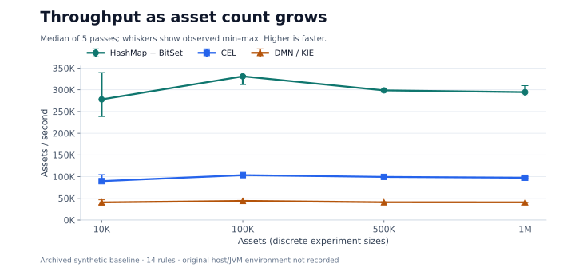
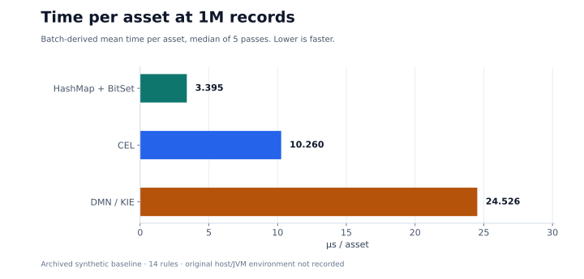
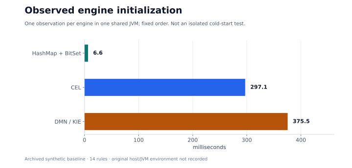
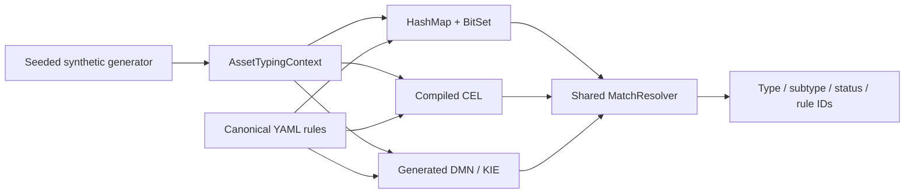

# ITAM Asset Typing Benchmark

[](https://github.com/GAbra/itam-asset-typing-benchmark/actions/workflows/ci.yml)
[](pom.xml)
[](LICENSE)
[](data/SOURCES.md)

**One ruleset. Three execution engines. A reproducible IT asset classification experiment.**

Compare **HashMap + BitSet**, **Common Expression Language (CEL)** and **DMN / Apache KIE** on the same normalized assets and classification rules. Explore the trade-off between a specialized Java classifier, compiled expressions and a standard decision table.

[Русская версия](README_RU.md) · [Methodology](docs/METHODOLOGY.md) · [Raw results](benchmark-results) · [Reproduce](docs/TEST_PROTOCOL.md) · [Contribute](CONTRIBUTING.md)

## Why this experiment exists

Automatic asset typing becomes difficult when several discovery systems describe the same object differently. AD might report a computer and its OS, Nmap a network device signature, and an inventory tool a workstation/server flag. Evidence can be incomplete or contradictory. A classifier must turn that evidence into a deterministic type/subtype while handling priorities, missing evidence and conflicts consistently.

The implementation choice also matters. A specialized indexed Java engine offers direct control over execution; CEL expresses conditions as compiled expressions; DMN expresses decisions in a standard table. Comparing them requires the same inputs, rules and output semantics. Otherwise a speed difference could simply reflect different classification behavior.

This experiment asks: do the three adapters agree with one another and the synthetic labels; how much classification work can each perform; how does throughput change from 10K to 1M assets; and how much initialization does each require? The results inform the engineering trade-off between runtime cost and how rules are represented. They do not evaluate production ingestion quality or all possible implementations of these technologies.

## Results at a glance

The archived 1M-asset experiment reports **zero engine disagreements and zero generator-label mismatches** with 14 fixed rules. These are observations on synthetic data, not a proof of general equivalence or a production capacity estimate.

| Engine | Median assets/s | Mean time per asset, median run | Observed initialization |
|:--|--:|--:|--:|
| HashMap + BitSet | **294,569** | **3.395 µs** | 6.6 ms |
| CEL | 97,462 | 10.260 µs | 297.1 ms |
| DMN / KIE | 40,773 | 24.526 µs | 375.5 ms |

Source: [benchmark-1000000.json](benchmark-results/benchmark-1000000.json), [verify-1000000.json](benchmark-results/verify-1000000.json). Five measured passes; two warmups over the first 5,000 records. Initialization is a single observation per engine in one JVM, not an isolated cold-start benchmark. **The original host/JVM environment was not recorded**, so absolute performance comparisons with other machines are limited.



<details>
<summary>Per-asset time and initialization figures</summary>





Figures are generated directly from committed reports by [scripts/render-results.py](scripts/render-results.py). Throughput and time per asset are reciprocal views of the same measurement.

</details>

## What is being classified?

An asset combines evidence shaped like Active Directory, Nmap, Kaspersky Security Center, Zabbix and SIEM records. The output is a normalized type/subtype, for example `DEVICE / SERVER`, `ACCOUNT / SERVICE_ACCOUNT` or `SOFTWARE / SECURITY_SOFTWARE`.



Each engine extracts the same 22 boolean features inside its `classify` call. All three use the same [canonical rules](rules/canonical-rules.yaml) and [conflict resolver](src/main/java/ru/itam/typing/engine/common/MatchResolver.java). Both BitSet and CEL have candidate indexes; DMN uses a generated `COLLECT` decision table. This compares these adapters as implemented, not every possible implementation of the technologies.

The raw source samples illustrate formats. The benchmark consumes generated, normalized JSONL; it does not connect to those products or parse their raw exports. See [architecture](docs/ARCHITECTURE.md) and [data provenance](data/SOURCES.md).

## Versioned distribution

[Release v1.0.0](https://github.com/GAbra/itam-asset-typing-benchmark/releases/tag/v1.0.0) provides the JAR, portable Docker tar and SHA-256 checksums without Actions artifact expiration. The container is `ghcr.io/gabra/itam-asset-typing-benchmark:v1.0.0`; `latest` is a moving alias. See [runtime instructions](docs/PREBUILT_RUNTIME.md).

## Quick start

### Docker (no local JDK or Maven required)

Install Docker with Compose and use Linux containers:

```sh
git clone https://github.com/GAbra/itam-asset-typing-benchmark.git
cd itam-asset-typing-benchmark
sh run-quick-demo.sh
```

Windows PowerShell, from the repository directory:

```powershell
.\run-quick-demo.ps1
```

The scripts build and test, generate 10,000 assets, verify all three engines, benchmark only after verification succeeds, and export the DMN model. Reports go to ignored `results/local/`; committed research results remain intact. The `run-quick-demo` filenames remain as compatibility entry points.

If registry access is unavailable, use the [CI-built portable runtime](docs/PREBUILT_RUNTIME.md). Runtime-only execution does not run the source test suite.

### Local Java 21 + Maven 3.9+

```sh
mvn -B clean verify
java -jar target/itam-asset-typing-benchmark-1.0.0.jar generate --count 10000 --seed 20260909
java -jar target/itam-asset-typing-benchmark-1.0.0.jar verify --data data/generated/normalized-10000.jsonl --out results/local/verify-10000.json
```

After `verify` reports `PASS` and exits successfully:

```sh
java -jar target/itam-asset-typing-benchmark-1.0.0.jar benchmark --data data/generated/normalized-10000.jsonl --warmup 2 --runs 5 --batch 2000 --out results/local/benchmark-10000.json
```

`benchmark` alone measures execution; it does not run the correctness gate. Use the supplied scripts for an enforced sequence. See [the protocol](docs/TEST_PROTOCOL.md) for 100K–1M runs and environment capture.

## Correctness evidence

| Assets | Engine mismatches | Generator-label mismatches | Result |
|--:|--:|--:|:--|
| 10,000 | 0 | 0 | [PASS](benchmark-results/verify-10000.json) |
| 100,000 | 0 | 0 | [PASS](benchmark-results/verify-100000.json) |
| 500,000 | 0 | 0 | [PASS](benchmark-results/verify-500000.json) |
| 1,000,000 | 0 | 0 | [PASS](benchmark-results/verify-1000000.json) |

Verification compares type, subtype, status and sorted winning rule IDs; SHA-256 digests also include asset IDs. Generator labels check type/subtype separately. Shared feature extraction and resolution can produce shared bugs, and generator labels are not independent real-world annotations. Targeted integration tests exercise conflict, fallback, forbidden-feature and disabled-rule cases outside the normal generator profiles.

CI checks source tests, deterministic generation across separate JVMs, 10K verification, report/figure consistency and the portable Docker runtime. **Throughput is never a CI pass/fail threshold.**

## How performance is calculated

For each engine and measured pass:

```text
assets/s = count × 1,000,000,000 / elapsedNs
ns/asset = elapsedNs / count
```

`ns` means nanoseconds (one billionth of a second). `assets/s` describes throughput: higher is faster. `ns/asset` describes average processing time per asset: lower is faster. They are reciprocal views of the same elapsed time, not independent evidence. For example, 1M assets in 3,394,789,334 ns corresponds to about 294,569 assets/s and 3,395 ns/asset (3.395 µs).

We report the median of five measured passes after two prefix warmups to reduce the influence of an unusually fast or slow pass. Min/max retain the observed spread; a median does not eliminate JIT, GC or scheduling effects. These are batch-derived averages, not per-request latency percentiles.

The timed section includes feature extraction, rule evaluation, shared resolution and checksum calculation. JSON parsing and file I/O are outside the timer, as is engine initialization. Consequently, these figures do not measure a full ingestion-to-database ITAM pipeline.

## Measurement scope and limitations

- Timed work includes feature extraction, rule evaluation, result resolution and checksum calculation. JSON parsing, file I/O and engine initialization are outside those timed sections.
- Each batch is processed sequentially in fixed order: BitSet → CEL → DMN. The engines share a JVM, JIT, GC and caches. There are no independent JVM forks or confidence intervals.
- Warmup repeats a prefix of `min(batch, 5000, max)` records, not the full dataset. Five passes do not establish that all JIT effects have disappeared.
- Only asset count scales. The ruleset stays at 14 rules; rule-count scaling, contention and production data are unmeasured.
- The committed reports are an archived baseline. New runs add runtime metadata, input hashes and explicit warmup size; missing historical environment information is left unknown.

Read the [full methodology and environment table](docs/METHODOLOGY.md) before interpreting speed ratios. This is a functional, batched JVM benchmark; a JMH microbenchmark is future work.

## Research roadmap

- [x] Canonical rules and three real execution engines
- [x] Seeded synthetic data, differential verification and 10K → 1M baseline
- [x] Docker workflows, CI correctness gate and generated figures
- [x] Input fingerprints and runtime metadata for new measurements
- [ ] Independent JVM forks / JMH, allocation and GC profiling
- [ ] Rule-count scaling: 14 → 100 → 1,000 at fixed asset count
- [ ] Conflict-heavy, missing-evidence and noisy-data workloads
- [ ] Incremental typing and multi-threaded throughput
- [ ] Fully documented repeat measurements on additional machines

## Contributing and citation

Bug reports, reproductions and carefully scoped experiments are welcome. Follow [CONTRIBUTING.md](CONTRIBUTING.md); keep source data synthetic and include raw reports when making performance claims. Use [CITATION.cff](CITATION.cff) or GitHub's **Cite this repository** action, and record the commit used for your experiment.

[MIT licensed](LICENSE). Third-party libraries retain their own licenses; see [dependencies](docs/DEPENDENCIES.md).
