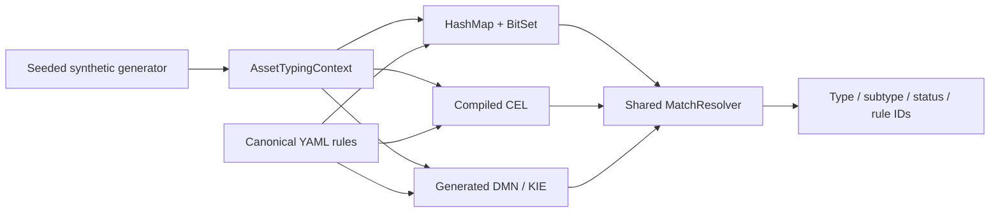

# ITAM Asset Typing Benchmark

[](https://github.com/GAbra/itam-asset-typing-benchmark/actions/workflows/ci.yml)
[](pom.xml)
[](LICENSE)
[](data/SOURCES.md)

**English** · [Русский](README_RU.md)

**One ruleset. Three execution engines. A reproducible IT asset classification experiment.**

Compare **HashMap + BitSet**, **Common Expression Language (CEL)** and **DMN / Apache KIE** on the same normalized assets and classification rules. Explore the trade-off between a specialized Java classifier, compiled expressions and a standard decision table.

[Methodology](docs/METHODOLOGY.md) · [Results](benchmark-results/README.md) · [Reproduce](docs/TEST_PROTOCOL.md) · [Architecture](docs/ARCHITECTURE.md) · [Contribute](CONTRIBUTING.md)

## Why this experiment exists

Automatic asset typing becomes difficult when several discovery systems describe the same object differently. AD might report a computer and its OS, Nmap a network-device signature, and an inventory tool a workstation/server flag. Evidence can be incomplete or contradictory. A classifier must turn that evidence into a deterministic type/subtype while handling priorities, missing evidence and conflicts consistently.

The implementation choice also matters. A specialized indexed Java engine offers direct control over execution; CEL expresses conditions as compiled expressions; DMN expresses decisions in a standard table. Comparing them requires the same inputs, rules and output semantics. Otherwise a speed difference could simply reflect different classification behavior.

This experiment asks whether the three adapters agree with one another and the synthetic labels, how much classification work each performs per unit of time, how throughput behaves as dataset size grows, and what initialization cost each adapter has. The results inform an engineering trade-off between runtime cost and rule representation. They do not evaluate production ingestion quality or every possible implementation of these technologies.

## Controlled baseline v2 — primary result

The current reference measurement is `benchmark-results/baseline-v2/`. It was created specifically to fix the provenance gap of the original experiment: the executable image, JAR checksum, host/container limits, JVM settings, seed, rule hash and input hashes are recorded.

All three controlled verification runs passed with **0 engine mismatches** and **0 generator-label mismatches**.

| Assets | HashMap + BitSet | CEL | DMN / KIE |
|--:|--:|--:|--:|
| 100,000 | **337,868 assets/s** | 102,782 | 48,071 |
| 500,000 | **338,754 assets/s** | 102,850 | 49,285 |
| 1,000,000 | **334,237 assets/s** | 104,800 | 49,150 |

At 1M assets the median per-asset times are **2.992 µs** for HashMap + BitSet, **9.542 µs** for CEL and **20.346 µs** for DMN / KIE. On this workload, BitSet uses about 3.19× less processing time than CEL and about 6.80× less than DMN; CEL uses about 2.13× less than DMN. These are measurements of these concrete adapters, not universal technology rankings.

### Controlled environment

| Parameter | Baseline v2 |
|:--|:--|
| Host CPU | AMD Ryzen 9 7950X, 16 cores / 32 threads |
| Host RAM | ~32 GiB physical |
| Host / virtualization | Windows 11 Pro, Docker Desktop 4.40.0, WSL2 |
| Container limit | 4 CPU, 4 GiB RAM, no additional swap |
| Java | Eclipse Adoptium 21.0.12 |
| JVM | `-Xms2g -Xmx2g -XX:+UseG1GC -XX:ActiveProcessorCount=4` |
| Seed | `20260909` |
| Rules | version `1.0.0`, 14 enabled rules |
| Warmup / measured passes | 2 / 5 |
| Engine order | HashMap + BitSet → CEL → DMN / KIE |
| Container image | pinned by SHA-256 image ID |
| JAR | pinned by SHA-256 |

The exact values, commands and checksums are committed in [baseline-v2](benchmark-results/baseline-v2/). Background host workload was not fully controlled, fixed engine order remains a limitation, and the benchmark is not JMH.

## Archived original experiment

The original 10K / 100K / 500K / 1M reports remain unchanged in `benchmark-results/*.json`. They established the first functional and performance baseline, but the original CPU, exact JVM, container limits and binary provenance were not recorded. For that reason their absolute speeds are retained as historical observations rather than the primary reproducible result.

<details>
<summary>Archived 1M headline and figures</summary>

| Engine | Median assets/s | Median time per asset |
|:--|--:|--:|
| HashMap + BitSet | 294,569 | 3.395 µs |
| CEL | 97,462 | 10.260 µs |
| DMN / KIE | 40,773 | 24.526 µs |


The figures are generated from the archived reports by [scripts/render-results.py](scripts/render-results.py). Do not interpret differences between the archived baseline and baseline v2 as code speedups: the old measurement environment is unknown.

</details>

## What is being classified?

An asset combines evidence shaped like Active Directory, Nmap, Kaspersky Security Center, Zabbix and SIEM records. The output is a normalized type/subtype, for example `DEVICE / SERVER`, `ACCOUNT / SERVICE_ACCOUNT` or `SOFTWARE / SECURITY_SOFTWARE`.



Each engine extracts the same 22 boolean features inside its `classify` call. All three use the same [canonical rules](rules/canonical-rules.yaml) and [conflict resolver](src/main/java/ru/itam/typing/engine/common/MatchResolver.java). Both BitSet and CEL have candidate indexes; DMN uses a generated `COLLECT` decision table. This compares these adapters as implemented, not every possible implementation of the technologies.

The raw source samples illustrate formats. The benchmark consumes generated, normalized JSONL; it does not connect to those products or parse their raw exports. See [architecture](docs/ARCHITECTURE.md) and [data provenance](data/SOURCES.md).

## Release status

The Maven project version is `1.0.0`, and CI contains the workflow that will publish a versioned GitHub Release and GHCR image when tag `v1.0.0` is created. Until that tag/release exists, use a successful main-branch CI artifact or build locally. See [portable runtime instructions](docs/PREBUILT_RUNTIME.md).

## Quick start

### Docker

Install Docker with Compose and use Linux containers:

```sh
git clone https://github.com/GAbra/itam-asset-typing-benchmark.git
cd itam-asset-typing-benchmark
sh run-quick-demo.sh
```

Windows PowerShell, from the repository directory:

```powershell
.\run-quick-demo.ps1
```

The scripts build and test, generate 10,000 assets, verify all three engines, benchmark only after verification succeeds, and export the DMN model. Reports go to ignored `results/local/`; committed research results remain intact.

If registry access is unavailable, use the [CI-built portable runtime](docs/PREBUILT_RUNTIME.md). Runtime-only execution does not run the source test suite.

### Local Java 21 + Maven 3.9+

```sh
mvn -B clean verify
java -jar target/itam-asset-typing-benchmark-1.0.0.jar generate --count 10000 --seed 20260909
java -jar target/itam-asset-typing-benchmark-1.0.0.jar verify --data data/generated/normalized-10000.jsonl --out results/local/verify-10000.json
```

After `verify` reports `PASS`:

```sh
java -jar target/itam-asset-typing-benchmark-1.0.0.jar benchmark --data data/generated/normalized-10000.jsonl --warmup 2 --runs 5 --batch 2000 --out results/local/benchmark-10000.json
```

`benchmark` alone measures execution; it does not run the correctness gate. See [the protocol](docs/TEST_PROTOCOL.md) for controlled 100K–1M runs and environment capture.

## Correctness evidence

### Controlled baseline v2

| Assets | Engine mismatches | Generator-label mismatches | Result |
|--:|--:|--:|:--|
| 100,000 | 0 | 0 | [PASS](benchmark-results/baseline-v2/verify-100000.json) |
| 500,000 | 0 | 0 | [PASS](benchmark-results/baseline-v2/verify-500000.json) |
| 1,000,000 | 0 | 0 | [PASS](benchmark-results/baseline-v2/verify-1000000.json) |

The archived 10K / 100K / 500K / 1M verification reports also contain zero mismatches and remain available in the repository root of `benchmark-results/`.

Verification compares type, subtype, status and sorted winning rule IDs; SHA-256 digests also include asset IDs. Generator labels check type/subtype separately. Shared feature extraction and resolution can produce shared bugs, and generator labels are not independent real-world annotations. Targeted integration tests exercise conflict, fallback, forbidden-feature and disabled-rule cases outside the normal generator profiles.

CI checks source tests, deterministic generation across separate JVMs, 10K verification, report/figure consistency and the portable Docker runtime. **Throughput is never a CI pass/fail threshold.**

## How performance is calculated

For each engine and measured pass:

```text
assets/s = count × 1,000,000,000 / elapsedNs
ns/asset = elapsedNs / count
```

`ns` means nanoseconds, one billionth of a second. `assets/s` describes throughput: higher is faster. `ns/asset` describes average processing time per asset: lower is faster. They are reciprocal views of the same elapsed time.

For example, the median 1M BitSet pass in baseline v2 took 2,991,889,882 ns: about 334,237 assets/s and 2,991.89 ns/asset, or 2.992 µs/asset.

We report the median of five measured passes after two prefix warmups to reduce the influence of an unusually fast or slow pass. Min/max retain the observed spread; a median does not eliminate JIT, GC or scheduling effects. These are batch-derived averages, not per-request latency percentiles.

The timed section includes feature extraction, rule evaluation, shared resolution and checksum calculation. JSON parsing and file I/O are outside the timer, as is engine initialization. Consequently, these figures do not measure a full ingestion-to-database ITAM pipeline.

## Measurement scope and limitations

- Each batch is processed sequentially in fixed order: BitSet → CEL → DMN. The engines share a JVM, JIT, GC and caches.
- Warmup repeats a prefix of `min(batch, 5000, max)` records, not the full dataset.
- Five passes in one JVM do not provide confidence intervals or independent-process variance.
- Only asset count scales. The ruleset stays at 14 rules; rule-count scaling, contention and production data are unmeasured.
- Baseline v2 fixes executable/environment provenance for the documented run, but background host load was not fully controlled.
- Archived and controlled baselines must not be merged into one performance curve or interpreted as before/after optimization results.

Read the [full methodology](docs/METHODOLOGY.md) before interpreting speed ratios.

## Research roadmap

- [x] Canonical rules and three real execution engines
- [x] Seeded synthetic data and differential verification
- [x] Archived 10K → 1M experiment retained unchanged
- [x] Controlled baseline v2 with pinned runtime/provenance through 1M assets
- [x] Docker workflows, CI correctness gate and generated archived figures
- [ ] Independent JVM forks / JMH, allocation and GC profiling
- [ ] Rule-count scaling: 14 → 100 → 1,000 at fixed asset count
- [ ] Conflict-heavy, missing-evidence and noisy-data workloads
- [ ] Incremental typing and multi-threaded throughput
- [ ] Repeat controlled measurements on additional machines

## Contributing and citation

Bug reports, reproductions and carefully scoped experiments are welcome. Follow [CONTRIBUTING.md](CONTRIBUTING.md); keep source data synthetic and include raw reports when making performance claims. Use [CITATION.cff](CITATION.cff) or GitHub's **Cite this repository** action, and record the commit used for your experiment.

[MIT licensed](LICENSE). Third-party libraries retain their own licenses; see [dependencies](docs/DEPENDENCIES.md).
