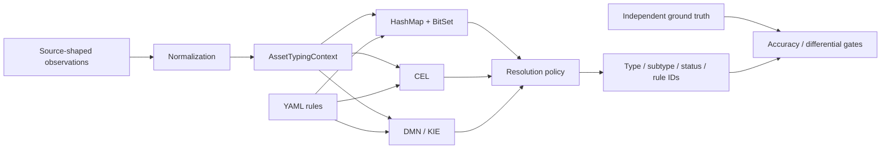

# ITAM Asset Typing Benchmark

[](https://github.com/GAbra/itam-asset-typing-benchmark/actions/workflows/ci.yml)
[](pom.xml)
[](LICENSE)
[](data/SOURCES.md)

**English** · [Русский](README_RU.md)

**One classification semantics. Three execution engines. Reproducible ITAM experiments from clean baselines to noisy multi-source workloads.**

The project compares a custom indexed **HashMap + BitSet** evaluator, **CEL Java** and **DMN / Apache KIE** on the same normalized assets and rule semantics. The research track also evaluates missing/conflicting evidence, conservative abstention and a broader software taxonomy relevant to RU-oriented enterprise environments.

[Final research summary](docs/RESEARCH_SUMMARY.md) · [Methodology](docs/METHODOLOGY.md) · [Baseline results](benchmark-results/README.md) · [Experiment protocol v2](docs/EXPERIMENT_PROTOCOL_V2.md) · [Real-world validation](docs/REAL_WORLD_VALIDATION_PROTOCOL.md) · [Architecture](docs/ARCHITECTURE.md)

## Project status

There are two intentionally different layers in this repository:

1. **Controlled baseline v2** — the stable performance/correctness baseline using the original 14-rule canonical semantics.
2. **Realistic Workload v2** — the completed research track with source-shaped observations, independent ground truth, noise/conflict scenarios, rule-count scaling, JMH cross-checks, a calibrated conflict policy and Software Taxonomy v3.

Release **`v2.0.0`** freezes the completed synthetic stage before any classifier results are inspected on real data. The current rulesets, taxonomy, normalization, resolver semantics and `conflictPriorityWindow=80` are treated as the frozen baseline. The next meaningful step is validation on an independently labelled real or appropriately anonymized production-like corpus under the preregistered protocol.

The project does **not** claim production accuracy from synthetic results.

## Headline findings

### Controlled baseline v2

All three controlled verification runs passed with **0 engine mismatches** and **0 generator-label mismatches**.

| Assets | HashMap + BitSet | CEL | DMN / KIE |
|--:|--:|--:|--:|
| 100,000 | **337,868 assets/s** | 102,782 | 48,071 |
| 500,000 | **338,754 assets/s** | 102,850 | 49,285 |
| 1,000,000 | **334,237 assets/s** | 104,800 | 49,150 |

At 1M assets the median per-asset times are **2.992 µs** for HashMap + BitSet, **9.542 µs** for CEL and **20.346 µs** for DMN / KIE. These are measurements of the concrete adapters in this repository, not universal technology rankings.

### Realistic workload performance

The full research experiment used 1,000,000 assets and preserved zero engine divergences. At 14 rules, END_TO_END throughput was approximately:

| Engine | Assets/s | ns/asset |
|:--|--:|--:|
| HashMap + BitSet | **325,376** | 3,073 |
| CEL | 115,012 | 8,695 |
| DMN / KIE | 48,938 | 20,434 |

The ranking remained consistent when the controlled ruleset was scaled to 50, 100 and 500 rules. The research track also contains ENGINE_ONLY measurements and a JMH cross-check.

### Conservative conflict handling

The research track adds a conservative resolver policy for cases where strong contradictory rules are close in priority. There are **no per-source weights**. The only additional control is the conflict-priority window.

A frozen sweep over `20, 40, 60, 80, 100, 120` selected:

```text
conflictPriorityWindow = 80
```

The value was then confirmed on a fresh seed. In that confirmation run, wrong confident FULL AUTO decisions were reduced by about **68–71%** across light/moderate/stress/severe noise while clean output remained unchanged. See [the final research summary](docs/RESEARCH_SUMMARY.md) and [calibration protocol](docs/CONFLICT_WINDOW_CALIBRATION.md).

### Software Taxonomy v3

The original binary software split was intentionally replaced in the research track by a 16-subtype taxonomy covering operating systems, office/business software, browsers, IDEs, database tools/servers, design/modeling, security/crypto, runtimes, developer tools, utilities, communications, components/agents and other applications.

The checked-in catalog contains **74 representative products/families** for coverage of RU-oriented enterprise scenarios. It mixes Russian and international software and is explicitly **not** a market-share model.

The final confirmation run (`seed=20260918`, `SOFTWARE_COUNT=200000`, conflict window `80`) passed all frozen gates:

| Scenario | Exact subtype accuracy | FULL AUTO coverage | FULL AUTO error rate | COMPONENT_AGENT accuracy |
|:--|--:|--:|--:|--:|
| Clean | 100.00% | 100.00% | 0.00% | 100.00% |
| Light | 99.62% | 99.62% | 0.00% | 99.88% |
| Stress | 97.94% | 97.94% | 0.00% | 98.38% |
| Severe | 92.44% | 92.44% | 0.00% | 93.13% |

These percentages describe the deterministic synthetic holdout, not real production accuracy. See [Software Taxonomy v3](docs/SOFTWARE_TAXONOMY_V3.md).

## What is being classified?

The benchmark/research workloads use evidence shaped like Active Directory, Nmap, Kaspersky Security Center, Zabbix and SIEM records. Outputs include normalized asset type, subtype, typing status and matched rule IDs.

Examples include:

- `DEVICE / SERVER`
- `DEVICE / WORKSTATION`
- `ACCOUNT / USER_ACCOUNT`
- `ACCOUNT / SERVICE_ACCOUNT`
- `SOFTWARE / OPERATING_SYSTEM`
- `SOFTWARE / DATABASE_TOOL`
- `SOFTWARE / SECURITY_SOFTWARE`
- `SOFTWARE / COMPONENT_AGENT`



The engines use the same normalized evidence and decision semantics. The custom BitSet and CEL adapters use application-level candidate indexing; DMN uses a generated decision table. The research track adds an independent linear reference evaluator to reduce the risk of shared implementation mistakes.

## Why the experiment exists

Automatic asset typing becomes difficult when discovery sources disagree. AD may identify a computer and OS, KSC may label it as workstation/server, Nmap may observe a network-device signature, and SIEM/Zabbix may contribute only partial context. Software inventory has similar ambiguity: a vendor name alone is often insufficient to distinguish a main product from an agent, runtime or component.

The project therefore separates several questions:

- do the engines implement the same decision semantics?
- how much runtime cost does each adapter add?
- what happens when evidence is missing or contradictory?
- when should the system abstain from a subtype instead of returning a confident but risky AUTO?
- can software be typed using multiple inventory attributes instead of fragile single-string matching?

## Quick start

### Docker

Install Docker with Linux containers:

```sh
git clone https://github.com/GAbra/itam-asset-typing-benchmark.git
cd itam-asset-typing-benchmark
sh run-quick-demo.sh
```

Windows PowerShell:

```powershell
.\run-quick-demo.ps1
```

The quick demo builds/tests the project, generates 10,000 synthetic assets, verifies engine equivalence and benchmarks only after verification succeeds.

### Local Java 21 + Maven 3.9+

```sh
mvn -B clean verify
java -jar target/itam-asset-typing-benchmark-2.0.0.jar generate --count 10000 --seed 20260909
java -jar target/itam-asset-typing-benchmark-2.0.0.jar verify \
  --data data/generated/normalized-10000.jsonl \
  --out results/local/verify-10000.json
```

After verification succeeds:

```sh
java -jar target/itam-asset-typing-benchmark-2.0.0.jar benchmark \
  --data data/generated/normalized-10000.jsonl \
  --warmup 2 --runs 5 --batch 2000 \
  --out results/local/benchmark-10000.json
```

For Realistic Workload v2 reproduction, use [Experiment Protocol v2](docs/EXPERIMENT_PROTOCOL_V2.md). Before using a real corpus, follow the [Real-world Validation Protocol](docs/REAL_WORLD_VALIDATION_PROTOCOL.md). Also see [Conflict-window calibration](docs/CONFLICT_WINDOW_CALIBRATION.md), [Robustness v2](docs/ROBUSTNESS_V2.md) and [Software Taxonomy v3](docs/SOFTWARE_TAXONOMY_V3.md).

## Controlled environment for baseline v2

| Parameter | Baseline v2 |
|:--|:--|
| Host CPU | AMD Ryzen 9 7950X, 16 cores / 32 threads |
| Host RAM | ~32 GiB physical |
| Host / virtualization | Windows 11 Pro, Docker Desktop 4.40.0, WSL2 |
| Container limit | 4 CPU, 4 GiB RAM, no additional swap |
| Java | Eclipse Adoptium 21 |
| JVM | `-Xms2g -Xmx2g -XX:+UseG1GC -XX:ActiveProcessorCount=4` |
| Seed | `20260909` |
| Rules | version `1.0.0`, 14 enabled rules |
| Warmup / measured passes | 2 / 5 |

Exact commands, hashes and provenance are committed under `benchmark-results/baseline-v2/`.

## Correctness and reproducibility

The baseline verifier compares type, subtype, status and sorted winning rule IDs. The research track additionally uses independently stored ground truth, deterministic holdout selection, source-shape checks, an independent reference evaluator, noise scenarios, SHA-256 manifests and frozen acceptance criteria.

Throughput is **not** used as a CI pass/fail threshold. Correctness and artifact-structure gates are kept separate from performance observations.

Committed experiment outputs intentionally keep compact JSON/provenance reports while large generated corpora and logs remain ignored.

## Scope and limitations

- All committed workloads are synthetic.
- Product/catalog coverage does not imply market share or prevalence.
- Production ingestion connectors are not benchmarked end to end.
- Baseline and research performance results are machine/environment-specific.
- The conflict window `80` is calibrated for the controlled research workload; if external validation justifies recalibration, that becomes a new version rather than a retroactive change to `v2.0.0`.
- A synthetic PASS proves reproducibility and behavior under the defined scenarios, not real-world production accuracy.
- The project types already-correlated assets; cross-source entity resolution is outside the current classifier.

## Research roadmap

- [x] Three real execution engines with shared semantics
- [x] Seeded baseline and differential verification
- [x] Controlled baseline v2 through 1M assets
- [x] Source-shaped realistic workload with independent ground truth
- [x] Missing/stale/conflicting evidence scenarios
- [x] Rule-count scaling 14 / 50 / 100 / 500
- [x] END_TO_END + ENGINE_ONLY measurements and JMH cross-check
- [x] Conflict-window calibration and fresh-seed confirmation (`80`)
- [x] Conservative robustness confirmation
- [x] RU-oriented Software Taxonomy v3 and independent confirmation
- [x] Preregistered external-validation protocol before real-world model results
- [ ] Independently labelled real or appropriately anonymized production-like corpus
- [ ] External-machine replication / production-oriented capacity testing

## Documentation

- [Final research summary](docs/RESEARCH_SUMMARY.md)
- [Architecture](docs/ARCHITECTURE.md)
- [Methodology](docs/METHODOLOGY.md)
- [Experiment Protocol v2](docs/EXPERIMENT_PROTOCOL_V2.md)
- [Real-world Validation Protocol](docs/REAL_WORLD_VALIDATION_PROTOCOL.md)
- [Conflict-window calibration](docs/CONFLICT_WINDOW_CALIBRATION.md)
- [Software Taxonomy v3](docs/SOFTWARE_TAXONOMY_V3.md)
- [Data provenance](data/SOURCES.md)
- [Engine implementation notes](docs/ENGINE_IMPLEMENTATION.md)

## Contributing and citation

Bug reports and carefully scoped reproductions are welcome. Keep source data synthetic unless you have explicit rights to share it, and preserve provenance when making performance or accuracy claims. Use [CITATION.cff](CITATION.cff) or GitHub's **Cite this repository** action and record the release and exact commit used.

[MIT licensed](LICENSE). Third-party libraries retain their own licenses; see [dependencies](docs/DEPENDENCIES.md).
