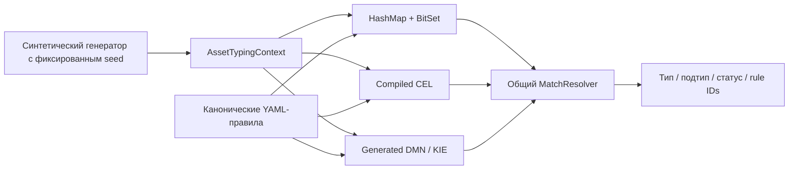

# ITAM Asset Typing Benchmark

[](https://github.com/GAbra/itam-asset-typing-benchmark/actions/workflows/ci.yml)
[](pom.xml)
[](LICENSE)
[](data/SOURCES_RU.md)

[English](README.md) · **Русский**

**Один набор правил. Три движка. Воспроизводимый эксперимент по типизации IT-активов.**

Сравниваются **HashMap + BitSet**, **Common Expression Language (CEL)** и **DMN / Apache KIE** на одних и тех же нормализованных активах и правилах классификации. Цель — увидеть инженерный компромисс между специализированным Java-классификатором, компилируемыми выражениями и стандартной таблицей решений.

[Методика](docs/METHODOLOGY_RU.md) · [Результаты](benchmark-results/README_RU.md) · [Воспроизведение](docs/TEST_PROTOCOL_RU.md) · [Архитектура](docs/ARCHITECTURE_RU.md) · [Участие](CONTRIBUTING_RU.md)

## Зачем нужен этот эксперимент

Автоматическая типизация усложняется, когда несколько систем обнаружения описывают один объект по-разному. AD может сообщать класс объекта и ОС, Nmap — сетевые признаки, инвентаризация — признак сервера или рабочей станции. Часть данных бывает неполной, часть — противоречивой. Классификатор должен детерминированно получить тип и подтип, одинаково обрабатывая приоритеты, отсутствующие признаки и конфликты.

Способ исполнения правил тоже важен. Специализированный индексированный Java-движок даёт прямой контроль над исполнением; CEL описывает условия как компилируемые выражения; DMN — как стандартную таблицу решений. Чтобы сравнение было содержательным, входные данные, правила и семантика результата должны совпадать. Иначе разница в скорости могла бы быть следствием того, что движки фактически решают разные задачи.

Эксперимент отвечает на несколько вопросов: совпадают ли результаты трёх реализаций между собой и с синтетическими метками; сколько классификаций каждый подход выполняет за единицу времени; как ведёт себя пропускная способность при росте набора данных; каковы затраты инициализации. Результат нужен для инженерного выбора между стоимостью исполнения и формой представления правил. Качество production-интеграций и все возможные реализации технологий здесь не оцениваются.

## Контролируемый baseline v2 — основной результат

Текущий эталонный замер хранится в `benchmark-results/baseline-v2/`. Он появился специально для устранения недостатка исходного эксперимента: теперь зафиксированы исполняемый Docker-образ, SHA-256 JAR, параметры хоста и контейнера, JVM, seed, хэш правил и хэши входных данных.

Все три контролируемые проверки завершились с **0 расхождений между движками** и **0 расхождений с метками генератора**.

| Активов | HashMap + BitSet | CEL | DMN / KIE |
|--:|--:|--:|--:|
| 100 000 | **337 868 активов/с** | 102 782 | 48 071 |
| 500 000 | **338 754 активов/с** | 102 850 | 49 285 |
| 1 000 000 | **334 237 активов/с** | 104 800 | 49 150 |

На 1M медианное время обработки одного актива составляет **2,992 мкс** для HashMap + BitSet, **9,542 мкс** для CEL и **20,346 мкс** для DMN / KIE. На этом workload BitSet использует примерно в 3,19 раза меньше процессорного времени на актив, чем CEL, и примерно в 6,80 раза меньше, чем DMN; CEL — примерно в 2,13 раза меньше, чем DMN. Это сравнение конкретных реализаций в этом репозитории, а не универсальный рейтинг технологий.

### Контролируемая среда

| Параметр | Baseline v2 |
|:--|:--|
| CPU хоста | AMD Ryzen 9 7950X, 16 ядер / 32 потока |
| RAM хоста | ~32 GiB физической памяти |
| Хост / виртуализация | Windows 11 Pro, Docker Desktop 4.40.0, WSL2 |
| Ограничения контейнера | 4 CPU, 4 GiB RAM, без дополнительного swap |
| Java | Eclipse Adoptium 21.0.12 |
| JVM | `-Xms2g -Xmx2g -XX:+UseG1GC -XX:ActiveProcessorCount=4` |
| Seed | `20260909` |
| Правила | версия `1.0.0`, 14 включённых правил |
| Прогрев / измеряемые проходы | 2 / 5 |
| Порядок движков | HashMap + BitSet → CEL → DMN / KIE |
| Docker-образ | зафиксирован exact SHA-256 image ID |
| JAR | зафиксирован SHA-256 |

Точные значения, команды и контрольные суммы сохранены в [baseline-v2](benchmark-results/baseline-v2/). Фоновая нагрузка хоста полностью не контролировалась, фиксированный порядок движков остаётся ограничением, а сам benchmark не является JMH.

## Исходный архивный эксперимент

Оригинальные отчёты для 10K / 100K / 500K / 1M сохранены без изменений в `benchmark-results/*.json`. Они сформировали первый функциональный и производительный baseline, но точные CPU, JVM, ограничения контейнера и происхождение бинарника тогда не были записаны. Поэтому абсолютные скорости исходного эксперимента теперь рассматриваются как исторические наблюдения, а не как основной воспроизводимый результат.

<details>
<summary>Исходный результат на 1M и архивные графики</summary>

| Движок | Медиана, активов/с | Медианное время на актив |
|:--|--:|--:|
| HashMap + BitSet | 294 569 | 3,395 мкс |
| CEL | 97 462 | 10,260 мкс |
| DMN / KIE | 40 773 | 24,526 мкс |


Графики строятся из исходных отчётов скриптом [scripts/render-results.py](scripts/render-results.py). Нельзя трактовать различия между archived baseline и baseline v2 как ускорение кода: среда старых измерений неизвестна.

</details>

## Что именно классифицируется

Актив объединяет признаки, по форме похожие на данные Active Directory, Nmap, Kaspersky Security Center, Zabbix и SIEM. Результат — нормализованный тип/подтип, например `DEVICE / SERVER`, `ACCOUNT / SERVICE_ACCOUNT` или `SOFTWARE / SECURITY_SOFTWARE`.



Каждый движок внутри `classify` извлекает один и тот же набор из 22 булевых признаков. Все три используют одни [канонические правила](rules/canonical-rules.yaml) и общий [механизм разрешения конфликтов](src/main/java/ru/itam/typing/engine/common/MatchResolver.java). BitSet и CEL используют индексы кандидатов; DMN — сгенерированную таблицу решений `COLLECT`. Сравниваются именно эти реализации адаптеров, а не все возможные реализации технологий.

Примеры исходных форматов являются иллюстративными. Benchmark работает с генерируемым нормализованным JSONL и не подключается к реальным продуктам и не парсит их выгрузки. См. [архитектуру](docs/ARCHITECTURE_RU.md) и [происхождение данных](data/SOURCES_RU.md).

## Статус релиза

Версия Maven-проекта уже `1.0.0`, а CI содержит workflow, который при создании тега `v1.0.0` опубликует GitHub Release и образ GHCR. Пока самого тега и Release нет, используйте artifact успешного CI на `main` либо собирайте проект локально. Подробнее — в [инструкции по готовому runtime](docs/PREBUILT_RUNTIME_RU.md).

## Быстрый запуск

### Docker

Нужен Docker с Compose в режиме Linux containers:

```sh
git clone https://github.com/GAbra/itam-asset-typing-benchmark.git
cd itam-asset-typing-benchmark
sh run-quick-demo.sh
```

Windows PowerShell из каталога репозитория:

```powershell
.\run-quick-demo.ps1
```

Скрипты собирают и тестируют проект, генерируют 10 000 активов, проверяют три движка, запускают benchmark только после успешной проверки и экспортируют DMN. Локальные отчёты записываются в игнорируемый `results/local/`; сохранённые исследовательские результаты не перезаписываются.

Если registry недоступен, используйте [готовый runtime из CI](docs/PREBUILT_RUNTIME_RU.md). Запуск runtime-образа сам по себе не выполняет исходный набор unit/integration tests.

### Локально: Java 21 + Maven 3.9+

```sh
mvn -B clean verify
java -jar target/itam-asset-typing-benchmark-1.0.0.jar generate --count 10000 --seed 20260909
java -jar target/itam-asset-typing-benchmark-1.0.0.jar verify --data data/generated/normalized-10000.jsonl --out results/local/verify-10000.json
```

После `PASS`:

```sh
java -jar target/itam-asset-typing-benchmark-1.0.0.jar benchmark --data data/generated/normalized-10000.jsonl --warmup 2 --runs 5 --batch 2000 --out results/local/benchmark-10000.json
```

Команда `benchmark` сама по себе не выполняет correctness gate. Полный контролируемый протокол для 100K–1M и фиксации среды описан в [протоколе](docs/TEST_PROTOCOL_RU.md).

## Подтверждение корректности

### Контролируемый baseline v2

| Активов | Расхождения движков | Расхождения с метками генератора | Результат |
|--:|--:|--:|:--|
| 100 000 | 0 | 0 | [PASS](benchmark-results/baseline-v2/verify-100000.json) |
| 500 000 | 0 | 0 | [PASS](benchmark-results/baseline-v2/verify-500000.json) |
| 1 000 000 | 0 | 0 | [PASS](benchmark-results/baseline-v2/verify-1000000.json) |

Архивные проверки 10K / 100K / 500K / 1M также содержат нулевые расхождения и сохранены в корне `benchmark-results/`.

Verification сравнивает тип, подтип, статус и отсортированные идентификаторы выигравших правил; SHA-256 digest также включает asset ID. Метки генератора отдельно проверяют type/subtype. Общие `FeatureExtractor` и `MatchResolver` могут дать общую ошибку сразу во всех движках, а синтетические метки не являются независимой разметкой реальных данных. Отдельные integration tests проверяют конфликты, fallback, запрещённые признаки и отключённые правила.

CI проверяет исходные тесты, детерминированность генерации в отдельных JVM, verification 10K, согласованность архивных отчётов/графиков и portable Docker runtime. **Производительность никогда не используется как CI-порог PASS/FAIL.**

## Как рассчитывается производительность

Для каждого движка и измеряемого прохода:

```text
активов/с = count × 1 000 000 000 / elapsedNs
ns/asset = elapsedNs / count
```

`ns` — наносекунда, миллиардная доля секунды. `assets/s` показывает пропускную способность: больше — быстрее. `ns/asset` — среднее время обработки одного актива: меньше — быстрее. Это два взаимосвязанных представления одного и того же измеренного времени.

Например, медианный проход BitSet на 1M в baseline v2 занял 2 991 889 882 нс: примерно 334 237 активов/с и 2 991,89 нс/актив, то есть 2,992 мкс/актив.

После двух прогревов на начальном фрагменте данных выполняются пять измеряемых проходов. Медиана уменьшает влияние отдельного необычно быстрого или медленного запуска; min/max сохраняют наблюдавшийся разброс. Медиана не устраняет эффекты JIT, GC и планировщика. Это средние значения по batch, а не latency percentile отдельных запросов.

Timed section включает извлечение признаков, оценку правил, общий resolver и вычисление checksum. JSON parsing, файловый I/O и инициализация движков находятся за пределами таймера. Поэтому цифры не показывают скорость полного ITAM-конвейера от ingestion до записи в БД.

## Область измерения и ограничения

- Каждый batch выполняется последовательно в фиксированном порядке: BitSet → CEL → DMN. Движки разделяют одну JVM, JIT, GC и кэши.
- Прогрев повторяет только префикс `min(batch, 5000, max)` записей, а не весь набор.
- Пять проходов в одной JVM не дают доверительных интервалов и дисперсии между независимыми процессами.
- Масштабируется только число активов; ruleset остаётся фиксированным на 14 правилах.
- Baseline v2 фиксирует происхождение исполняемого кода и среды для этого запуска, но фоновая нагрузка хоста полностью не контролировалась.
- Архивный и контролируемый baseline нельзя объединять в одну performance-кривую или трактовать как «до/после оптимизации».

Перед интерпретацией коэффициентов производительности см. [полную методику](docs/METHODOLOGY_RU.md).

## План дальнейших исследований

- [x] Канонические правила и три реальных движка исполнения
- [x] Детерминированные синтетические данные и дифференциальная проверка
- [x] Исходный эксперимент 10K → 1M сохранён без изменений
- [x] Контролируемый baseline v2 с зафиксированным runtime/provenance до 1M активов
- [x] Docker workflow, correctness gate в CI и архивные генерируемые графики
- [ ] Независимые JVM forks / JMH, профилирование аллокаций и GC
- [ ] Масштабирование количества правил: 14 → 100 → 1 000 при фиксированном числе активов
- [ ] Конфликтные, неполные и зашумлённые входные данные
- [ ] Инкрементальная типизация и многопоточная обработка
- [ ] Повторные контролируемые измерения на других машинах

## Участие и цитирование

Приветствуются bug reports, воспроизводимые примеры и аккуратно ограниченные новые эксперименты. Следуйте [CONTRIBUTING_RU.md](CONTRIBUTING_RU.md); используйте синтетические данные и прикладывайте raw reports к заявлениям о производительности. Для цитирования используйте [CITATION.cff](CITATION.cff) или действие GitHub **Cite this repository** и обязательно фиксируйте commit, на котором выполнен эксперимент.

[Лицензия MIT](LICENSE). Сторонние библиотеки сохраняют собственные лицензии; см. [зависимости](docs/DEPENDENCIES_RU.md).
