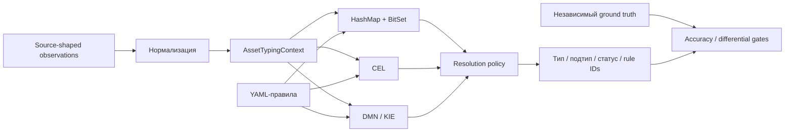

# ITAM Asset Typing Benchmark

[](https://github.com/GAbra/itam-asset-typing-benchmark/actions/workflows/ci.yml)
[](pom.xml)
[](LICENSE)
[](data/SOURCES_RU.md)

[English](README.md) · **Русский**

**Одна семантика типизации. Три движка. Воспроизводимые эксперименты ITAM — от чистого baseline до шумных мульти-источниковых данных.**

Проект сравнивает специализированный индексированный **HashMap + BitSet**, **CEL Java** и **DMN / Apache KIE** на одних и тех же нормализованных активах и правилах. Исследовательская ветка дополнительно проверяет неполные/противоречивые данные, консервативный отказ от рискованного AUTO и расширенную типизацию ПО, ориентированную на российский корпоративный IT.

[Итоговая исследовательская сводка](docs/RESEARCH_SUMMARY_RU.md) · [Методика](docs/METHODOLOGY_RU.md) · [Baseline-результаты](benchmark-results/README_RU.md) · [Experiment Protocol v2](docs/EXPERIMENT_PROTOCOL_V2_RU.md) · [Архитектура](docs/ARCHITECTURE_RU.md)

## Статус проекта

В репозитории сознательно разделены два уровня:

1. **Controlled baseline v2** — стабильный baseline производительности и корректности на исходной 14-rule семантике.
2. **`research/realistic-workload-v2`** — завершённый исследовательский трек с source-shaped данными, независимым ground truth, noise/conflict сценариями, масштабированием правил, JMH cross-check, откалиброванной политикой противоречий и Software Taxonomy v3.

Исследовательский этап завершён на уровне синтетического прототипа. Дальнейшее синтетическое «докручивание» для текущей версии не требуется. Следующий содержательный шаг — проверка на независимо размеченном реальном или корректно обезличенном production-like корпусе.

Проект **не** заявляет production accuracy по результатам синтетики.

## Основные результаты

### Controlled baseline v2

Все три контролируемые проверки завершились с **0 расхождений между движками** и **0 расхождений с метками генератора**.

| Активов | HashMap + BitSet | CEL | DMN / KIE |
|--:|--:|--:|--:|
| 100 000 | **337 868 активов/с** | 102 782 | 48 071 |
| 500 000 | **338 754 активов/с** | 102 850 | 49 285 |
| 1 000 000 | **334 237 активов/с** | 104 800 | 49 150 |

На 1M медианное время обработки одного актива составляет **2,992 мкс** для HashMap + BitSet, **9,542 мкс** для CEL и **20,346 мкс** для DMN / KIE. Это результаты конкретных адаптеров данного репозитория, а не универсальный рейтинг технологий.

### Производительность realistic workload

Полный research-эксперимент использовал 1 000 000 активов и сохранил нулевые расхождения между движками. При 14 правилах END_TO_END производительность составила примерно:

| Движок | Активов/с | нс/актив |
|:--|--:|--:|
| HashMap + BitSet | **325 376** | 3 073 |
| CEL | 115 012 | 8 695 |
| DMN / KIE | 48 938 | 20 434 |

Порядок движков сохранился при контролируемом увеличении набора правил до 50, 100 и 500. В ветке также есть ENGINE_ONLY замеры и JMH cross-check.

### Консервативная обработка противоречий

Исследовательская ветка добавляет консервативную политику resolver для случаев, когда сильные противоречащие правила близки по приоритету. **Весов по источникам нет.** Дополнительный параметр один — `conflictPriorityWindow`.

По заранее зафиксированному sweep `20, 40, 60, 80, 100, 120` выбрано:

```text
conflictPriorityWindow = 80
```

Значение отдельно подтверждено на новом seed. В контрольном прогоне число неправильных уверенных FULL AUTO снизилось примерно на **68–71%** для light/moderate/stress/severe, при этом clean-результат не изменился. Подробности — в [итоговой сводке](docs/RESEARCH_SUMMARY_RU.md) и [калибровке порога](docs/CONFLICT_WINDOW_CALIBRATION_RU.md).

### Software Taxonomy v3

Исходное бинарное деление ПО заменено в research-треке на 16 подтипов: ОС, офисное и бизнес-ПО, браузеры, IDE, инструменты и серверы БД, проектирование/дизайн, security/crypto, runtime, dev tools, утилиты, коммуникации, компоненты/агенты и прочее прикладное ПО.

Каталог содержит **74 репрезентативных продукта/семейства** для покрытия RU-oriented корпоративных сценариев. В нём есть российские и международные продукты; это **не** модель рыночных долей.

Финальный подтверждающий прогон (`seed=20260918`, `SOFTWARE_COUNT=200000`, conflict window `80`) прошёл все заранее зафиксированные критерии:

| Сценарий | Точность подтипа | FULL AUTO coverage | Ошибка FULL AUTO | Точность COMPONENT_AGENT |
|:--|--:|--:|--:|--:|
| Clean | 100,00% | 100,00% | 0,00% | 100,00% |
| Light | 99,62% | 99,62% | 0,00% | 99,88% |
| Stress | 97,94% | 97,94% | 0,00% | 98,38% |
| Severe | 92,44% | 92,44% | 0,00% | 93,13% |

Эти проценты относятся к детерминированному синтетическому holdout, а не к реальной production accuracy. См. [Software Taxonomy v3](docs/SOFTWARE_TAXONOMY_V3_RU.md).

## Что типизируется

В benchmark/research workload используются данные, по форме похожие на Active Directory, Nmap, Kaspersky Security Center, Zabbix и SIEM. На выходе формируются нормализованный тип, подтип, статус типизации и matched rule IDs.

Примеры:

- `DEVICE / SERVER`
- `DEVICE / WORKSTATION`
- `ACCOUNT / USER_ACCOUNT`
- `ACCOUNT / SERVICE_ACCOUNT`
- `SOFTWARE / OPERATING_SYSTEM`
- `SOFTWARE / DATABASE_TOOL`
- `SOFTWARE / SECURITY_SOFTWARE`
- `SOFTWARE / COMPONENT_AGENT`



Движки получают одинаковые нормализованные признаки и семантику решения. BitSet и CEL используют application-level candidate indexing; DMN — сгенерированную decision table. Исследовательская ветка также содержит независимый линейный reference evaluator, чтобы уменьшить риск общей ошибки во всех реализациях.

## Зачем нужен эксперимент

Автоматическая типизация усложняется, когда источники описывают один объект по-разному. AD может видеть компьютер и ОС, KSC — сервер/рабочую станцию, Nmap — признаки сетевого устройства, SIEM/Zabbix — только часть контекста. Для ПО аналогично: одного производителя недостаточно, чтобы отличить основной продукт от агента, runtime или компонента.

Поэтому проект разделяет несколько вопросов:

- одинаково ли три движка реализуют одну семантику;
- сколько вычислительной стоимости добавляет каждый адаптер;
- что происходит при пропавших или противоречивых признаках;
- когда система должна отказаться от подтипа вместо рискованного уверенного `AUTO`;
- можно ли типизировать ПО по нескольким атрибутам вместо хрупкого поиска по одной строке.

## Быстрый запуск

### Docker

Нужен Docker в режиме Linux containers:

```sh
git clone https://github.com/GAbra/itam-asset-typing-benchmark.git
cd itam-asset-typing-benchmark
sh run-quick-demo.sh
```

Windows PowerShell:

```powershell
.\run-quick-demo.ps1
```

Quick demo собирает и тестирует проект, генерирует 10 000 синтетических активов, проверяет эквивалентность движков и запускает benchmark только после успешной проверки.

### Локально: Java 21 + Maven 3.9+

```sh
mvn -B clean verify
java -jar target/itam-asset-typing-benchmark-1.0.0.jar generate --count 10000 --seed 20260909
java -jar target/itam-asset-typing-benchmark-1.0.0.jar verify \
  --data data/generated/normalized-10000.jsonl \
  --out results/local/verify-10000.json
```

После успешной проверки:

```sh
java -jar target/itam-asset-typing-benchmark-1.0.0.jar benchmark \
  --data data/generated/normalized-10000.jsonl \
  --warmup 2 --runs 5 --batch 2000 \
  --out results/local/benchmark-10000.json
```

Для realistic research-трека используйте [Experiment Protocol v2](docs/EXPERIMENT_PROTOCOL_V2_RU.md), [калибровку порога](docs/CONFLICT_WINDOW_CALIBRATION_RU.md), [Robustness v2](docs/ROBUSTNESS_V2_RU.md) и [Software Taxonomy v3](docs/SOFTWARE_TAXONOMY_V3_RU.md).

## Контролируемая среда baseline v2

| Параметр | Baseline v2 |
|:--|:--|
| CPU хоста | AMD Ryzen 9 7950X, 16 ядер / 32 потока |
| RAM хоста | ~32 GiB физической памяти |
| Хост / виртуализация | Windows 11 Pro, Docker Desktop 4.40.0, WSL2 |
| Ограничения контейнера | 4 CPU, 4 GiB RAM, без дополнительного swap |
| Java | Eclipse Adoptium 21 |
| JVM | `-Xms2g -Xmx2g -XX:+UseG1GC -XX:ActiveProcessorCount=4` |
| Seed | `20260909` |
| Правила | версия `1.0.0`, 14 включённых правил |
| Прогрев / измеряемые проходы | 2 / 5 |

Точные команды, хэши и provenance сохранены в `benchmark-results/baseline-v2/`.

## Корректность и воспроизводимость

Baseline verifier сравнивает тип, подтип, статус и отсортированные winning rule IDs. Research-трек дополнительно использует отдельно хранимый ground truth, детерминированный holdout, проверки source shape, независимый reference evaluator, noise-сценарии, SHA-256 manifests и заранее зафиксированные acceptance criteria.

Throughput **не** используется как CI pass/fail threshold. Проверки корректности и структуры артефактов отделены от наблюдений производительности.

В Git сохраняются компактные JSON/provenance-отчёты, а большие сгенерированные корпусы и логи остаются ignored.

## Ограничения

- Все зафиксированные workload являются синтетическими.
- Наличие продукта в каталоге не означает его долю рынка или распространённость.
- Production ingestion connectors не измеряются end-to-end.
- Производительность baseline/research зависит от машины и окружения.
- `conflictPriorityWindow=80` откалиброван на контролируемом research workload; внешняя валидация может потребовать повторной калибровки.
- Синтетический PASS доказывает воспроизводимость и поведение в заданных сценариях, но не production accuracy.

## Research roadmap

- [x] Три реальных execution engine с общей семантикой
- [x] Seeded baseline и differential verification
- [x] Controlled baseline v2 до 1M активов
- [x] Source-shaped realistic workload с независимым ground truth
- [x] Missing/stale/conflicting evidence scenarios
- [x] Масштабирование правил 14 / 50 / 100 / 500
- [x] END_TO_END + ENGINE_ONLY и JMH cross-check
- [x] Калибровка порога и подтверждение на новом seed (`80`)
- [x] Подтверждение conservative robustness
- [x] RU-oriented Software Taxonomy v3 и независимый confirmation run
- [ ] Независимо размеченный реальный или корректно обезличенный production-like corpus
- [ ] Репликация на внешних машинах / production-oriented capacity testing

## Документация

- [Итоговая исследовательская сводка](docs/RESEARCH_SUMMARY_RU.md)
- [Архитектура](docs/ARCHITECTURE_RU.md)
- [Методика](docs/METHODOLOGY_RU.md)
- [Experiment Protocol v2](docs/EXPERIMENT_PROTOCOL_V2_RU.md)
- [Калибровка порога](docs/CONFLICT_WINDOW_CALIBRATION_RU.md)
- [Software Taxonomy v3](docs/SOFTWARE_TAXONOMY_V3_RU.md)
- [Происхождение данных](data/SOURCES_RU.md)
- [Реализация движков](docs/ENGINE_IMPLEMENTATION_RU.md)

## Участие и цитирование

Bug reports и аккуратно ограниченные воспроизводимые эксперименты приветствуются. Не добавляйте реальные чувствительные данные без явного права на публикацию и сохраняйте provenance для любых заявлений о производительности или точности. Для цитирования используйте [CITATION.cff](CITATION.cff) или GitHub **Cite this repository**, обязательно фиксируя точный commit.

[Лицензия MIT](LICENSE). Сторонние библиотеки сохраняют собственные лицензии; см. [dependencies](docs/DEPENDENCIES_RU.md).
