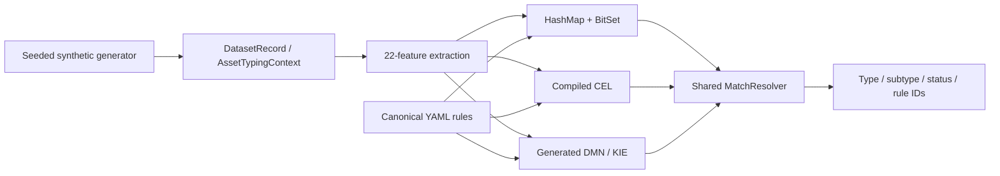

# Architecture

**English** · [Русский](ARCHITECTURE_RU.md)

## Data flow

The seeded generator emits normalized `DatasetRecord` JSONL. Each record contains an `AssetTypingContext` with asset ID, sources, source object kinds, attributes and system parameters, plus expected type/subtype labels. Raw source samples are illustrative; there are no source adapters or live integrations.

Each engine independently invokes `FeatureExtractor` inside `classify`. The extractor emits the same 22 boolean features. No deduplication or cross-asset comparison occurs.

## Canonical rules

All implementations receive the same `rules/canonical-rules.yaml` with version 1.0.0 and 14 rules. A rule defines ID, target type/subtype, priority, required features, any-of features, forbidden features and enabled state.

A condition matches when all required features are true, no forbidden feature is true, and at least one any-of feature is true if the any-of list is nonempty. Disabled rules do not participate.

## Engine adapters

| Adapter | Preparation | Per-asset execution |
|:--|:--|:--|
| HashMap + BitSet | Feature IDs, masks and a required-feature candidate index | Extract features, select candidates, compare masks |
| CEL | Generate and compile expressions; cache programs and a required-feature candidate index | Extract features, evaluate candidate programs |
| DMN / KIE | Generate and load a DMN `COLLECT` decision table | Extract features, evaluate table, map returned IDs to rules |

Rules without a required feature remain eligible in indexed adapters. DMN any-of conditions can expand into multiple rows. Duplicate matches from that expansion are deduplicated by rule ID.

## Shared resolution

`MatchResolver` deduplicates rule IDs and retains the maximum priority. Different types at that priority produce `TYPE_CONFLICT`; different subtypes produce `SUBTYPE_CONFLICT`. A type without a subtype produces `AUTO_TYPE_ONLY`, and a complete result produces `AUTO`. No matches produce `NOT_CLASSIFIED`.

This shared code keeps output semantics consistent but is also a shared failure surface. Differential agreement is therefore complemented by expected-output tests and generator-label verification.

## CLI and measurements

`generate`, `verify`, `benchmark`, `explain` and `export-dmn` are implemented in `ru.itam.typing.cli.Main`.

Verification compares outputs and labels, emits ordered SHA-256 result digests and returns a nonzero exit on mismatch or invalid/empty input. Records without expected types still contribute to engine agreement but not to label coverage; reports expose `groundTruthChecked`.

Benchmarking streams parsed batches, records elapsed classification/checksum time per engine and summarizes measured passes. JSON parsing, file I/O, engine construction, report serialization and input hashing are outside the per-engine timed sections.

The controlled baseline v2 adds explicit host/container/JVM provenance around this same execution model; it does not change the classification semantics. See [methodology](METHODOLOGY.md) for exact timing boundaries and limitations and [results](../benchmark-results/README.md) for archived vs controlled baselines.
