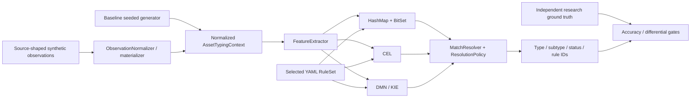

# Architecture

**English** · [Русский](ARCHITECTURE_RU.md)

This repository now contains two deliberately separated execution layers:

1. **Controlled baseline** — the original deterministic benchmark path using `rules/canonical-rules.yaml` (14 rules) and the historical classification semantics.
2. **Realistic research track** — source-shaped AD/Nmap/KSC/Zabbix/SIEM observations, deterministic noise, independent ground truth, conservative conflict handling, rule-count scaling and Software Taxonomy v3.

The baseline is retained for reproducible performance comparison. The research track extends the workload and decision policy without rewriting the archived baseline artifacts.

## High-level data flow

There is no asset-to-asset matching or deduplication in this repository. Classification is performed independently for each normalized asset.

## Input models

### Baseline

The baseline generator writes `DatasetRecord` JSONL. Each record contains an `AssetTypingContext` plus expected type/subtype labels.

### Realistic research track

The research generator writes source-shaped `RawAssetBundle` observations and a separate `GroundTruthLabel`. `ObservationNormalizer` / `RealisticDatasetMaterializer` converts the observations into the same `AssetTypingContext` consumed by the engines. The label is kept outside the classifier input.

Checked-in source fixtures and adapters validate the shape of synthetic AD/Nmap/KSC/Zabbix/SIEM observations. They are **not live production connectors**.

## Feature extraction

`FeatureExtractor` is shared by BitSet, CEL and DMN.

The original baseline feature semantics are retained for backwards compatibility. The canonical 14-rule ruleset still consumes the original baseline feature set. The current extractor also exposes additional research-only software features, including `SOFTWARE_AMBIGUOUS_HINT` and `SOFTWARE_CATEGORY_*` features produced by `SoftwareEvidenceClassifier` for KSC software inventory records.

This means the current feature map is a **superset** of the original baseline features. A rule set only evaluates the features it references.

## Rule sets

The repository intentionally keeps multiple rule sets for different experiments:

- `rules/canonical-rules.yaml` — original baseline semantics, 14 rules;
- generated scaled rule sets — controlled rule-count experiments;
- `rules/software-taxonomy-v3.yaml` — research software taxonomy with 16 software subtypes and a type-only fallback.

Every engine receives the same selected `RuleSet` for a given run.

## Engine adapters

| Adapter | Preparation | Per-asset execution |
|:--|:--|:--|
| HashMap + BitSet | Feature IDs, masks and required-feature candidate index | Convert true features to a BitSet, select candidates, evaluate masks |
| CEL | Compile rule expressions and build an application-level candidate index | Evaluate compiled candidate programs |
| DMN / KIE | Generate and load a DMN `COLLECT` decision table | Evaluate the decision table and map returned rule IDs to `RuleMatch` |
| Reference linear evaluator | No performance index; direct rule scan | Independent research correctness oracle |

The reference evaluator is used by the research acceptance path and is not a fourth performance competitor.

## Resolution policy

All production adapters convert matches into the same `RuleMatch` representation and use `MatchResolver`.

Two policies are available:

- `LEGACY_MAX_PRIORITY` (`conflictPriorityWindow=0`) — preserves the historical baseline semantics;
- `CONSERVATIVE_NEAR_PRIORITY` — also considers strong contradictory matches within a configured priority window.

The research track calibrated and then independently confirmed `conflictPriorityWindow=80`. The default engine constructors remain legacy-compatible; research runners explicitly select the conservative policy when required.

With either policy, the final statuses remain:

- `NOT_CLASSIFIED` — no matching rule;
- `TYPE_CONFLICT` — incompatible asset types;
- `SUBTYPE_CONFLICT` — incompatible subtypes of the same type;
- `AUTO_TYPE_ONLY` — type known, subtype deliberately unresolved;
- `AUTO` — complete automatic type/subtype result.

## Correctness model

Baseline verification compares BitSet, CEL and DMN results and checks the seeded generator labels.

The realistic research path adds stronger controls:

- ground truth stored separately from observations;
- deterministic label-independent 80/20 holdout;
- an independent linear reference evaluator;
- source-shape validation;
- explicit missing/stale/conflicting evidence scenarios;
- frozen acceptance gates and SHA-256 artifact manifests.

See [Final research summary](RESEARCH_SUMMARY.md), [Experiment Protocol v2](EXPERIMENT_PROTOCOL_V2.md), [Conflict-window calibration](CONFLICT_WINDOW_CALIBRATION.md), [Robustness v2](ROBUSTNESS_V2.md) and [Software Taxonomy v3](SOFTWARE_TAXONOMY_V3.md).

## Runtime and measurement scope

The stable baseline CLI (`generate`, `verify`, `benchmark`, `explain`, `export-dmn`) remains in `ru.itam.typing.cli.Main`.

Research-specific CLIs and runners live under `ru.itam.typing.realistic` and `scripts/`. The research track adds END_TO_END, ENGINE_ONLY and JMH measurements, but throughput is never used as a correctness gate.

The project still does not implement a live ITAM service, database persistence, queues, background scheduling, asset deduplication or live AD/Nmap/KSC/Zabbix/SIEM ingestion.

## Documentation map

- [Detailed software implementation](IMPLEMENTATION.md) — current baseline and research execution paths;
- [Detailed engine implementation](ENGINE_IMPLEMENTATION.md) — BitSet, CEL, DMN, reference evaluator and resolution policy;
- [Baseline methodology](METHODOLOGY.md) — archived and controlled baseline measurement details;
- [Final research summary](RESEARCH_SUMMARY.md) — completed realistic-workload findings and scope limitations.

Editable baseline flow diagrams remain under `docs/diagrams/`.