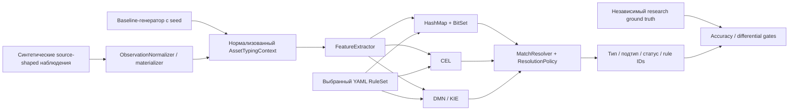

# Архитектура

[English](ARCHITECTURE.md) · **Русский**

В репозитории теперь намеренно разделены два уровня исполнения:

1. **Контролируемый baseline** — исходный детерминированный benchmark на `rules/canonical-rules.yaml` (14 правил) и исторической семантике типизации.
2. **Realistic research track** — source-shaped наблюдения AD/Nmap/KSC/Zabbix/SIEM, детерминированный шум, независимый ground truth, консервативная обработка противоречий, масштабирование правил и Software Taxonomy v3.

Baseline сохраняется для воспроизводимого сравнения производительности. Исследовательский контур расширяет workload и decision policy, не переписывая архивные baseline-артефакты.

## Верхнеуровневый поток данных

Сравнения активов между собой и дедупликации в этом репозитории нет. Каждый нормализованный актив классифицируется независимо.

## Входные модели

### Baseline

Baseline-генератор пишет JSONL `DatasetRecord`. Каждая запись содержит `AssetTypingContext` и ожидаемые type/subtype.

### Realistic research track

Research-генератор формирует source-shaped `RawAssetBundle` и отдельный `GroundTruthLabel`. `ObservationNormalizer` / `RealisticDatasetMaterializer` превращает наблюдения в тот же `AssetTypingContext`, который получают движки. Эталонная метка не передаётся классификатору.

Checked-in fixtures и adapters проверяют форму синтетических наблюдений AD/Nmap/KSC/Zabbix/SIEM. Это **не live production connectors**.

## Извлечение признаков

`FeatureExtractor` общий для BitSet, CEL и DMN.

Исходные baseline-признаки сохранены для обратной совместимости. Канонический ruleset из 14 правил по-прежнему использует исходный набор baseline-признаков. Текущий extractor дополнительно формирует research-only признаки ПО, включая `SOFTWARE_AMBIGUOUS_HINT` и `SOFTWARE_CATEGORY_*`, которые создаёт `SoftwareEvidenceClassifier` для записей инвентаризации ПО KSC.

Таким образом, текущая feature map — **надмножество** исходных baseline-признаков. Конкретный ruleset использует только те признаки, на которые ссылаются его правила.

## Наборы правил

В репозитории намеренно несколько ruleset для разных экспериментов:

- `rules/canonical-rules.yaml` — исходная baseline-семантика, 14 правил;
- сгенерированные scaled rulesets — контролируемые эксперименты по росту количества правил;
- `rules/software-taxonomy-v3.yaml` — research taxonomy ПО с 16 подтипами и fallback только до типа.

В рамках одного запуска все движки получают один и тот же выбранный `RuleSet`.

## Адаптеры движков

| Адаптер | Подготовка | Выполнение на одном активе |
|:--|:--|:--|
| HashMap + BitSet | ID признаков, masks и индекс кандидатов по required feature | Собрать BitSet истинных признаков, выбрать кандидатов, проверить masks |
| CEL | Скомпилировать выражения и построить application-level candidate index | Выполнить скомпилированные candidate programs |
| DMN / KIE | Сгенерировать и загрузить DMN-таблицу `COLLECT` | Выполнить decision table и преобразовать rule IDs в `RuleMatch` |
| Reference linear evaluator | Без performance-index, прямой проход по правилам | Независимый research correctness oracle |

Reference evaluator используется в research acceptance и не является четвёртым конкурентом по производительности.

## Политика разрешения результата

Все рабочие адаптеры преобразуют совпадения в единый `RuleMatch` и используют `MatchResolver`.

Доступны две политики:

- `LEGACY_MAX_PRIORITY` (`conflictPriorityWindow=0`) — сохраняет историческую baseline-семантику;
- `CONSERVATIVE_NEAR_PRIORITY` — дополнительно учитывает сильные противоречащие правила в пределах заданного окна приоритетов.

В research track значение `conflictPriorityWindow=80` сначала было выбрано по заранее зафиксированному sweep-критерию, затем подтверждено на новом seed. Конструкторы движков по умолчанию остаются legacy-совместимыми; research runners явно включают conservative policy там, где это требуется.

Финальные статусы остаются едиными:

- `NOT_CLASSIFIED` — совпавших правил нет;
- `TYPE_CONFLICT` — несовместимые типы;
- `SUBTYPE_CONFLICT` — несовместимые подтипы одного типа;
- `AUTO_TYPE_ONLY` — тип известен, подтип намеренно не выбран;
- `AUTO` — полный автоматический type/subtype.

## Модель проверки корректности

Baseline verification сравнивает BitSet, CEL и DMN и проверяет метки seeded generator.

Realistic research path добавляет более сильные проверки:

- ground truth хранится отдельно от наблюдений;
- детерминированный label-independent holdout 80/20;
- независимый linear reference evaluator;
- source-shape validation;
- явные сценарии missing/stale/conflicting evidence;
- заранее зафиксированные acceptance gates и SHA-256 manifests.

См. [итоговую исследовательскую сводку](RESEARCH_SUMMARY_RU.md), [Experiment Protocol v2](EXPERIMENT_PROTOCOL_V2_RU.md), [калибровку порога противоречия](CONFLICT_WINDOW_CALIBRATION_RU.md), [Robustness v2](ROBUSTNESS_V2_RU.md) и [Software Taxonomy v3](SOFTWARE_TAXONOMY_V3_RU.md).

## Runtime и границы измерений

Стабильный baseline CLI (`generate`, `verify`, `benchmark`, `explain`, `export-dmn`) остаётся в `ru.itam.typing.cli.Main`.

Research-specific CLI и runners находятся в `ru.itam.typing.realistic` и `scripts/`. Research track добавляет END_TO_END, ENGINE_ONLY и JMH измерения, но throughput никогда не используется как correctness gate.

Проект по-прежнему не реализует live ITAM service, database persistence, queues, background scheduling, дедупликацию активов или live ingestion из AD/Nmap/KSC/Zabbix/SIEM.

## Карта документации

- [Подробная программная реализация](IMPLEMENTATION_RU.md) — текущие baseline и research execution paths;
- [Подробная реализация движков](ENGINE_IMPLEMENTATION_RU.md) — BitSet, CEL, DMN, reference evaluator и resolution policy;
- [Baseline-методика](METHODOLOGY_RU.md) — детали архивного и контролируемого baseline;
- [Итоговая research-сводка](RESEARCH_SUMMARY_RU.md) — результаты realistic workload и ограничения выводов.

Редактируемые baseline flow diagrams сохранены в `docs/diagrams/`.