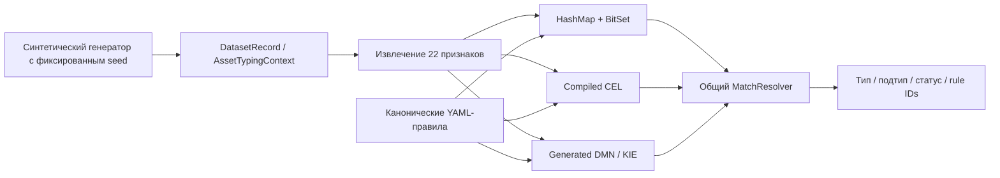

# Архитектура

[English](ARCHITECTURE.md) · **Русский**

Эта страница показывает верхнеуровневую архитектуру. Для перехода от блоков к фактическим классам и runtime-потоку используйте [подробную программную реализацию](IMPLEMENTATION_RU.md). Внутреннее устройство HashMap + BitSet, CEL и DMN/KIE описано отдельно в [подробной реализации движков](ENGINE_IMPLEMENTATION_RU.md).

## Поток данных

Генератор с фиксированным seed создаёт нормализованный JSONL из `DatasetRecord`. Каждая запись содержит `AssetTypingContext` с asset ID, источниками, типами объектов источников, атрибутами и системными параметрами, а также ожидаемыми type/subtype. Raw samples нужны только для иллюстрации форматов; реальных source adapters и live integrations в проекте нет.

Каждый движок независимо вызывает `FeatureExtractor` внутри `classify`. Extractor формирует один и тот же набор из 22 булевых признаков. Дедупликации и сравнения активов между собой нет.

## Уровни документации реализации

Чтобы не перегружать верхнеуровневую схему, подробности разделены на два документа:

- [Подробная программная реализация](IMPLEMENTATION_RU.md) — карта пакетов и классов, загрузка правил, data model, `generate`, `verify`, `benchmark`, `explain`, `export-dmn`, lifecycle движков и точный runtime-поток;
- [Подробная реализация движков](ENGINE_IMPLEMENTATION_RU.md) — отдельные схемы подготовки и исполнения HashMap + BitSet, CEL и DMN/KIE, candidate indexes, masks/programs/DMN rows и общий `MatchResolver`.

Таким образом, эта страница отвечает на вопрос **«из каких архитектурных блоков состоит решение»**, `IMPLEMENTATION_RU.md` — **«какие классы вызывают друг друга»**, а `ENGINE_IMPLEMENTATION_RU.md` — **«как именно каждый движок вычисляет совпавшие правила»**.

## Канонические правила

Все реализации получают один и тот же `rules/canonical-rules.yaml` версии 1.0.0 с 14 правилами. Правило содержит ID, целевой type/subtype, priority, required features, any-of features, forbidden features и enabled state.

Условие совпадает, когда истинны все required features, ни один forbidden feature не истинный и, если список any-of непустой, истинный хотя бы один его элемент. Отключённые правила не участвуют.

## Адаптеры движков

| Адаптер | Подготовка | Выполнение на одном активе |
|:--|:--|:--|
| HashMap + BitSet | ID признаков, bit masks и индекс кандидатов по required feature | Извлечь признаки, выбрать кандидатов, сравнить masks |
| CEL | Сгенерировать и скомпилировать выражения; закэшировать programs и индекс кандидатов | Извлечь признаки, выполнить candidate programs |
| DMN / KIE | Сгенерировать и загрузить DMN decision table с hit policy `COLLECT` | Извлечь признаки, выполнить таблицу, сопоставить возвращённые ID с правилами |

Правила без required feature остаются кандидатами в индексированных адаптерах. Any-of в DMN может разворачиваться в несколько строк. Совпадения-дубликаты, появившиеся из такого expansion, дедуплицируются по rule ID.

## Общий resolver

`MatchResolver` дедуплицирует rule IDs и оставляет максимальный priority. Разные типы на максимальном priority дают `TYPE_CONFLICT`; разные подтипы — `SUBTYPE_CONFLICT`. Тип без подтипа даёт `AUTO_TYPE_ONLY`, полный type/subtype — `AUTO`, отсутствие совпадений — `NOT_CLASSIFIED`.

Общий resolver обеспечивает одинаковую семантику результата, но одновременно является общей точкой отказа. Поэтому дифференциальное сравнение движков дополняется expected-output tests и проверкой меток генератора.

## CLI и измерения

Команды `generate`, `verify`, `benchmark`, `explain` и `export-dmn` реализованы в `ru.itam.typing.cli.Main`.

Verification сравнивает результаты и метки, формирует упорядоченные SHA-256 digest и возвращает ненулевой exit code при расхождении, некорректном или пустом input. Записи без expected type участвуют в сравнении движков, но не в label coverage; в отчёте это видно по `groundTruthChecked`.

Benchmark потоково читает распарсенные batch, измеряет classification/checksum time каждого движка и формирует summary по проходам. JSON parsing, file I/O, создание движков, сериализация отчёта и input hashing находятся за пределами per-engine timed section.

Контролируемый baseline v2 добавляет к этой же модели исполнения явный provenance хоста, контейнера и JVM, не меняя семантику классификации. Точные границы измерения и ограничения описаны в [методике](METHODOLOGY_RU.md), разделение архивного и контролируемого baseline — в [результатах](../benchmark-results/README_RU.md), а class/module execution flow — в [подробной программной реализации](IMPLEMENTATION_RU.md).
