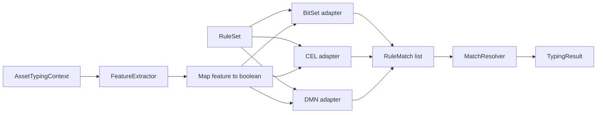
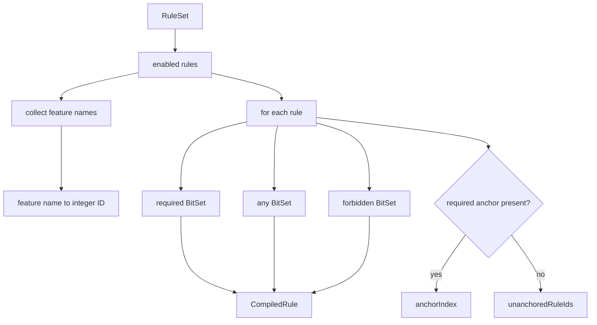
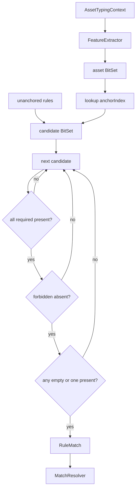
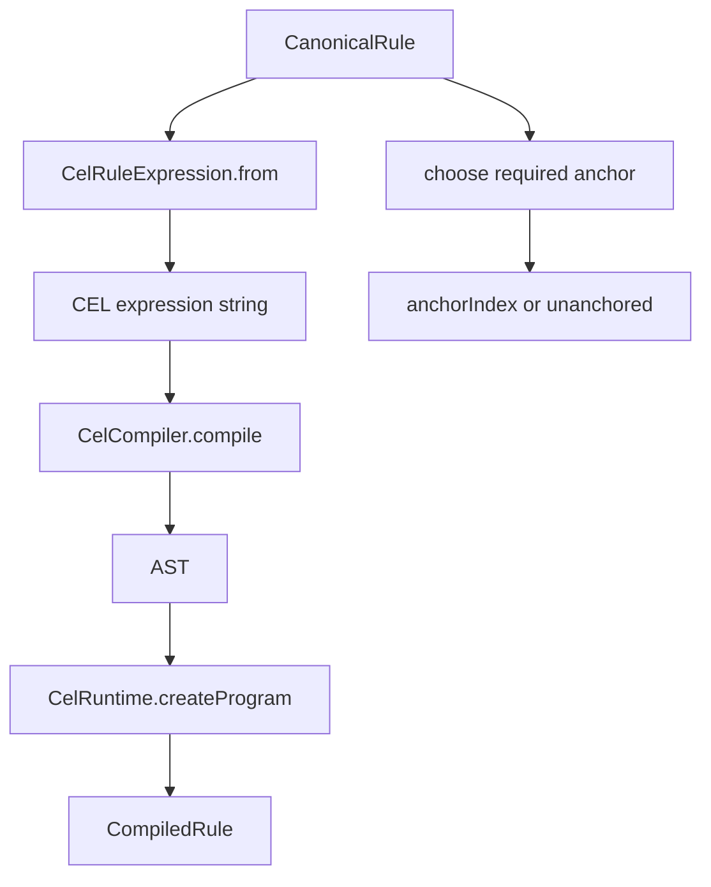
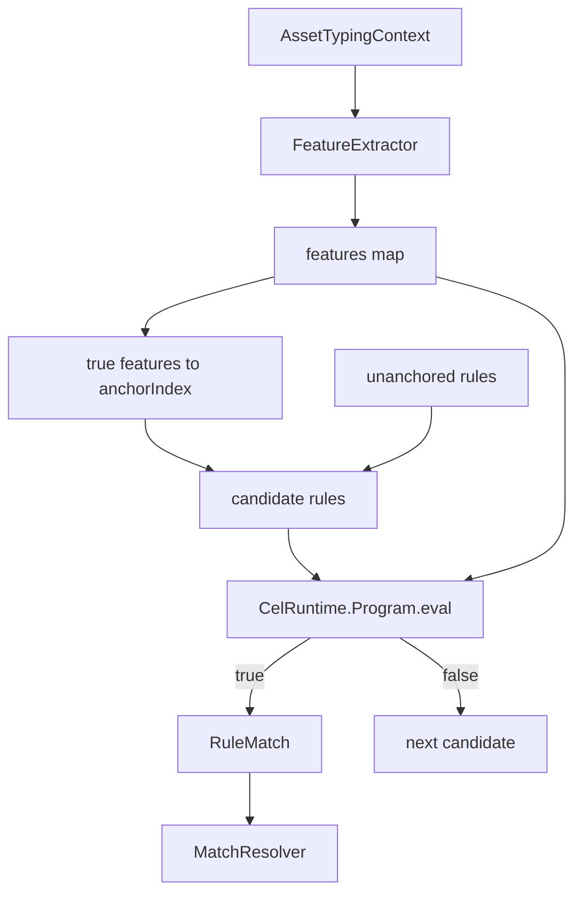
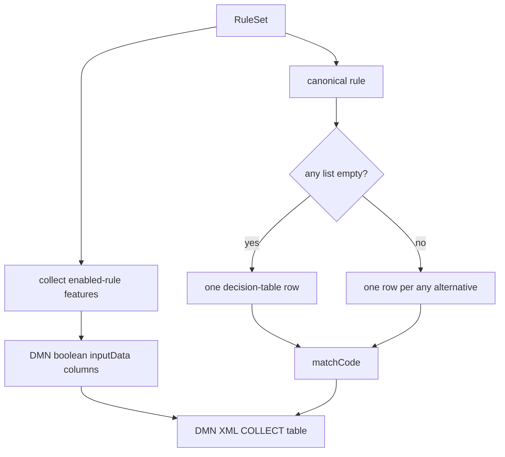
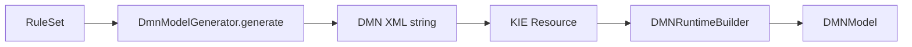
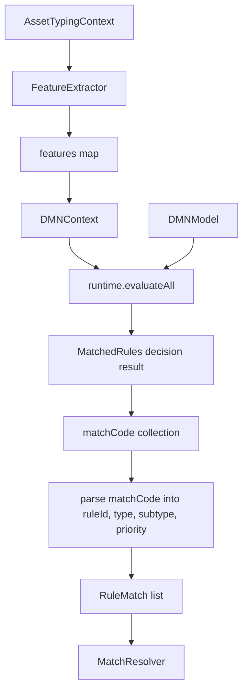
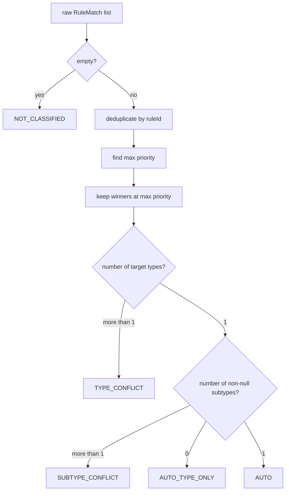

# Detailed engine implementation

**English** · [Русский](ENGINE_IMPLEMENTATION_RU.md)

This document explains how the same `RuleSet` is transformed and executed by the three adapters. The complete CLI/data/rules/report path is in [IMPLEMENTATION.md](IMPLEMENTATION.md); the high-level view is in [ARCHITECTURE.md](ARCHITECTURE.md).

## Shared contract

All engines implement the same interface:

```java
public interface TypingEngine {
    String name();
    TypingResult classify(AssetTypingContext context);
}
```

The following components are shared by every engine:

1. the same `RuleSet` loaded from `rules/canonical-rules.yaml`;
2. the same `FeatureExtractor` and the same 22 features;
3. the same intermediate `RuleMatch(ruleId, targetType, targetSubtype, priority)` format;
4. the same `MatchResolver.resolve(...)`;
5. the same `TypingResult` format.

Only the **rule matching** stage differs.



---

## 1. HashMap + BitSet

File: `src/main/java/ru/itam/typing/engine/bitset/BitSetTypingEngine.java`.

### Preparation phase

The constructor scans enabled rules and collects feature names from `required`, `any` and `forbidden`. Each feature name receives an integer ID. Every rule is then compiled into an internal `CompiledRule` with three `BitSet` masks: `required`, `any`, and `forbidden`.

The anchor is chosen only from `required` features using a fixed rank:

```text
0: OBJ_*
1: KSC_* / NMAP_*
2: OS_* / *HINT*
3: SRC_*
4: everything else
```

Lexicographical order breaks ties. Rules without required features are stored as unanchored rules.

```text
anchorIndex: featureId -> [compiledRuleIndex...]
unanchoredRuleIds: [compiledRuleIndex...]
```



### Per-asset classification

1. `FeatureExtractor.extract(context)` creates `Map<String, Boolean>`.
2. True features are converted into one asset `BitSet`.
3. Candidate rules are selected through `anchorIndex` using set bits.
4. Unanchored rules are added.
5. Each candidate is checked against `required`, `forbidden`, and `any` masks.



The BitSet adapter optimizes feature representation and candidate selection. It is specialized for the benchmark's boolean-feature model.

---

## 2. CEL

Files:

- `src/main/java/ru/itam/typing/engine/cel/CelRuleExpression.java`;
- `src/main/java/ru/itam/typing/engine/cel/CelTypingEngine.java`.

### Expression generation

`CelRuleExpression.from(rule)` converts a canonical rule into a boolean expression over `features: map<string, bool>`.

```text
required A, B    -> features["A"] && features["B"]
forbidden C      -> !features["C"]
any D, E         -> (features["D"] || features["E"])
```

All clauses are joined with `&&`. An empty condition becomes `true`.

### Preparation phase

For every enabled rule:

1. build the expression string;
2. compile it to an AST;
3. create a `CelRuntime.Program`;
4. cache that program inside `CompiledRule`;
5. add the rule to the candidate anchor index.

CEL uses the same anchor policy as BitSet.



### Per-asset classification



Candidate selection is similar to BitSet, but final rule conditions are executed by the CEL runtime instead of direct Java BitSet operations.

---

## 3. DMN / Apache KIE

Files:

- `src/main/java/ru/itam/typing/engine/dmn/DmnModelGenerator.java`;
- `src/main/java/ru/itam/typing/engine/dmn/DmnTypingEngine.java`.

### DMN model generation

`DmnModelGenerator` collects features from enabled rules and emits DMN XML. The model contains one boolean `inputData` per feature, the `MatchedRules` decision, a decision table with `hitPolicy="COLLECT"`, and a string output called `matchCode`.

For each canonical rule:

```text
required feature  -> true
forbidden feature -> false
unused feature    -> -
```

`any` is expanded into multiple DMN rows, one row per alternative. A canonical rule may therefore appear more than once in the result; `MatchResolver` later deduplicates matches by `ruleId`.

`matchCode` uses this actual format:

```text
ruleId|targetType|targetSubtype|priority
```



### KIE runtime loading



Engine construction fails if the model cannot be loaded or reports errors.

### Per-asset classification

1. the extractor creates the feature map;
2. a new `DMNContext` is created;
3. every feature is copied into that context as a boolean variable;
4. `runtime.evaluateAll(model, dmnContext)` executes the model;
5. the `MatchedRules` decision result is read;
6. output values are parsed back into `RuleMatch` objects through `matchCode`;
7. matches go to `MatchResolver`.



The literal `|` separators from the actual `matchCode` format are intentionally kept out of the Mermaid node label because GitHub Mermaid interprets `|` as syntax. The real encoded value is still `ruleId|targetType|targetSubtype|priority`.

### Main difference from the other adapters

The DMN adapter has no separate Java candidate index. Matching is delegated to the generated DMN decision table executed through Apache KIE.

---

## 4. Shared MatchResolver

File: `src/main/java/ru/itam/typing/engine/common/MatchResolver.java`.

All engines pass their `RuleMatch` list to the same resolver.



Resolution order:

- duplicate `ruleId` values collapse;
- only maximum-priority matches remain;
- winners are sorted by `ruleId`;
- multiple target types produce `TYPE_CONFLICT`;
- one type with multiple subtypes produces `SUBTYPE_CONFLICT`;
- one type with no subtype produces `AUTO_TYPE_ONLY`;
- one type with one subtype produces `AUTO`.

## Execution-path comparison

| Stage | HashMap + BitSet | CEL | DMN / KIE |
|:--|:--|:--|:--|
| Rule source | canonical YAML | canonical YAML | canonical YAML |
| Condition preparation | BitSet masks | CEL expression + AST/program | DMN XML rows |
| Candidate index | yes | yes | no separate Java index |
| Execution unit | BitSet operations | `CelRuntime.Program.eval` | KIE DMN decision table |
| Any-of | BitSet intersection | `||` expression | expansion to multiple rows |
| Engine output | `RuleMatch` | `RuleMatch` | `matchCode` → `RuleMatch` |
| Conflict semantics | shared `MatchResolver` | shared `MatchResolver` | shared `MatchResolver` |

The benchmark compares three different **execution representations** while keeping inputs, features, rules, and final resolution semantics the same.
