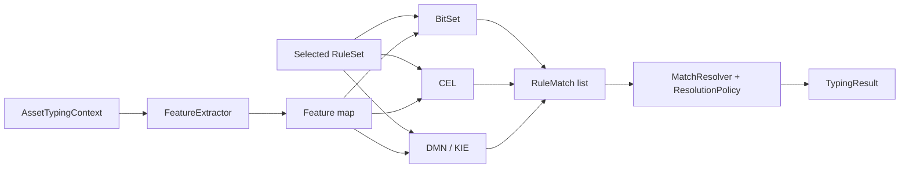

# Detailed engine implementation

**English** · [Русский](ENGINE_IMPLEMENTATION_RU.md)

This document describes how the same selected `RuleSet` is executed by the three production adapters and how the independent research reference evaluator fits into acceptance testing.

## Shared contract

The three compared adapters implement `TypingEngine`:

```java
public interface TypingEngine {
    String name();
    TypingResult classify(AssetTypingContext context);
}
```

BitSet and CEL also implement the feature-map execution path used by research tooling.

Shared components are:

1. one selected `RuleSet` per run;
2. one deterministic `FeatureExtractor` semantic map;
3. common `RuleMatch(ruleId, targetType, targetSubtype, priority)` values;
4. one `MatchResolver` API with an explicit `ResolutionPolicy`;
5. one `TypingResult` format.

The current feature map is a superset of the original baseline features. `canonical-rules.yaml` still consumes the historical baseline set; research rule sets may also consume `SOFTWARE_CATEGORY_*` features.



## 1. HashMap + BitSet

File: `src/main/java/ru/itam/typing/engine/bitset/BitSetTypingEngine.java`.

### Preparation

For enabled rules the constructor collects referenced feature names and assigns integer IDs. Each rule is compiled into `required`, `any` and `forbidden` BitSet masks.

An anchor is selected from required features to build a candidate index. Rules without required features remain unanchored and are always eligible.

```text
anchorIndex: featureId -> [compiledRuleIndex...]
unanchoredRuleIds: [compiledRuleIndex...]
```

### Per asset

1. Extract features.
2. Convert true referenced features into an asset BitSet.
3. Select candidate rules from `anchorIndex` plus unanchored rules.
4. Evaluate required/forbidden/any masks.
5. Convert matches to `RuleMatch`.
6. Resolve using the configured `ResolutionPolicy`.

The default constructor uses `LEGACY_MAX_PRIORITY`; research runners can explicitly pass the conservative policy.

## 2. CEL

Files:

- `src/main/java/ru/itam/typing/engine/cel/CelRuleExpression.java`
- `src/main/java/ru/itam/typing/engine/cel/CelTypingEngine.java`

`CelRuleExpression` translates a canonical rule into a boolean expression over `features: map<string, bool>`.

```text
required A, B -> features["A"] && features["B"]
forbidden C   -> !features["C"]
any D, E      -> (features["D"] || features["E"])
```

For each enabled rule CEL compiles and caches a runtime program. The adapter also uses an application-level required-feature candidate index so only candidate programs are evaluated per asset.

Final matches are represented as the same `RuleMatch` objects and passed to the same configured resolver policy as BitSet.

## 3. DMN / Apache KIE

Files:

- `src/main/java/ru/itam/typing/engine/dmn/DmnModelGenerator.java`
- `src/main/java/ru/itam/typing/engine/dmn/DmnTypingEngine.java`

The generator creates a DMN model with boolean input columns and a `COLLECT` decision table. Canonical `any` clauses may expand to multiple rows. Returned match codes are parsed back into rule ID, type, subtype and priority; duplicate rule IDs are later collapsed by the resolver.

Unlike BitSet and CEL, the DMN adapter has no separate Java candidate index. Matching is delegated to the Apache KIE DMN runtime.

The default DMN constructor remains legacy-compatible; the research path can inject the same conservative `ResolutionPolicy` used by the other adapters.

## 4. Reference linear evaluator

File: `src/main/java/ru/itam/typing/engine/reference/ReferenceTypingEngine.java`.

The reference evaluator exists to reduce the shared-bug risk in research acceptance. It scans the selected rule set directly instead of reusing the BitSet/CEL candidate-index implementation or the DMN runtime path.

It is used for correctness comparison, not as a performance competitor.

## 5. MatchResolver and ResolutionPolicy

Files:

- `src/main/java/ru/itam/typing/engine/common/MatchResolver.java`
- `src/main/java/ru/itam/typing/engine/common/ResolutionPolicy.java`

### Legacy policy

`LEGACY_MAX_PRIORITY` has `conflictPriorityWindow=0` and preserves the original semantics:

1. deduplicate by `ruleId`;
2. find maximum priority;
3. keep max-priority winners;
4. multiple winner types -> `TYPE_CONFLICT`;
5. one type with multiple winner subtypes -> `SUBTYPE_CONFLICT`;
6. one type with no subtype -> `AUTO_TYPE_ONLY`;
7. one type/subtype -> `AUTO`.

### Conservative policy

`CONSERVATIVE_NEAR_PRIORITY` additionally inspects rules with:

```text
priority >= maxPriority - conflictPriorityWindow
```

If sufficiently strong nearby evidence contains multiple types, the result becomes `TYPE_CONFLICT`. If it contains multiple non-null subtypes of the same type, the result becomes `SUBTYPE_CONFLICT`.

If no nearby contradiction exists, the historical max-priority winners still determine the final subtype. Lower-priority evidence never promotes a subtype.

The completed research sweep selected and independently confirmed:

```text
conflictPriorityWindow = 80
```

This is a single contradiction threshold, not a set of source/vendor weights.

## Execution comparison

| Stage | HashMap + BitSet | CEL | DMN / KIE | Reference |
|:--|:--|:--|:--|:--|
| Rule source | selected YAML | selected YAML | selected YAML | selected YAML |
| Preparation | masks + index | CEL programs + index | generated DMN model | direct rule structures |
| Candidate index | yes | yes | no Java index | no |
| Rule execution | BitSet operations | CEL runtime | KIE DMN table | linear Java checks |
| Output | `RuleMatch` | `RuleMatch` | match code -> `RuleMatch` | `RuleMatch` |
| Resolution semantics | configured policy | configured policy | configured policy | independently mirrored for acceptance |
| Performance benchmark role | yes | yes | yes | no |

## Backwards compatibility

The original canonical benchmark is preserved because:

- `rules/canonical-rules.yaml` is unchanged;
- original software subtypes remain in `AssetSubtype`;
- historical `SECURITY_SOFTWARE_HINT` extraction remains available;
- engine constructors without an explicit policy still use `LEGACY_MAX_PRIORITY`;
- baseline verification and controlled performance artifacts remain separate from research results.

## Scope

These are concrete adapters, not universal rankings of BitSet, CEL or DMN technologies. Performance conclusions apply only to the implementations, rules, data and environment documented in this repository.

For measured results see [RESEARCH_SUMMARY.md](RESEARCH_SUMMARY.md) and for baseline timing boundaries see [METHODOLOGY.md](METHODOLOGY.md).