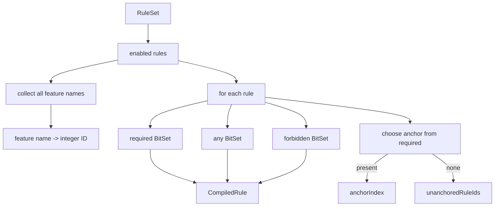
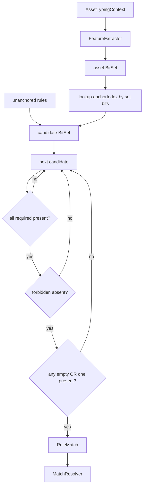
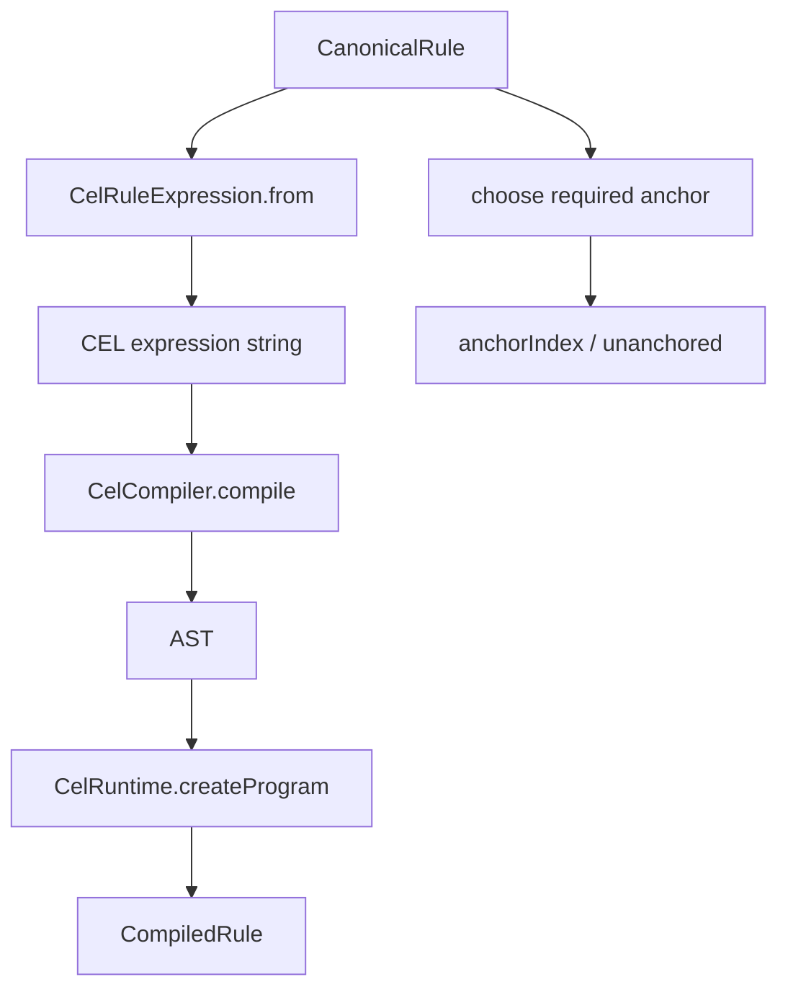
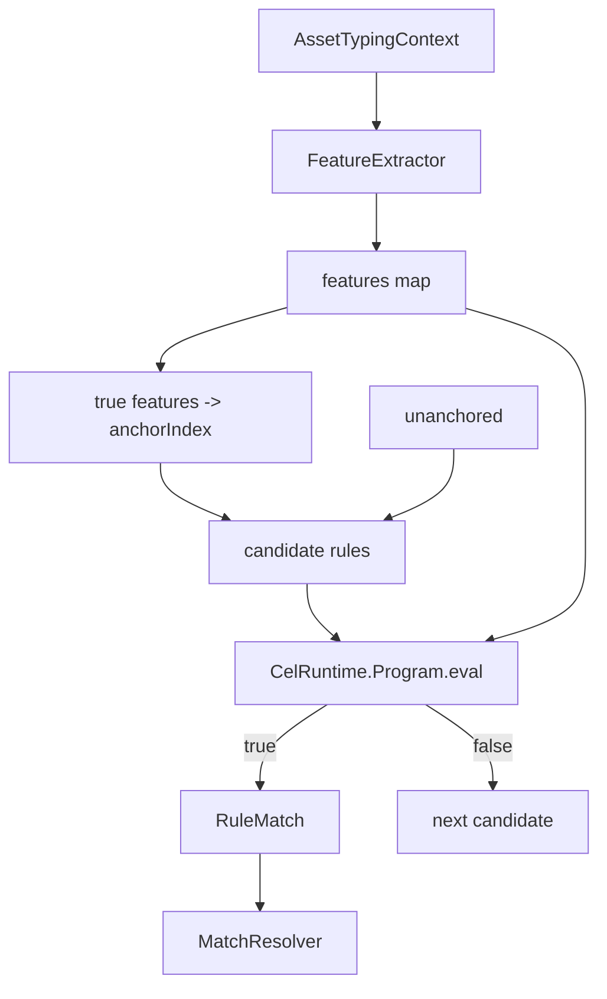
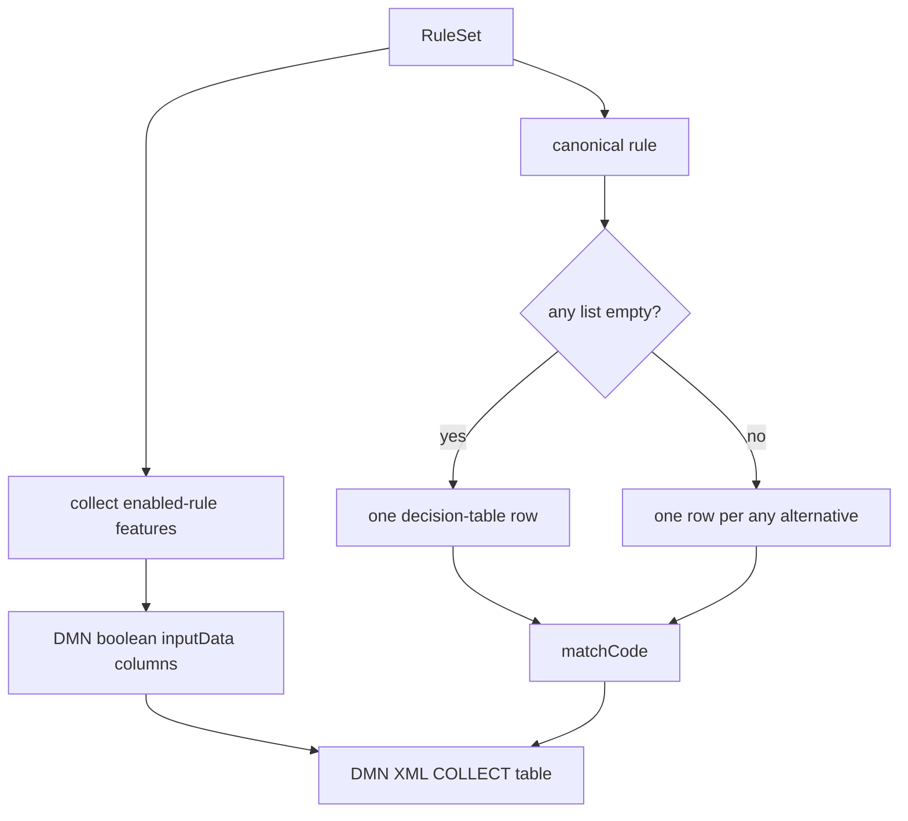
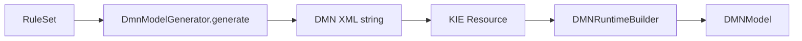
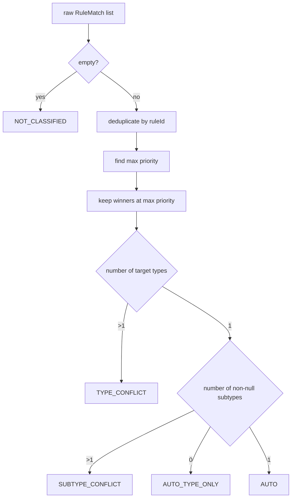

# Detailed engine implementation

**English** · [Русский](ENGINE_IMPLEMENTATION_RU.md)

This document explains how the same `RuleSet` is transformed and executed by the three adapters. The complete CLI/data/rules/report path is in [IMPLEMENTATION.md](IMPLEMENTATION.md); the high-level view is in [ARCHITECTURE.md](ARCHITECTURE.md).

## Shared contract

All engines implement:

```java
public interface TypingEngine {
    String name();
    TypingResult classify(AssetTypingContext context);
}
```

The following components are shared by every engine:

1. the same `RuleSet` loaded from `rules/canonical-rules.yaml`;
2. the same `FeatureExtractor` and 22 features;
3. the same intermediate `RuleMatch(ruleId, targetType, targetSubtype, priority)`;
4. the same `MatchResolver.resolve(...)`;
5. the same `TypingResult` format.

Only the **rule matching** stage differs.


---

## 1. HashMap + BitSet

File: `src/main/java/ru/itam/typing/engine/bitset/BitSetTypingEngine.java`.

### Preparation phase

The constructor scans enabled rules and collects all feature names from `required`, `any` and `forbidden`. Each feature name receives an integer ID.

Each rule is then compiled into an internal `CompiledRule`:

```text
CanonicalRule
  ├─ required[]   -> BitSet required
  ├─ any[]        -> BitSet any
  ├─ forbidden[]  -> BitSet forbidden
  └─ one required feature -> anchor
```

The anchor is selected only from required features using a fixed rank:

```text
0: OBJ_*
1: KSC_* / NMAP_*
2: OS_* / *HINT*
3: SRC_*
4: everything else
```

Lexicographical order breaks ties. Rules without required features are stored as unanchored rules.

The constructor produces:

```text
anchorIndex: featureId -> [compiledRuleIndex...]
unanchoredRuleIds: [compiledRuleIndex...]
```



### Per-asset classification

1. `FeatureExtractor.extract(context)` creates the feature map.
2. True features are converted to one asset `BitSet`.
3. For every set feature bit, candidate rules are read from `anchorIndex`.
4. All unanchored rules are added.
5. Each candidate is checked with three mask operations.

Required check:

```text
missingRequired = required - asset
match only when missingRequired is empty
```

Forbidden check:

```text
forbiddenPresent = forbidden ∩ asset
match only when forbiddenPresent is empty
```

Any-of check:

```text
if any is not empty:
    anyPresent = any ∩ asset
    match only when anyPresent is not empty
```



### What is optimized

Feature names are converted to integer IDs and rule feature sets to compact masks. The engine also does not blindly evaluate every enabled rule for every asset: candidates are selected by one required anchor per rule plus the unanchored set.

This is a specialized implementation for the benchmark's boolean-feature and canonical-rule model.

---

## 2. CEL

Files:

- `src/main/java/ru/itam/typing/engine/cel/CelRuleExpression.java`;
- `src/main/java/ru/itam/typing/engine/cel/CelTypingEngine.java`.

### Expression generation

`CelRuleExpression.from(rule)` converts a canonical rule into a boolean expression over:

```text
features: map<string, bool>
```

Transformation semantics:

```text
required A, B    -> features["A"] && features["B"]
forbidden C      -> !features["C"]
any D, E         -> (features["D"] || features["E"])
```

All clauses are joined with `&&`. A completely empty condition becomes `true`.

### Preparation phase

The constructor creates a CEL compiler with `features` declared as `map<string,bool>`, boolean result type, and a runtime.

For every enabled rule:

1. build the expression string;
2. compile it to an AST;
3. create a `CelRuntime.Program`;
4. cache that program inside `CompiledRule` so it is not recompiled per asset;
5. add the rule to the candidate anchor index.

CEL uses the same anchor ranking as BitSet. Rules without required features are unanchored.



### Per-asset classification

1. the shared extractor creates the feature map;
2. true features form a candidate BitSet through the string-keyed anchor index;
3. unanchored rules are added;
4. each candidate executes `program.eval(Map.of("features", features))`;
5. boolean `true` becomes a `RuleMatch`;
6. matches go to the shared resolver.



### Main difference from BitSet

Candidate selection is similar, but final rule conditions are executed by the CEL runtime rather than direct Java BitSet operations. This makes rule conditions declarative expressions at the cost of CEL program-evaluation overhead.

---

## 3. DMN / Apache KIE

Files:

- `src/main/java/ru/itam/typing/engine/dmn/DmnModelGenerator.java`;
- `src/main/java/ru/itam/typing/engine/dmn/DmnTypingEngine.java`.

### DMN model generation

`DmnModelGenerator` collects all feature names from enabled rules and emits DMN XML.

The model contains:

- one boolean `inputData` per feature;
- a `MatchedRules` decision;
- a decision table with `hitPolicy="COLLECT"`;
- one string output named `matchCode`.

For each canonical rule, decision-table cells are generated as:

```text
required feature  -> true
forbidden feature -> false
unused feature    -> -
```

`any` is represented by expanding one canonical rule into several DMN rows, one per any-feature alternative. A canonical rule may therefore be returned more than once; `MatchResolver` later deduplicates by rule ID.

The output is encoded as:

```text
ruleId|targetType|targetSubtype|priority
```



### KIE runtime loading

`DmnTypingEngine` generates the XML in its constructor, wraps it in a KIE `Resource`, builds a `DMNRuntime`, retrieves the model by namespace/name and fails construction if the model is missing or reports errors.



### Per-asset classification

1. the extractor creates the feature map;
2. a new `DMNContext` is created;
3. each feature is copied into the DMN context as a boolean variable;
4. `runtime.evaluateAll(model, dmnContext)` executes the model;
5. the `MatchedRules` decision result is retrieved;
6. output strings are parsed back into `RuleMatch` objects;
7. matches go to `MatchResolver`.

```mermaid
flowchart TD
    C[AssetTypingContext] --> F[FeatureExtractor]
    F --> M[features map]
    M --> DC[DMNContext]
    DC --> E[runtime.evaluateAll]
    MODEL[DMNModel] --> E
    E --> DR[MatchedRules decision result]
    DR --> CODE[matchCode collection]
    CODE --> PARSE[split ruleId|type|subtype|priority]
    PARSE --> RM[RuleMatch list]
    RM --> RES[MatchResolver]
```

### Main difference from the other adapters

The current DMN adapter has no separate Java candidate index. Rule matching is delegated to the generated DMN decision table running through Apache KIE. This is the most standardized decision representation of the three and the heaviest execution path in the measured workload.

---

## 4. Shared MatchResolver

File: `src/main/java/ru/itam/typing/engine/common/MatchResolver.java`.

All engines terminate with the same resolution algorithm:



Details:

- duplicate rule IDs collapse to one match;
- only maximum-priority matches remain;
- winners are sorted by rule ID, making `matchedRuleIds` deterministic;
- a type conflict returns null type/subtype;
- a subtype conflict retains the common type but nulls subtype;
- one type with no subtype becomes `AUTO_TYPE_ONLY`;
- one type plus one subtype becomes `AUTO`.

## Execution-path comparison

| Stage | HashMap + BitSet | CEL | DMN / KIE |
|:--|:--|:--|:--|
| Rule source | canonical YAML | canonical YAML | canonical YAML |
| Condition preparation | BitSet masks | CEL expression + AST/program | DMN XML rows |
| Candidate index | yes | yes | no separate Java index |
| Execution unit | BitSet operations | `CelRuntime.Program.eval` | KIE DMN decision table |
| Any-of | BitSet intersection | `||` expression | expansion to multiple rows |
| Engine output | `RuleMatch` | `RuleMatch` | `matchCode` → `RuleMatch` |
| Conflict semantics | shared `MatchResolver` | shared `MatchResolver` | shared `MatchResolver` |

The benchmark therefore compares three different **execution representations** while keeping inputs, features, rules and final resolution semantics the same.