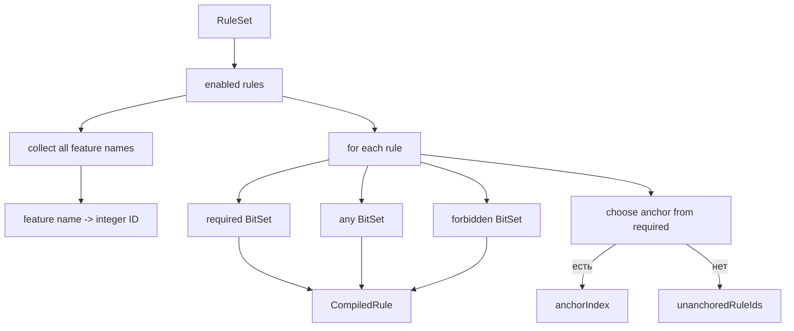
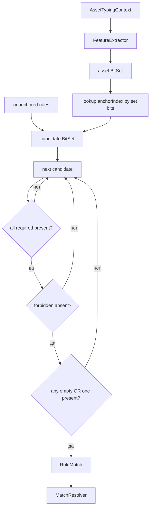
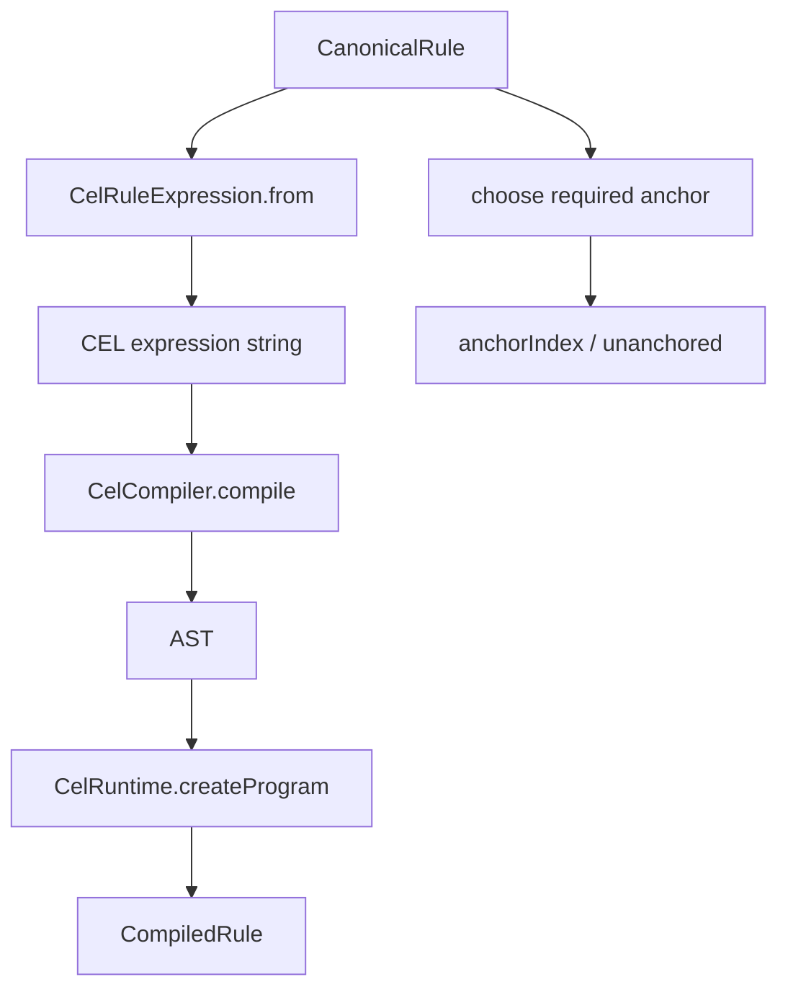
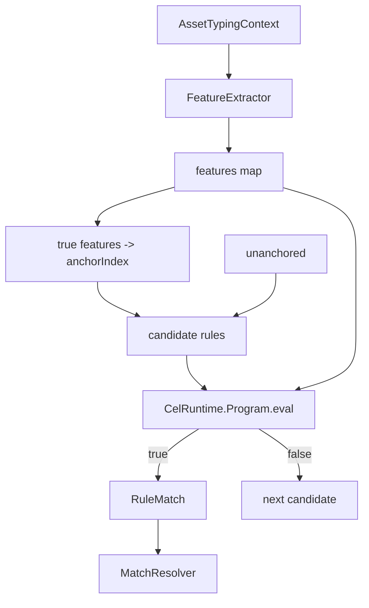
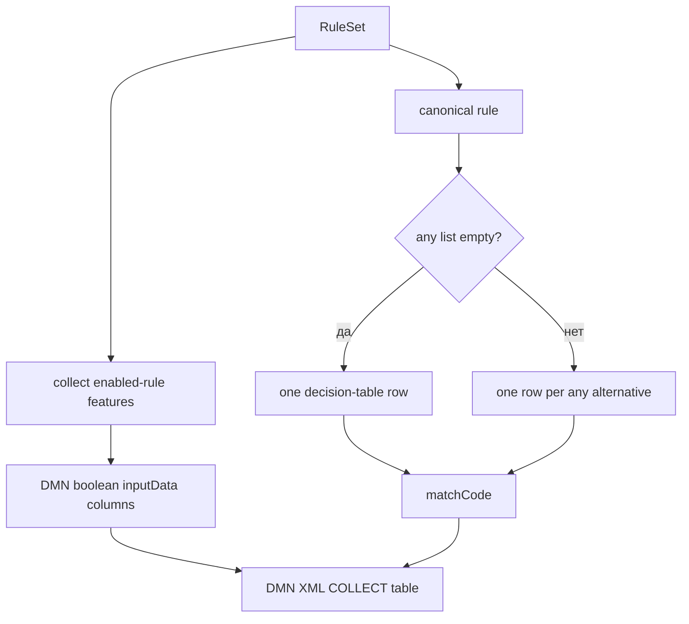
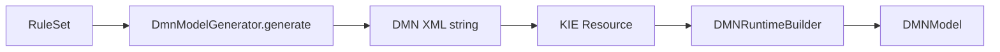
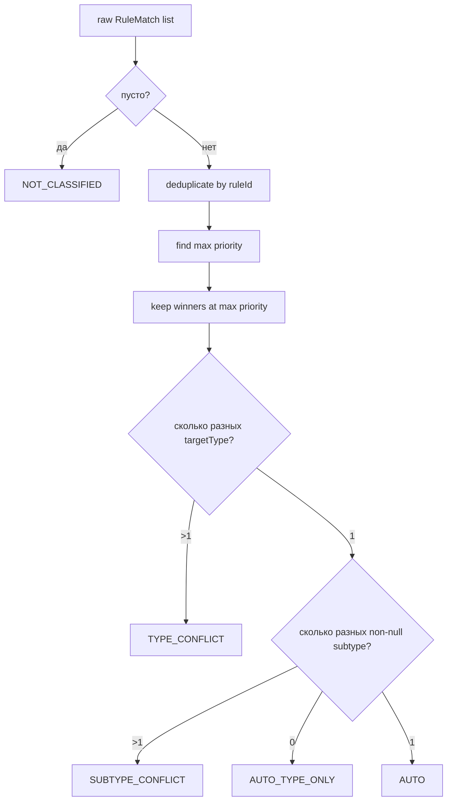

# Подробная реализация движков

[English](ENGINE_IMPLEMENTATION.md) · **Русский**

Этот документ описывает, как один и тот же `RuleSet` реально преобразуется и исполняется тремя адаптерами. Полный путь CLI/data/rules/reports находится в [IMPLEMENTATION_RU.md](IMPLEMENTATION_RU.md), а верхнеуровневая схема — в [ARCHITECTURE_RU.md](ARCHITECTURE_RU.md).

## Общий контракт

Все движки реализуют:

```java
public interface TypingEngine {
    String name();
    TypingResult classify(AssetTypingContext context);
}
```

Общие для всех движков части:

1. один `RuleSet` из `rules/canonical-rules.yaml`;
2. один `FeatureExtractor` с одинаковыми 22 features;
3. промежуточный `RuleMatch(ruleId, targetType, targetSubtype, priority)`;
4. один `MatchResolver.resolve(...)`;
5. один формат `TypingResult`.

Различается только этап **«какие правила совпали»**.


---

## 1. HashMap + BitSet

Файл: `src/main/java/ru/itam/typing/engine/bitset/BitSetTypingEngine.java`.

### Фаза подготовки

Конструктор проходит только enabled rules и собирает все признаки из `required`, `any`, `forbidden` в отсортированное множество. Каждому имени признака назначается integer ID.

Затем каждое правило компилируется во внутренний `CompiledRule`:

```text
CanonicalRule
  ├─ required[]   -> BitSet required
  ├─ any[]        -> BitSet any
  ├─ forbidden[]  -> BitSet forbidden
  └─ one required feature -> anchor
```

Anchor выбирается только из `required` по фиксированному рангу:

```text
0: OBJ_*
1: KSC_* / NMAP_*
2: OS_* / *HINT*
3: SRC_*
4: остальные
```

При одинаковом ранге используется лексикографический порядок. Правила без `required` становятся `unanchored`.

После этого строится:

```text
anchorIndex: featureId -> [compiledRuleIndex...]
unanchoredRuleIds: [compiledRuleIndex...]
```



### Классификация одного актива

1. `FeatureExtractor.extract(context)` создаёт `Map<String, Boolean>`.
2. Все true features переводятся в один asset `BitSet`.
3. Для каждого установленного feature bit берутся правила из `anchorIndex`.
4. Добавляются все unanchored rules.
5. Для каждого кандидата выполняются три проверки масок.

Проверка required:

```text
missingRequired = required - asset
match только если missingRequired пуст
```

Проверка forbidden:

```text
forbiddenPresent = forbidden ∩ asset
match только если forbiddenPresent пуст
```

Проверка any:

```text
если any не пуст:
    anyPresent = any ∩ asset
    match только если anyPresent не пуст
```



### Что оптимизируется

BitSet-вариант заранее переводит имена признаков в integer IDs и наборы признаков в компактные masks. Кроме того, он не проверяет каждый enabled rule безусловно: candidate set формируется по одному required anchor на правило плюс unanchored rules.

Это специализированная реализация под текущую модель boolean features и canonical rule semantics.

---

## 2. CEL

Файлы:

- `src/main/java/ru/itam/typing/engine/cel/CelRuleExpression.java`;
- `src/main/java/ru/itam/typing/engine/cel/CelTypingEngine.java`.

### Генерация выражения

`CelRuleExpression.from(rule)` переводит canonical rule в boolean expression над переменной:

```text
features: map<string, bool>
```

Семантика преобразования:

```text
required A, B    -> features["A"] && features["B"]
forbidden C      -> !features["C"]
any D, E         -> (features["D"] || features["E"])
```

Все части объединяются через `&&`. Полностью пустое условие превращается в `true`.

### Фаза подготовки

Конструктор создаёт CEL compiler с переменной `features` типа `map<string,bool>` и ожидаемым результатом `bool`, а также runtime.

Для каждого enabled rule:

1. строится expression string;
2. compiler создаёт AST;
3. runtime создаёт `CelRuntime.Program`;
4. program сохраняется в `CompiledRule` и повторно не компилируется при каждом asset;
5. строится anchor index.

Anchor policy у CEL совпадает с BitSet: `OBJ_*` → `KSC_/NMAP_` → `OS_/HINT` → `SRC_` → остальные. Правила без required остаются unanchored.



### Классификация одного актива

1. общий extractor создаёт feature map;
2. по true features формируется candidate BitSet через string `anchorIndex`;
3. добавляются unanchored rules;
4. для каждого кандидата вызывается `program.eval(Map.of("features", features))`;
5. boolean `true` превращается в `RuleMatch`;
6. matches передаются в общий resolver.



### Ключевое отличие от BitSet

Candidate selection похож, но финальное условие исполняет CEL runtime, а не прямые BitSet-операции Java. За счёт этого rule condition существует как декларативное выражение, но появляется стоимость CEL program evaluation.

---

## 3. DMN / Apache KIE

Файлы:

- `src/main/java/ru/itam/typing/engine/dmn/DmnModelGenerator.java`;
- `src/main/java/ru/itam/typing/engine/dmn/DmnTypingEngine.java`.

### Генерация DMN-модели

`DmnModelGenerator` собирает все features из enabled rules и создаёт DMN XML.

Модель содержит:

- один boolean `inputData` на feature;
- decision `MatchedRules`;
- decision table с `hitPolicy="COLLECT"`;
- один output `matchCode` типа string.

Для каждого canonical rule формируется строка таблицы. Значения колонок:

```text
required feature  -> true
forbidden feature -> false
неиспользуемая    -> -
```

`any` реализуется разворачиванием одного canonical rule в несколько DMN rows: по одной строке на каждый any-feature. Поэтому одно canonical rule потенциально может вернуться несколько раз; общий `MatchResolver` затем дедуплицирует совпадения по `ruleId`.

Output кодируется как:

```text
ruleId|targetType|targetSubtype|priority
```



### Загрузка KIE runtime

`DmnTypingEngine` генерирует XML в конструкторе, оборачивает его в KIE `Resource`, создаёт `DMNRuntime`, получает модель по namespace/model name и останавливает создание движка, если модель не загрузилась или содержит ошибки.



### Классификация одного актива

1. extractor формирует feature map;
2. создаётся новый `DMNContext`;
3. каждый feature записывается в DMN context как boolean variable;
4. выполняется `runtime.evaluateAll(model, dmnContext)`;
5. берётся decision result `MatchedRules`;
6. collection output разбирается обратно в `RuleMatch` через `matchCode`;
7. список передаётся в `MatchResolver`.

```mermaid
flowchart TD
    C[AssetTypingContext] --> F[FeatureExtractor]
    F --> M[features map]
    M --> DC[DMNContext]
    DC --> E[runtime.evaluateAll]
    MODEL[DMNModel] --> E
    E --> DR[MatchedRules decision result]
    DR --> CODE[matchCode collection]
    CODE --> PARSE[split ruleId|type|subtype|priority]
    PARSE --> RM[RuleMatch list]
    RM --> RES[MatchResolver]
```

### Ключевое отличие от первых двух

В текущей реализации DMN не использует отдельный Java candidate index. Совпадение определяется исполнением сгенерированной DMN decision table через Apache KIE runtime. Это наиболее стандартизованное представление решения из трёх, но также самый тяжёлый execution path в измеренном workload.

---

## 4. Общий MatchResolver

Файл: `src/main/java/ru/itam/typing/engine/common/MatchResolver.java`.

Все три движка заканчивают работу одинаково: они передают resolver список `RuleMatch`.

Порядок обработки строго следующий:



Детали:

- дубликаты rule ID схлопываются до одного совпадения;
- учитываются только правила с максимальным `priority`;
- winners сортируются по `ruleId`, поэтому `matchedRuleIds` детерминированы;
- type conflict возвращает `type=null`, `subtype=null`;
- subtype conflict сохраняет общий type, но возвращает `subtype=null`;
- отсутствие subtype у единственного типа даёт `AUTO_TYPE_ONLY`;
- один type + один subtype даёт `AUTO`.

## Сводное сравнение execution path

| Этап | HashMap + BitSet | CEL | DMN / KIE |
|:--|:--|:--|:--|
| Rule source | canonical YAML | canonical YAML | canonical YAML |
| Подготовка условия | BitSet masks | CEL expression + AST/program | DMN XML rows |
| Candidate index | да | да | нет отдельного Java index |
| Единица исполнения | BitSet operations | `CelRuntime.Program.eval` | KIE DMN decision table |
| Any-of | BitSet intersection | `||` expression | expansion в несколько rows |
| Выход движка | `RuleMatch` | `RuleMatch` | `matchCode` → `RuleMatch` |
| Conflict semantics | общий `MatchResolver` | общий `MatchResolver` | общий `MatchResolver` |

Именно поэтому benchmark сравнивает три **execution representations** при одинаковых входах, признаках, правилах и финальной семантике результата.