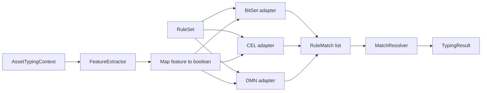
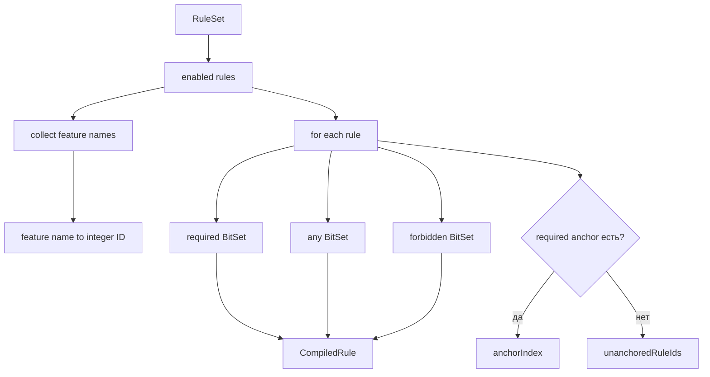
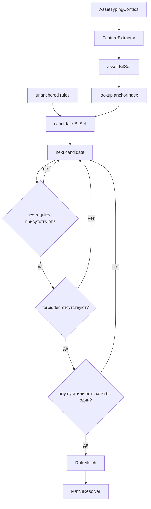
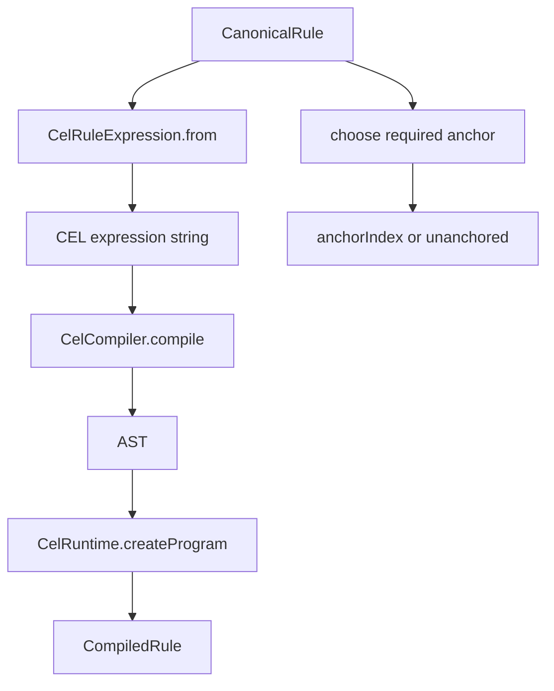
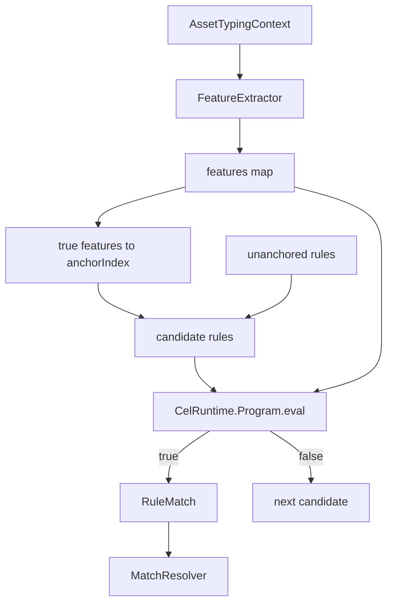
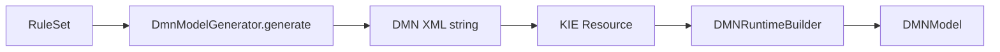
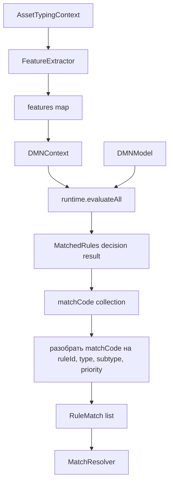
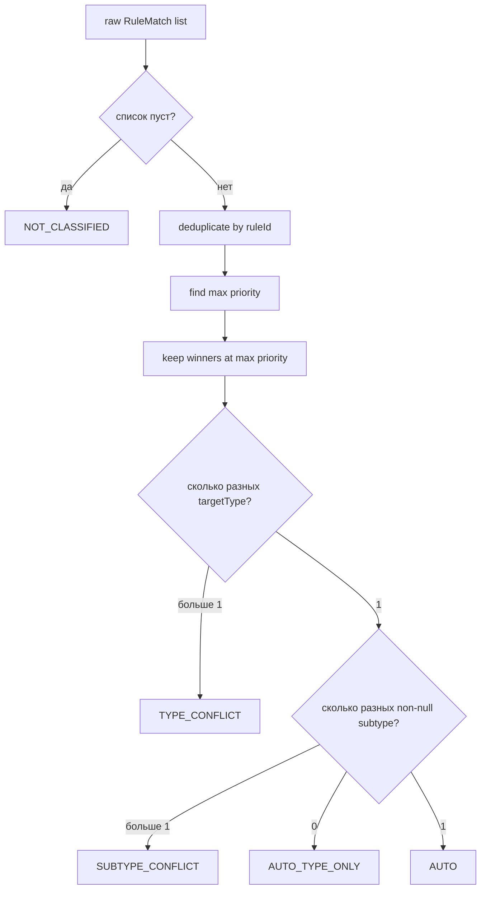

# Подробная реализация движков

[English](ENGINE_IMPLEMENTATION.md) · **Русский**

Этот документ описывает, как один и тот же `RuleSet` преобразуется и исполняется тремя адаптерами. Полный путь CLI/data/rules/reports находится в [IMPLEMENTATION_RU.md](IMPLEMENTATION_RU.md), а верхнеуровневая схема — в [ARCHITECTURE_RU.md](ARCHITECTURE_RU.md).

## Общий контракт

Все движки реализуют один интерфейс:

```java
public interface TypingEngine {
    String name();
    TypingResult classify(AssetTypingContext context);
}
```

Общие части для всех движков:

1. один `RuleSet` из `rules/canonical-rules.yaml`;
2. один `FeatureExtractor` и одинаковые 22 признака;
3. один промежуточный формат `RuleMatch(ruleId, targetType, targetSubtype, priority)`;
4. один `MatchResolver.resolve(...)`;
5. один формат `TypingResult`.

Различается только этап **определения совпавших правил**.



---

## 1. HashMap + BitSet

Файл: `src/main/java/ru/itam/typing/engine/bitset/BitSetTypingEngine.java`.

### Фаза подготовки

Конструктор проходит enabled rules и собирает признаки из `required`, `any`, `forbidden`. Каждому признаку назначается integer ID. Затем правило компилируется во внутренний `CompiledRule` с тремя `BitSet`: `required`, `any`, `forbidden`.

Anchor выбирается только из `required` по фиксированному рангу:

```text
0: OBJ_*
1: KSC_* / NMAP_*
2: OS_* / *HINT*
3: SRC_*
4: остальные
```

При одинаковом ранге используется лексикографический порядок. Правила без `required` становятся `unanchored`.

```text
anchorIndex: featureId -> [compiledRuleIndex...]
unanchoredRuleIds: [compiledRuleIndex...]
```



### Классификация одного актива

1. `FeatureExtractor.extract(context)` создаёт `Map<String, Boolean>`.
2. Все true-признаки переводятся в asset `BitSet`.
3. По установленным битам выбираются candidate rules через `anchorIndex`.
4. Добавляются `unanchored` rules.
5. Для каждого кандидата проверяются маски `required`, `forbidden`, `any`.



BitSet-вариант оптимизирует представление признаков и candidate selection. Это специализированная реализация под boolean-feature модель текущего benchmark.

---

## 2. CEL

Файлы:

- `src/main/java/ru/itam/typing/engine/cel/CelRuleExpression.java`;
- `src/main/java/ru/itam/typing/engine/cel/CelTypingEngine.java`.

### Генерация выражений

`CelRuleExpression.from(rule)` переводит canonical rule в boolean expression над `features: map<string, bool>`.

```text
required A, B    -> features["A"] && features["B"]
forbidden C      -> !features["C"]
any D, E         -> (features["D"] || features["E"])
```

Все части объединяются через `&&`. Пустое условие становится `true`.

### Фаза подготовки

Для каждого enabled rule:

1. строится expression string;
2. CEL compiler создаёт AST;
3. runtime создаёт `CelRuntime.Program`;
4. program кэшируется в `CompiledRule`;
5. правило добавляется в candidate anchor index.

Anchor policy совпадает с BitSet.



### Классификация одного актива



Candidate selection похож на BitSet, но финальное условие исполняется CEL runtime, а не прямыми Java BitSet-операциями.

---

## 3. DMN / Apache KIE

Файлы:

- `src/main/java/ru/itam/typing/engine/dmn/DmnModelGenerator.java`;
- `src/main/java/ru/itam/typing/engine/dmn/DmnTypingEngine.java`.

### Генерация DMN-модели

`DmnModelGenerator` собирает признаки из enabled rules и создаёт DMN XML. Модель содержит boolean `inputData` на каждый feature, decision `MatchedRules`, decision table с `hitPolicy="COLLECT"` и string output `matchCode`.

Для canonical rule:

```text
required feature  -> true
forbidden feature -> false
неиспользуемая    -> -
```

`any` разворачивается в несколько DMN rows — по одной строке на альтернативу. Поэтому одно canonical rule может вернуться несколько раз; `MatchResolver` затем дедуплицирует совпадения по `ruleId`.

`matchCode` имеет формат:

```text
ruleId|targetType|targetSubtype|priority
```


### Загрузка KIE runtime



Если модель не загрузилась или содержит ошибки, создание `DmnTypingEngine` завершается ошибкой.

### Классификация одного актива

1. extractor формирует feature map;
2. создаётся новый `DMNContext`;
3. каждый feature записывается в context как boolean variable;
4. выполняется `runtime.evaluateAll(model, dmnContext)`;
5. берётся decision result `MatchedRules`;
6. collection output разбирается в `RuleMatch` через `matchCode`;
7. список передаётся в `MatchResolver`.



Здесь исправлена важная деталь Mermaid: символ `|` из фактического формата `matchCode` не помещается внутрь подписи узла, потому что GitHub Mermaid воспринимает его как синтаксический разделитель. Сам фактический формат данных остаётся `ruleId|targetType|targetSubtype|priority`.

### Ключевое отличие от первых двух

DMN не использует отдельный Java candidate index. Совпадение определяется исполнением сгенерированной DMN decision table через Apache KIE runtime.

---

## 4. Общий MatchResolver

Файл: `src/main/java/ru/itam/typing/engine/common/MatchResolver.java`.

Все три движка передают resolver список `RuleMatch`.



Порядок обработки:

- дубликаты `ruleId` схлопываются;
- остаются только совпадения с максимальным `priority`;
- winners сортируются по `ruleId`;
- несколько типов дают `TYPE_CONFLICT`;
- один тип и несколько subtype дают `SUBTYPE_CONFLICT`;
- один тип без subtype даёт `AUTO_TYPE_ONLY`;
- один тип и один subtype дают `AUTO`.

## Сводное сравнение execution path

| Этап | HashMap + BitSet | CEL | DMN / KIE |
|:--|:--|:--|:--|
| Rule source | canonical YAML | canonical YAML | canonical YAML |
| Подготовка условия | BitSet masks | CEL expression + AST/program | DMN XML rows |
| Candidate index | да | да | нет отдельного Java index |
| Единица исполнения | BitSet operations | `CelRuntime.Program.eval` | KIE DMN decision table |
| Any-of | BitSet intersection | `||` expression | expansion в несколько rows |
| Выход движка | `RuleMatch` | `RuleMatch` | `matchCode` → `RuleMatch` |
| Conflict semantics | общий `MatchResolver` | общий `MatchResolver` | общий `MatchResolver` |

Benchmark сравнивает три разные **execution representations** при одинаковых входах, признаках, правилах и финальной семантике разрешения конфликтов.
