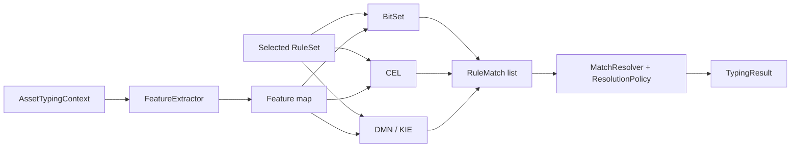

# Подробная реализация движков

[English](ENGINE_IMPLEMENTATION.md) · **Русский**

Документ описывает, как один выбранный `RuleSet` исполняется тремя рабочими адаптерами и как независимый reference evaluator используется в research acceptance.

## Общий контракт

Три сравниваемых адаптера реализуют `TypingEngine`:

```java
public interface TypingEngine {
    String name();
    TypingResult classify(AssetTypingContext context);
}
```

BitSet и CEL также поддерживают feature-map execution path для research tooling.

Общими остаются:

1. один выбранный `RuleSet` на запуск;
2. одна детерминированная semantic feature map из `FeatureExtractor`;
3. единый `RuleMatch(ruleId, targetType, targetSubtype, priority)`;
4. один API `MatchResolver` с явным `ResolutionPolicy`;
5. один формат `TypingResult`.

Текущая feature map — надмножество исходных baseline-признаков. `canonical-rules.yaml` по-прежнему использует исторический baseline-набор, а research ruleset могут дополнительно использовать `SOFTWARE_CATEGORY_*`.



## 1. HashMap + BitSet

Файл: `src/main/java/ru/itam/typing/engine/bitset/BitSetTypingEngine.java`.

### Подготовка

Для enabled rules конструктор собирает все используемые признаки и назначает им integer ID. Каждое правило компилируется в BitSet masks `required`, `any` и `forbidden`.

Из required features выбирается anchor для candidate index. Правила без required features остаются unanchored и всегда допускаются к проверке.

```text
anchorIndex: featureId -> [compiledRuleIndex...]
unanchoredRuleIds: [compiledRuleIndex...]
```

### Выполнение на активе

1. Извлечь признаки.
2. Преобразовать истинные используемые признаки в asset BitSet.
3. Выбрать candidate rules через `anchorIndex` и добавить unanchored rules.
4. Проверить required/forbidden/any masks.
5. Сформировать `RuleMatch`.
6. Передать совпадения в resolver с настроенным `ResolutionPolicy`.

Конструктор по умолчанию использует `LEGACY_MAX_PRIORITY`; research runners могут явно передать conservative policy.

## 2. CEL

Файлы:

- `src/main/java/ru/itam/typing/engine/cel/CelRuleExpression.java`;
- `src/main/java/ru/itam/typing/engine/cel/CelTypingEngine.java`.

`CelRuleExpression` преобразует каноническое правило в boolean expression над `features: map<string, bool>`.

```text
required A, B -> features["A"] && features["B"]
forbidden C   -> !features["C"]
any D, E      -> (features["D"] || features["E"])
```

Для каждого enabled rule CEL компилирует и кэширует runtime program. Адаптер также использует application-level candidate index по required feature, поэтому на активе выполняются только candidate programs.

Совпадения приводятся к тому же `RuleMatch` и обрабатываются тем же настроенным resolver policy, что и BitSet.

## 3. DMN / Apache KIE

Файлы:

- `src/main/java/ru/itam/typing/engine/dmn/DmnModelGenerator.java`;
- `src/main/java/ru/itam/typing/engine/dmn/DmnTypingEngine.java`.

Генератор создаёт DMN model с boolean input columns и decision table с hit policy `COLLECT`. Канонический `any` может разворачиваться в несколько строк. Возвращённый match code преобразуется обратно в rule ID, type, subtype и priority; дубликаты rule ID затем схлопываются resolver-ом.

В отличие от BitSet и CEL, у DMN нет отдельного Java candidate index: matching выполняется внутри Apache KIE DMN runtime.

DMN-конструктор по умолчанию также остаётся legacy-совместимым; research path может передать тот же conservative `ResolutionPolicy`, что используется другими адаптерами.

## 4. Reference linear evaluator

Файл: `src/main/java/ru/itam/typing/engine/reference/ReferenceTypingEngine.java`.

Reference evaluator нужен для уменьшения риска общего дефекта в research acceptance. Он напрямую проходит selected ruleset и не переиспользует BitSet/CEL candidate-index implementation или DMN runtime path.

Он используется для correctness comparison и не является четвёртым performance-конкурентом.

## 5. MatchResolver и ResolutionPolicy

Файлы:

- `src/main/java/ru/itam/typing/engine/common/MatchResolver.java`;
- `src/main/java/ru/itam/typing/engine/common/ResolutionPolicy.java`.

### Legacy policy

`LEGACY_MAX_PRIORITY` имеет `conflictPriorityWindow=0` и сохраняет исходную семантику:

1. дедупликация по `ruleId`;
2. поиск максимального priority;
3. сохранение winners с максимальным priority;
4. несколько типов среди winners -> `TYPE_CONFLICT`;
5. один тип и несколько подтипов -> `SUBTYPE_CONFLICT`;
6. тип без подтипа -> `AUTO_TYPE_ONLY`;
7. один type/subtype -> `AUTO`.

### Conservative policy

`CONSERVATIVE_NEAR_PRIORITY` дополнительно рассматривает правила, для которых:

```text
priority >= maxPriority - conflictPriorityWindow
```

Если достаточно сильные близкие по приоритету evidence содержат несколько типов, получается `TYPE_CONFLICT`. Если они содержат несколько non-null подтипов одного типа, получается `SUBTYPE_CONFLICT`.

Если близкого противоречия нет, финальный подтип по-прежнему определяется историческими max-priority winners. Более слабое evidence никогда не повышает подтип до победителя.

Завершённый research sweep выбрал и независимый confirmation подтвердил:

```text
conflictPriorityWindow = 80
```

Это один порог противоречия, а не набор весов источников или производителей.

## Сравнение execution path

| Этап | HashMap + BitSet | CEL | DMN / KIE | Reference |
|:--|:--|:--|:--|:--|
| Источник правил | selected YAML | selected YAML | selected YAML | selected YAML |
| Подготовка | masks + index | CEL programs + index | generated DMN model | direct rule structures |
| Candidate index | да | да | отдельного Java index нет | нет |
| Выполнение правил | BitSet operations | CEL runtime | KIE DMN table | linear Java checks |
| Выход | `RuleMatch` | `RuleMatch` | match code -> `RuleMatch` | `RuleMatch` |
| Resolution semantics | configured policy | configured policy | configured policy | независимо повторены для acceptance |
| Участие в performance benchmark | да | да | да | нет |

## Обратная совместимость

Исходный canonical benchmark сохранён, потому что:

- `rules/canonical-rules.yaml` не изменён;
- исходные software subtype остаются в `AssetSubtype`;
- исторический `SECURITY_SOFTWARE_HINT` сохранён;
- конструкторы движков без явного policy используют `LEGACY_MAX_PRIORITY`;
- baseline verification и controlled performance artifacts отделены от research results.

## Ограничение выводов

Это конкретные адаптеры, а не универсальный рейтинг BitSet, CEL или DMN как технологий. Performance-выводы относятся только к реализациям, rules, data и environment, зафиксированным в репозитории.

Измеренные результаты приведены в [RESEARCH_SUMMARY_RU.md](RESEARCH_SUMMARY_RU.md), baseline timing boundaries — в [METHODOLOGY_RU.md](METHODOLOGY_RU.md).