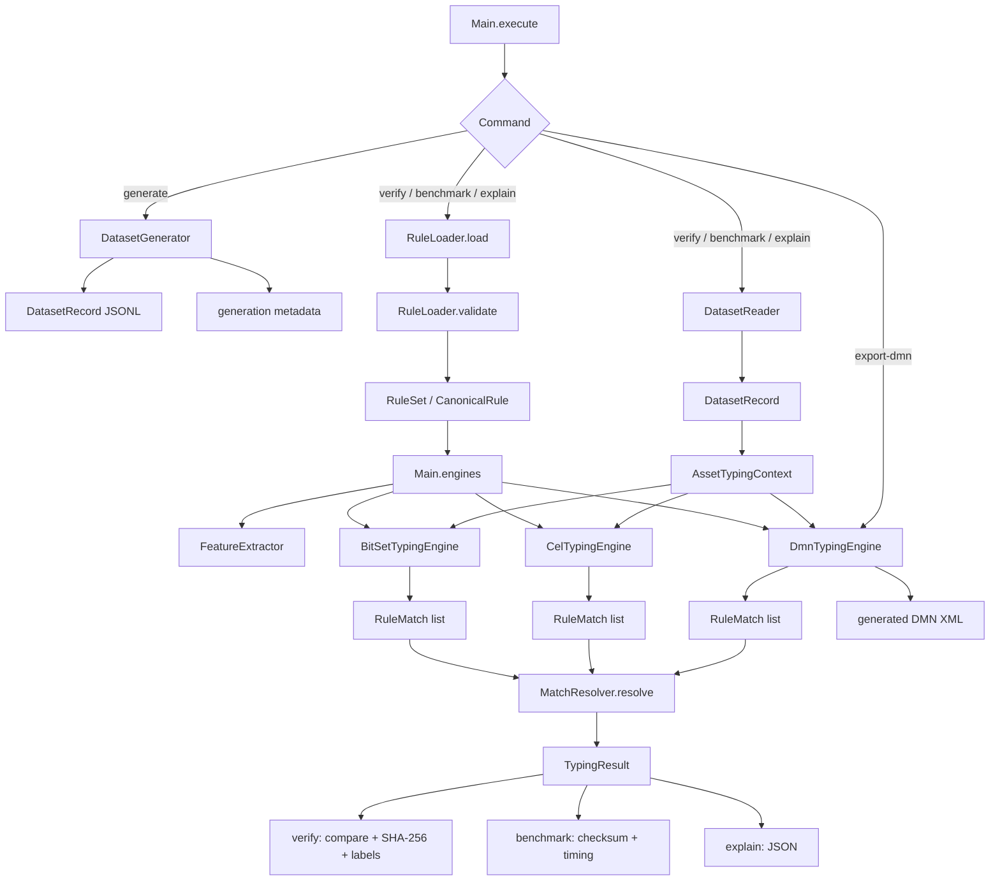
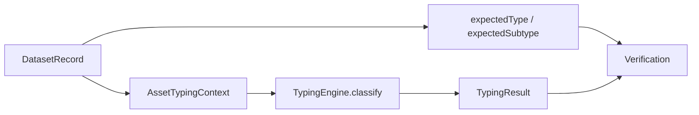
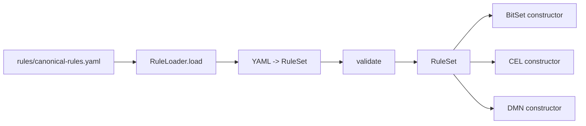
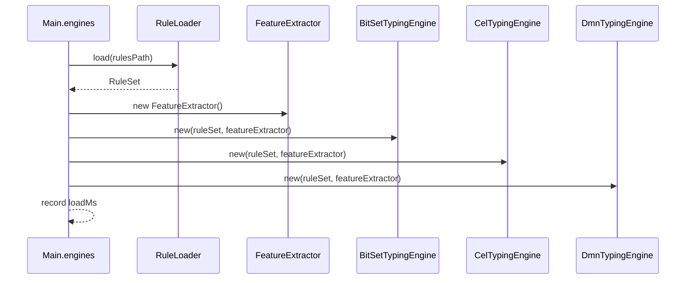
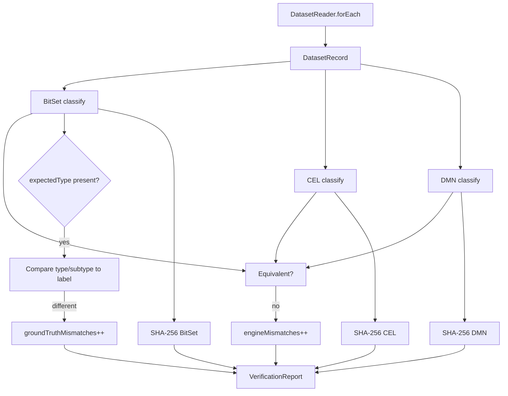
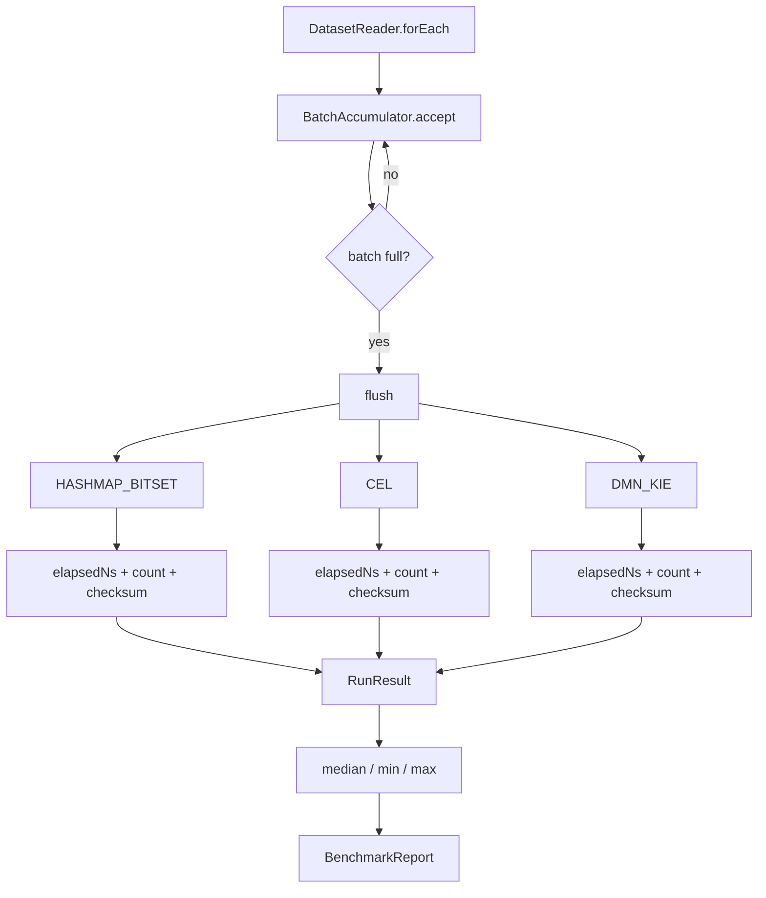

# Detailed software implementation

**English** · [Русский](IMPLEMENTATION_RU.md)

This page describes the actual class/module execution path of the current implementation rather than only the experiment concept. The high-level architecture is in [ARCHITECTURE.md](ARCHITECTURE.md); internals of the three execution engines are documented separately in [ENGINE_IMPLEMENTATION.md](ENGINE_IMPLEMENTATION.md).

## Package map

```text
src/main/java/ru/itam/typing/
├── cli/
│   └── Main.java
├── data/
│   ├── DatasetGenerator.java
│   └── DatasetReader.java
├── engine/
│   ├── TypingEngine.java
│   ├── bitset/BitSetTypingEngine.java
│   ├── cel/CelRuleExpression.java
│   ├── cel/CelTypingEngine.java
│   ├── common/MatchResolver.java
│   ├── dmn/DmnModelGenerator.java
│   └── dmn/DmnTypingEngine.java
├── features/
│   └── FeatureExtractor.java
├── model/
│   ├── AssetType.java
│   ├── AssetSubtype.java
│   ├── AssetTypingContext.java
│   ├── DatasetRecord.java
│   ├── RuleMatch.java
│   ├── TypingResult.java
│   └── TypingStatus.java
└── rules/
    ├── CanonicalRule.java
    ├── RuleLoader.java
    └── RuleSet.java
```

## Complete runtime flow



`Main` is the orchestration layer: it parses CLI arguments, loads rules, creates one `FeatureExtractor` and all three engines, reads datasets and emits reports. `TypingEngine` defines the shared `name()` + `classify(AssetTypingContext)` contract.

## Input and output model

`DatasetRecord` contains an `AssetTypingContext` plus expected `expectedType` / `expectedSubtype` labels. The context contains `assetId`, `sources`, `sourceObjectKinds`, `attributes` and `systemParameters`.

`TypingResult` contains `assetId`, final `type`, `subtype`, `status` and `matchedRuleIds`.



## Rule loading and validation

The single rule source is `rules/canonical-rules.yaml`. `RuleLoader` deserializes YAML into `RuleSet` and validates it before any engine is created.

Validation checks ruleset version, non-empty and unique rule IDs, required target type, and that a feature is not simultaneously required and forbidden. `CanonicalRule` stores rule ID, target type/subtype, priority, required/any/forbidden feature lists and enabled state. Null feature lists are normalized to empty immutable lists.



## Feature extraction

Every `classify` call invokes the same `FeatureExtractor`. It creates the same map of 22 known boolean features from `sources`, `sourceObjectKinds` and context attributes.

Examples include source flags such as `SRC_AD`; object-kind flags such as `OBJ_AD_USER`; service-account hints; OS flags; KSC workstation/server flags; Nmap network/general-purpose flags; and a security-software hint.

All three engines therefore receive the same semantic feature map. They differ only in how the canonical rules are executed afterward.

## Engine construction

`Main.engines()` executes the following sequence:



Canonical-rule loading time and each engine constructor time are recorded separately in `engineLoadMs`; they are outside per-engine classification timing.

## `generate`

`Main.generate()` calls `DatasetGenerator.generate(count, seed, out)`, writes JSONL and stores a separate `<dataset>.meta.json` generation summary.

## `verify`

Verification constructs all engines once and streams the dataset through `DatasetReader.forEach`.

For each record it executes all three engines, compares type/subtype/status plus the sorted set of matched rule IDs, updates a separate SHA-256 result digest per engine, and checks generator labels when present. Up to 20 diagnostic samples are retained for mismatches.



`PASS` requires a non-empty dataset, zero engine mismatches and zero generator-label mismatches. `FAIL` returns exit code `2`.

The generator-label check is performed directly against the BitSet result; CEL and DMN are covered by the separate differential comparison. Therefore a PASS means all engines agree and the BitSet result agrees with the generator labels.

## `benchmark`

Benchmark also creates engines once. `DatasetReader.first` loads a warmup prefix of `min(max, batch, 5000)`. Warmup runs all engines but is not included in measured results.

Measured runs use `BatchAccumulator`:



Inside `flush()`, each engine timer covers iteration over an already parsed batch, including `engine.classify(record.context())`, `resultHash()` and XOR checksum bookkeeping. JSONL parsing happens outside that timer. Engine order is fixed as `HASHMAP_BITSET → CEL → DMN_KIE`.

Each measured run stores count, elapsed nanoseconds, assets/s, ns/asset and checksum. Summary reports median throughput and ns/asset plus min/max throughput.

## `explain` and `export-dmn`

`explain` locates one asset by `assetId`, prints its 22 extracted features and all three engine results. It is a diagnostic path, not a separate classifier.

`export-dmn` constructs the same `DmnTypingEngine` used by verify/benchmark and writes its `generatedDmn()` string, so the exported table corresponds to the KIE model generated from that ruleset.

## Class responsibility matrix

| Class | Responsibility |
|:--|:--|
| `Main` | CLI orchestration, engine lifecycle, verify, benchmark, provenance, reports |
| `DatasetGenerator` | deterministic synthetic dataset generation |
| `DatasetReader` | streaming JSONL reader and warmup-prefix reader |
| `AssetTypingContext` | normalized classification input |
| `DatasetRecord` | context + expected labels |
| `FeatureExtractor` | context → 22 boolean features |
| `RuleLoader` | YAML loading and basic rule validation |
| `RuleSet` / `CanonicalRule` | canonical in-memory rule model |
| `TypingEngine` | common engine interface |
| `BitSetTypingEngine` | masks + candidate index + BitSet evaluation |
| `CelRuleExpression` | canonical rule → CEL expression |
| `CelTypingEngine` | compile/cache CEL programs + candidate evaluation |
| `DmnModelGenerator` | canonical rules → DMN XML decision table |
| `DmnTypingEngine` | load/evaluate DMN through Apache KIE |
| `RuleMatch` | intermediate matched-rule representation |
| `MatchResolver` | shared priority/conflict resolution semantics |
| `TypingResult` | final classification result |

## Out of scope of this implementation

The current benchmark does not contain live AD/Nmap/KSC/Zabbix/SIEM connectors, a persistence layer, ITAM API, queues, background service, asset deduplication or multithreaded production serving. Raw source samples illustrate formats; the benchmark executes on normalized synthetic JSONL.

For the internals of **HashMap + BitSet, CEL and DMN/KIE**, continue with [ENGINE_IMPLEMENTATION.md](ENGINE_IMPLEMENTATION.md).