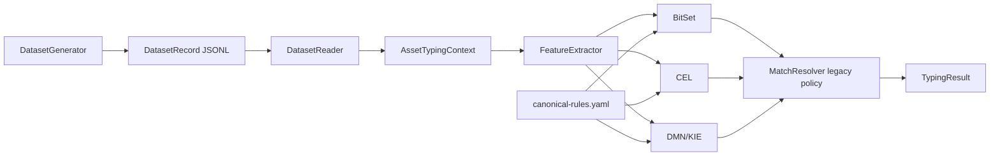
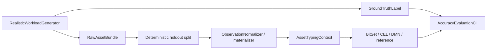

# Detailed software implementation

**English** · [Русский](IMPLEMENTATION_RU.md)

This page describes the current codebase after completion of `research/realistic-workload-v2`. The stable baseline CLI is still present and backwards-compatible; the research track adds source-shaped workloads, independent ground truth, additional rule sets, conservative resolution and software-taxonomy evaluation.

For the high-level view see [ARCHITECTURE.md](ARCHITECTURE.md). Engine internals are documented in [ENGINE_IMPLEMENTATION.md](ENGINE_IMPLEMENTATION.md).

## Package map

```text
src/main/java/ru/itam/typing/
├── cli/
│   └── Main.java
├── data/
│   ├── DatasetGenerator.java
│   └── DatasetReader.java
├── engine/
│   ├── TypingEngine.java
│   ├── FeatureMapTypingEngine.java
│   ├── bitset/BitSetTypingEngine.java
│   ├── cel/CelTypingEngine.java
│   ├── dmn/DmnTypingEngine.java
│   ├── common/MatchResolver.java
│   ├── common/ResolutionPolicy.java
│   └── reference/ReferenceTypingEngine.java
├── features/
│   ├── FeatureExtractor.java
│   └── SoftwareEvidenceClassifier.java
├── model/
│   ├── AssetType.java
│   ├── AssetSubtype.java
│   ├── AssetTypingContext.java
│   ├── DatasetRecord.java
│   ├── RuleMatch.java
│   ├── TypingResult.java
│   └── TypingStatus.java
├── realistic/
│   ├── RealisticWorkloadCli.java
│   ├── RealisticWorkloadGenerator.java
│   ├── RealisticDatasetMaterializer.java
│   ├── ObservationNormalizer.java
│   ├── HoldoutSplitCli.java
│   ├── AccuracyEvaluationCli.java
│   ├── ResearchBenchmarkCli.java
│   ├── RuleSetScaler.java / RuleScaleCli.java
│   ├── SoftwareAmbiguityInjector.java
│   ├── SoftwareTaxonomyV3Generator.java
│   ├── SourceFixtureAdapters.java
│   └── SourceSchemaRegistry.java
└── rules/
    ├── CanonicalRule.java
    ├── RuleLoader.java
    └── RuleSet.java
```

JMH code is under `src/jmh/java/ru/itam/typing/bench/`.

## Stable baseline path

`ru.itam.typing.cli.Main` keeps the original commands:

- `generate`
- `verify`
- `benchmark`
- `explain`
- `export-dmn`

The baseline path loads `rules/canonical-rules.yaml`, creates one shared `FeatureExtractor`, constructs BitSet/CEL/DMN engines with the default legacy resolver policy, and processes normalized `DatasetRecord` JSONL.



The controlled baseline v2 preserves this execution model and records stronger runtime/environment provenance.

## Research workload path

The realistic track intentionally separates observations from labels.

`RealisticWorkloadGenerator` creates source-shaped `RawAssetBundle` records and separate `GroundTruthLabel` records. `HoldoutSplitCli` performs a deterministic label-independent 80/20 split. `RealisticDatasetMaterializer` and `ObservationNormalizer` convert holdout observations to `AssetTypingContext`.



The generator does not load the typing rules or `FeatureExtractor`; the classifier does not load the labelled catalog/ground-truth sidecar.

## Input models

`AssetTypingContext` remains the common engine input and contains:

- `assetId`
- `sources`
- `sourceObjectKinds`
- `attributes`
- `systemParameters`

Baseline `DatasetRecord` adds expected labels in the same record. The research track instead stores the expected answer separately as `GroundTruthLabel`.

## Feature extraction

`FeatureExtractor` returns a deterministic boolean feature map shared by BitSet, CEL and DMN.

The original baseline feature semantics remain intact for `canonical-rules.yaml`. The current extractor also emits research-only software features for `ksc:software_inventory_application`, including:

- `SOFTWARE_AMBIGUOUS_HINT`
- `SOFTWARE_CATEGORY_OPERATING_SYSTEM`
- `SOFTWARE_CATEGORY_OFFICE_SOFTWARE`
- `SOFTWARE_CATEGORY_BUSINESS_SOFTWARE`
- `SOFTWARE_CATEGORY_BROWSER`
- `SOFTWARE_CATEGORY_IDE`
- `SOFTWARE_CATEGORY_DATABASE_TOOL`
- `SOFTWARE_CATEGORY_DATABASE_SERVER`
- `SOFTWARE_CATEGORY_DESIGN_MODELING`
- `SOFTWARE_CATEGORY_SECURITY_SOFTWARE`
- `SOFTWARE_CATEGORY_CRYPTO_SOFTWARE`
- `SOFTWARE_CATEGORY_RUNTIME_PLATFORM`
- `SOFTWARE_CATEGORY_DEV_TOOL`
- `SOFTWARE_CATEGORY_UTILITY`
- `SOFTWARE_CATEGORY_COMMUNICATION`
- `SOFTWARE_CATEGORY_COMPONENT_AGENT`
- `SOFTWARE_CATEGORY_APPLICATION_SOFTWARE`

`SoftwareEvidenceClassifier` derives one software category from normalized inventory evidence such as name, family, package, install path, executables/services and platform. Insufficient evidence returns `null`, allowing the ruleset to choose type-only classification rather than inventing a subtype.

## Rule loading

`RuleLoader` loads YAML into `RuleSet` / `CanonicalRule` and validates rule IDs and rule structure before engine construction.

Main rule sets used by the repository are:

- `rules/canonical-rules.yaml` — stable baseline;
- generated scaled rule sets for 14/50/100/500-rule experiments;
- `rules/software-taxonomy-v3.yaml` — research software taxonomy.

All compared engines receive the exact same selected rule set for a run.

## Resolution

`MatchResolver` supports an explicit `ResolutionPolicy`.

Default constructors use `LEGACY_MAX_PRIORITY`, preserving the historical baseline behavior. Research runners can pass `ResolutionPolicy.conservative(window)`; the completed robustness/calibration track fixed the confirmed research value at `80`.

The conservative policy does not assign weights to AD/KSC/Nmap or vendors. It only widens the set of sufficiently strong contradictory matches considered before returning a confident subtype.

## Verification and acceptance

### Baseline

`verify` compares BitSet/CEL/DMN output equivalence and checks baseline generator labels. A valid PASS requires a non-empty dataset, zero engine mismatches and zero label mismatches.

### Research

`AccuracyEvaluationCli` additionally compares against separate ground truth and the independent `ReferenceTypingEngine`. Research runners validate source shape, deterministic holdout identity, engine divergences, decision-quality metrics and pre-declared gate criteria.

Large JSONL corpora and logs stay ignored. Compact JSON summaries, provenance and SHA-256 manifests can be committed.

## Performance paths

The repository contains three measurement scopes:

- baseline application benchmark in `Main`;
- research `END_TO_END` and `ENGINE_ONLY` measurements in `ResearchBenchmarkCli`;
- forked JMH cross-checks via Maven profile `-Pjmh`.

Performance observations are never used as correctness gates.

## Source-shaped fixtures

`SourceFixtureAdapters` and `SourceSchemaRegistry` validate controlled AD/Nmap/KSC/Zabbix/SIEM fixture shapes. `KscTypedChunkAdapter` handles typed KSC host payload details such as numeric IPv4 representation.

These classes support synthetic/protocol fidelity; they are not live connectors to customer infrastructure.

## Editable diagrams

The original baseline verify/benchmark SVG and draw.io flows remain under `docs/diagrams/`. They document the stable baseline CLI and are retained for reproducibility.

## Out of scope

The repository does not provide:

- a production ITAM API;
- live source connectors;
- database persistence;
- queues/background scheduling;
- asset deduplication/entity resolution;
- multithreaded production serving;
- production-accuracy claims.

For research results and non-claims see [RESEARCH_SUMMARY.md](RESEARCH_SUMMARY.md).