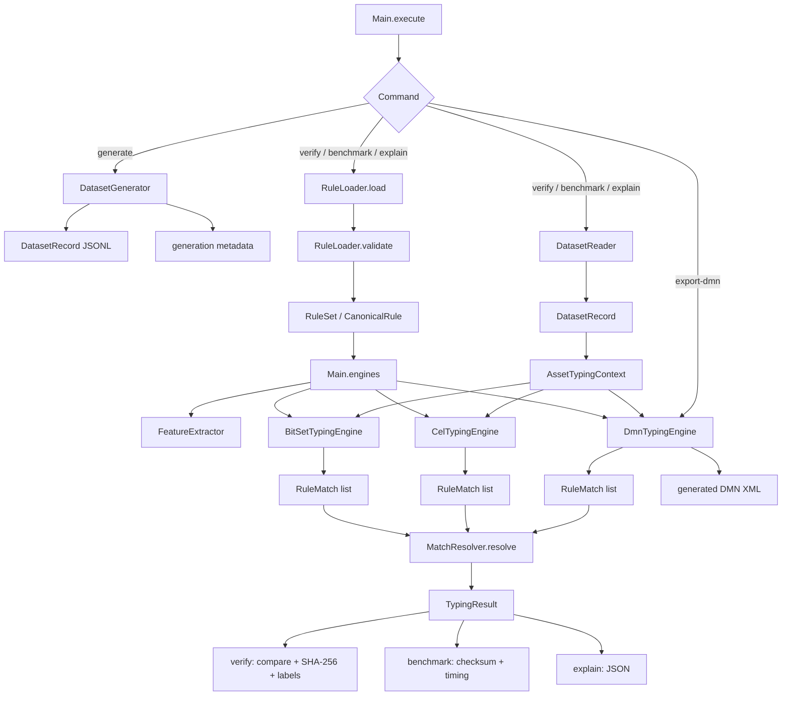
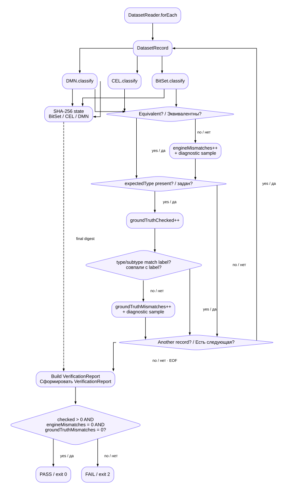
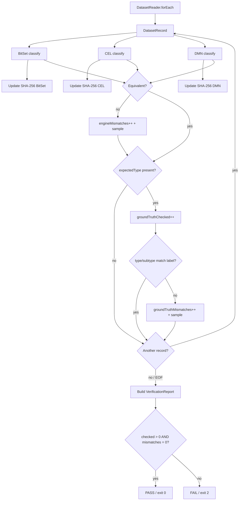
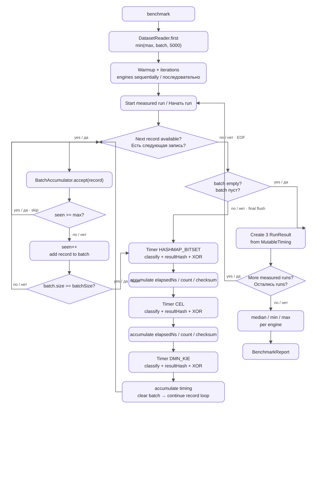

# Detailed software implementation

**English** · [Русский](IMPLEMENTATION_RU.md)

This page describes the actual class/module execution path of the current implementation. The high-level architecture is in [ARCHITECTURE.md](ARCHITECTURE.md), while the three engine internals are in [ENGINE_IMPLEMENTATION.md](ENGINE_IMPLEMENTATION.md).

For the two most branch-heavy flows, `verify` and `benchmark`, static SVG renderings and editable draw.io sources are stored next to the Mermaid source. The SVG files are intended as a fallback for GitHub clients that do not render Mermaid.

- `verify`: [SVG](diagrams/verify-flow.svg) · [draw.io](diagrams/verify-flow.drawio)
- `benchmark`: [SVG](diagrams/benchmark-flow.svg) · [draw.io](diagrams/benchmark-flow.drawio)

## Package map

```text
src/main/java/ru/itam/typing/
├── cli/
│   └── Main.java
├── data/
│   ├── DatasetGenerator.java
│   └── DatasetReader.java
├── engine/
│   ├── TypingEngine.java
│   ├── bitset/BitSetTypingEngine.java
│   ├── cel/CelRuleExpression.java
│   ├── cel/CelTypingEngine.java
│   ├── common/MatchResolver.java
│   ├── dmn/DmnModelGenerator.java
│   └── dmn/DmnTypingEngine.java
├── features/
│   └── FeatureExtractor.java
├── model/
│   ├── AssetType.java
│   ├── AssetSubtype.java
│   ├── AssetTypingContext.java
│   ├── DatasetRecord.java
│   ├── RuleMatch.java
│   ├── TypingResult.java
│   └── TypingStatus.java
└── rules/
    ├── CanonicalRule.java
    ├── RuleLoader.java
    └── RuleSet.java
```

## Complete runtime flow



`Main` is the orchestration layer: it parses CLI arguments, loads rules, creates one `FeatureExtractor` and all three engines, reads datasets and emits reports. `TypingEngine` defines the common `name()` + `classify(AssetTypingContext)` contract.

## Input and output model

`DatasetRecord` contains an `AssetTypingContext` plus expected `expectedType` / `expectedSubtype` labels. The context contains `assetId`, `sources`, `sourceObjectKinds`, `attributes` and `systemParameters`. `TypingResult` contains `assetId`, final `type`, `subtype`, `status` and `matchedRuleIds`.

## Rule loading and validation

The single rule source is `rules/canonical-rules.yaml`. `RuleLoader` deserializes YAML into `RuleSet` and validates it before engine construction. Validation covers ruleset version, non-empty and unique rule IDs, required target type, and required/forbidden overlap.

## Feature extraction

Every `classify` call invokes the shared `FeatureExtractor`, which creates the same 22-feature boolean map from the normalized context. All three engines receive the same semantic feature map and differ only in rule execution.

## Engine construction

`Main.engines()` loads the `RuleSet`, creates one `FeatureExtractor`, and then constructs `BitSetTypingEngine`, `CelTypingEngine`, and `DmnTypingEngine` sequentially. Rule-load and constructor times are captured in `engineLoadMs` and remain outside per-engine classification timing.

## `generate`

`Main.generate()` calls `DatasetGenerator.generate(count, seed, out)`, writes JSONL and a `<dataset>.meta.json` sidecar.

## `verify`

Verification constructs all three engines once and streams the dataset through `DatasetReader.forEach`.

For every record all three classifiers execute and all three SHA-256 digests are updated. The results are then compared for equivalence. A differential mismatch increments `engineMismatches` and may retain a diagnostic sample, but processing continues to the label check. When `expectedType` is present, `groundTruthChecked` is incremented and the BitSet type/subtype is compared with the generator label; a mismatch increments `groundTruthMismatches`. Processing then continues to the next record. Only after EOF is `VerificationReport` built and PASS/FAIL decided.



[Open SVG](diagrams/verify-flow.svg) · [Editable draw.io](diagrams/verify-flow.drawio)

<details>
<summary>Mermaid source for verify</summary>



</details>

`PASS` requires a non-empty dataset, zero engine mismatches and zero generator-label mismatches. `FAIL` returns exit code `2`. The generator-label check is performed directly against BitSet; CEL and DMN are covered by differential comparison.

## `benchmark`

Benchmark creates the engines once. `DatasetReader.first` reads the warmup prefix `min(max, batch, 5000)` and warmup iterations run outside measured results.

Each measured run streams the dataset again. `BatchAccumulator.accept` stops accepting new records after `max`; otherwise it increments `seen`, appends the record to the batch, and calls `flush` when the batch reaches `batchSize`. If EOF occurs with a partial batch, `Main.benchmark()` explicitly calls a final `acc.flush()`, so the tail is not lost.

Inside `flush()` engines execute **sequentially**, not in parallel, in fixed order `HASHMAP_BITSET → CEL → DMN_KIE`. Each engine gets its own timer around the already parsed batch; classification, `resultHash()` and XOR checksum are accumulated into `MutableTiming`. Only after the full measured run are three `RunResult` objects created. After all measured runs, median/min/max summaries are computed and `BenchmarkReport` is written.



[Open SVG](diagrams/benchmark-flow.svg) · [Editable draw.io](diagrams/benchmark-flow.drawio)

<details>
<summary>Mermaid source for benchmark</summary>

```mermaid
flowchart TD
    S[benchmark] --> W[DatasetReader.first min(max,batch,5000)]
    W --> WI[Warmup × warmupIterations]
    WI --> RUN[Start measured run]
    RUN --> F[DatasetReader.forEach]
    F --> A[BatchAccumulator.accept]
    A --> MAX{seen >= max?}
    MAX -->|yes| MORE{Another record?}
    MAX -->|no| ADD[seen++ and add record to batch]
    ADD --> Q{batch.size >= batchSize?}
    Q -->|no| MORE
    Q -->|yes| B[timer HASHMAP_BITSET]
    B --> BT[accumulate timing]
    BT --> C[timer CEL]
    C --> CT[accumulate timing]
    CT --> D[timer DMN_KIE]
    D --> DT[accumulate timing and clear batch]
    DT --> MORE
    MORE -->|yes| A
    MORE -->|no / EOF| E{batch empty?}
    E -->|no| B
    E -->|yes| RR[Create 3 RunResult from MutableTiming]
    RR --> NR{More measured runs?}
    NR -->|yes| RUN
    NR -->|no| SUM[median / min / max]
    SUM --> REP[BenchmarkReport]
```

</details>

The timed section includes `engine.classify(record.context())`, `resultHash()` and XOR checksum. JSONL parsing is outside the per-engine timer. `RunResult` is created after the complete run, not after each `flush()`.

## `explain` and `export-dmn`

`explain` locates one asset by `assetId`, prints its 22 features and all three engine results. `export-dmn` constructs the same `DmnTypingEngine` used by verify/benchmark and writes its `generatedDmn()` string.

## Class responsibility matrix

| Class | Responsibility |
|:--|:--|
| `Main` | CLI orchestration, engine lifecycle, verify, benchmark, provenance, reports |
| `DatasetGenerator` | deterministic synthetic dataset generation |
| `DatasetReader` | streaming JSONL and warmup-prefix reading |
| `AssetTypingContext` | normalized classification input |
| `DatasetRecord` | context + expected labels |
| `FeatureExtractor` | context → 22 boolean features |
| `RuleLoader` | YAML loading and basic rule validation |
| `RuleSet` / `CanonicalRule` | canonical in-memory rule model |
| `TypingEngine` | common engine interface |
| `BitSetTypingEngine` | masks + candidate index + BitSet evaluation |
| `CelRuleExpression` | canonical rule → CEL expression |
| `CelTypingEngine` | compile/cache CEL programs + candidate evaluation |
| `DmnModelGenerator` | canonical rules → DMN XML decision table |
| `DmnTypingEngine` | load/evaluate DMN through Apache KIE |
| `RuleMatch` | intermediate matched-rule representation |
| `MatchResolver` | shared priority/conflict resolution semantics |
| `TypingResult` | final classification result |

## Out of scope

The benchmark does not contain live AD/Nmap/KSC/Zabbix/SIEM connectors, persistence, an ITAM API, queues, a background service, asset deduplication or multithreaded production serving. It executes on normalized synthetic JSONL.

For the internals of **HashMap + BitSet, CEL and DMN/KIE**, continue with [ENGINE_IMPLEMENTATION.md](ENGINE_IMPLEMENTATION.md).