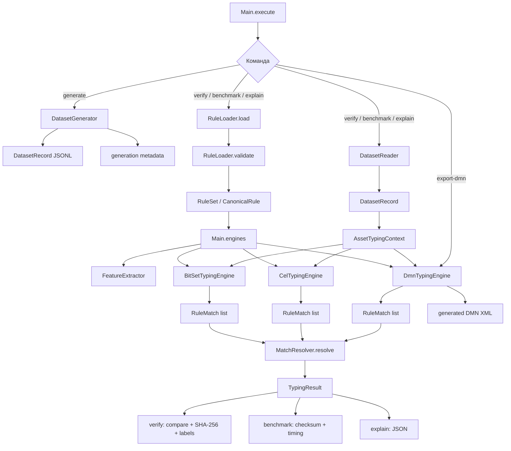
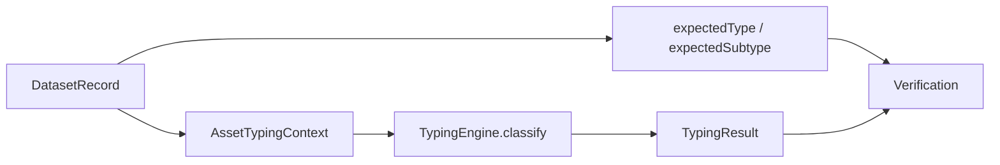
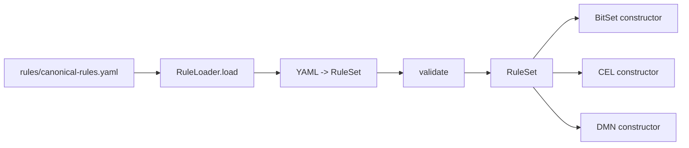
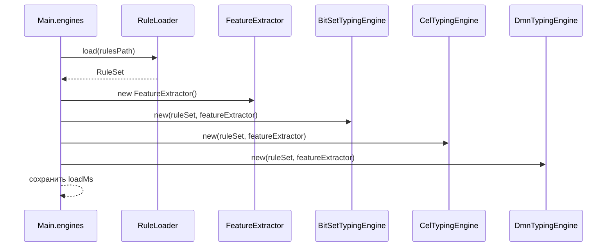
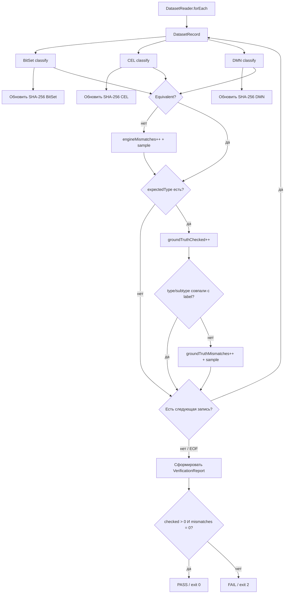

# Подробная программная реализация

[English](IMPLEMENTATION.md) · **Русский**

Эта страница описывает фактический путь выполнения по классам и модулям текущей реализации. Верхнеуровневая архитектура находится в [ARCHITECTURE_RU.md](ARCHITECTURE_RU.md), а внутреннее устройство трёх движков — в [ENGINE_IMPLEMENTATION_RU.md](ENGINE_IMPLEMENTATION_RU.md).

Для двух наиболее ветвящихся потоков — `verify` и `benchmark` — рядом с Mermaid сохранены статические SVG и редактируемые draw.io-файлы. SVG предназначены в том числе для клиентов GitHub, где Mermaid может не отображаться.

- `verify`: [SVG](diagrams/verify-flow.svg) · [draw.io](diagrams/verify-flow.drawio)
- `benchmark`: [SVG](diagrams/benchmark-flow.svg) · [draw.io](diagrams/benchmark-flow.drawio)

## Карта пакетов

```text
src/main/java/ru/itam/typing/
├── cli/
│   └── Main.java
├── data/
│   ├── DatasetGenerator.java
│   └── DatasetReader.java
├── engine/
│   ├── TypingEngine.java
│   ├── bitset/BitSetTypingEngine.java
│   ├── cel/CelRuleExpression.java
│   ├── cel/CelTypingEngine.java
│   ├── common/MatchResolver.java
│   ├── dmn/DmnModelGenerator.java
│   └── dmn/DmnTypingEngine.java
├── features/
│   └── FeatureExtractor.java
├── model/
│   ├── AssetType.java
│   ├── AssetSubtype.java
│   ├── AssetTypingContext.java
│   ├── DatasetRecord.java
│   ├── RuleMatch.java
│   ├── TypingResult.java
│   └── TypingStatus.java
└── rules/
    ├── CanonicalRule.java
    ├── RuleLoader.java
    └── RuleSet.java
```

## Полный runtime-поток



`Main` — orchestration layer: разбирает CLI-аргументы, загружает правила, создаёт один `FeatureExtractor` и три движка, читает dataset и формирует отчёты. `TypingEngine` задаёт общий контракт `name()` + `classify(AssetTypingContext)`.

## Модель входа и результата

`DatasetRecord` состоит из `AssetTypingContext` и ожидаемых `expectedType` / `expectedSubtype`. Контекст содержит `assetId`, `sources`, `sourceObjectKinds`, `attributes`, `systemParameters`. `TypingResult` содержит `assetId`, итоговые `type`, `subtype`, `status` и `matchedRuleIds`.



## Загрузка и валидация правил

Единственный источник правил — `rules/canonical-rules.yaml`. `RuleLoader` десериализует YAML в `RuleSet` и валидирует его до создания движков. Проверяются `rulesetVersion`, непустой и уникальный `ruleId`, наличие `targetType` и отсутствие признака одновременно в `required` и `forbidden`.



## Извлечение признаков

Каждый `classify` вызывает общий `FeatureExtractor`. Он строит одну и ту же карту из 22 булевых признаков по `sources`, `sourceObjectKinds` и атрибутам контекста. Все три движка получают одинаковую семантическую карту и отличаются только способом исполнения правил.

## Создание движков

`Main.engines()` загружает `RuleSet`, создаёт один `FeatureExtractor`, затем последовательно конструирует `BitSetTypingEngine`, `CelTypingEngine`, `DmnTypingEngine`. Время загрузки правил и каждого конструктора фиксируется в `engineLoadMs`; оно не входит в per-engine classification timing.



## Команда `generate`

`Main.generate()` вызывает `DatasetGenerator.generate(count, seed, out)`, записывает JSONL и sidecar `<dataset>.meta.json`.

## Команда `verify`

Verification создаёт три движка один раз и потоково читает dataset через `DatasetReader.forEach`.

Для каждой записи выполняются все три классификации, обновляются три SHA-256 digest, затем проверяется эквивалентность результатов. Если результаты различаются, увеличивается `engineMismatches` и сохраняется diagnostic sample. Независимо от исхода differential check поток продолжается к label-check. При наличии `expectedType` увеличивается `groundTruthChecked`, затем BitSet type/subtype сравниваются с generator label; несовпадение увеличивает `groundTruthMismatches`. После обработки записи чтение продолжается до EOF. Только после EOF строится `VerificationReport` и вычисляется PASS/FAIL.


[Открыть SVG отдельно](diagrams/verify-flow.svg) · [Редактируемый draw.io](diagrams/verify-flow.drawio)

<details>
<summary>Mermaid-источник verify</summary>



</details>

`PASS` выдаётся только если dataset не пустой, `engineMismatches == 0` и `groundTruthMismatches == 0`. При `FAIL` команда возвращает exit code `2`. Label-check выполняется непосредственно по BitSet; CEL и DMN покрываются differential comparison.

## Команда `benchmark`

Benchmark создаёт движки один раз. `DatasetReader.first` читает warmup-prefix `min(max, batch, 5000)`, после чего выполняются warmup iterations вне measured results.

Каждый measured run заново потоково читает dataset. `BatchAccumulator.accept` прекращает добавление новых записей после `max`, иначе увеличивает `seen`, добавляет запись в batch и вызывает `flush`, когда batch достиг `batchSize`. Если EOF наступил на неполном batch, `Main.benchmark()` вызывает финальный `acc.flush()`, поэтому хвост данных не теряется.

Критически важно: внутри `flush()` движки выполняются **не параллельно**, а строго последовательно в фиксированном порядке `HASHMAP_BITSET → CEL → DMN_KIE`. Для каждого движка отдельно стартует таймер, классифицируется весь уже распарсенный batch, считается `resultHash`/XOR checksum и накопительные `elapsedNs`, `count`, `checksum`. Только после завершения всего measured run из накопленных `MutableTiming` создаются три `RunResult`. После всех measured runs вычисляются median/min/max и формируется `BenchmarkReport`.


[Открыть SVG отдельно](diagrams/benchmark-flow.svg) · [Редактируемый draw.io](diagrams/benchmark-flow.drawio)

<details>
<summary>Mermaid-источник benchmark</summary>

```mermaid
flowchart TD
    S[benchmark] --> W[DatasetReader.first min(max,batch,5000)]
    W --> WI[Warmup × warmupIterations]
    WI --> RUN[Начать measured run]
    RUN --> F[DatasetReader.forEach]
    F --> A[BatchAccumulator.accept]
    A --> MAX{seen >= max?}
    MAX -->|да| MORE{Есть следующая запись?}
    MAX -->|нет| ADD[seen++ и добавить record в batch]
    ADD --> Q{batch.size >= batchSize?}
    Q -->|нет| MORE
    Q -->|да| B[таймер HASHMAP_BITSET]
    B --> BT[накопить timing]
    BT --> C[таймер CEL]
    C --> CT[накопить timing]
    CT --> D[таймер DMN_KIE]
    D --> DT[накопить timing и очистить batch]
    DT --> MORE
    MORE -->|да| A
    MORE -->|нет / EOF| E{batch пуст?}
    E -->|нет| B
    E -->|да| RR[Создать 3 RunResult из MutableTiming]
    RR --> NR{Остались measured runs?}
    NR -->|да| RUN
    NR -->|нет| SUM[median / min / max]
    SUM --> REP[BenchmarkReport]
```

</details>

В timed section входит `engine.classify(record.context())`, `resultHash()` и XOR checksum. JSONL parsing находится за пределами per-engine timer. `RunResult` создаётся после полного прохода run, а не после каждого `flush()`.

## Команды `explain` и `export-dmn`

`explain` ищет asset по `assetId`, выводит 22 features и результаты всех трёх движков. `export-dmn` создаёт тот же `DmnTypingEngine`, который используется в benchmark/verify, и записывает его `generatedDmn()`.

## Ответственность классов

| Класс | Ответственность |
|:--|:--|
| `Main` | CLI orchestration, engine lifecycle, verify, benchmark, provenance, reports |
| `DatasetGenerator` | детерминированная генерация synthetic dataset |
| `DatasetReader` | потоковое чтение JSONL и warmup-prefix |
| `AssetTypingContext` | нормализованный вход классификации |
| `DatasetRecord` | контекст + expected labels |
| `FeatureExtractor` | контекст → 22 boolean features |
| `RuleLoader` | загрузка и базовая валидация YAML ruleset |
| `RuleSet` / `CanonicalRule` | canonical in-memory rule model |
| `TypingEngine` | общий интерфейс движков |
| `BitSetTypingEngine` | masks + candidate index + BitSet evaluation |
| `CelRuleExpression` | canonical rule → CEL expression |
| `CelTypingEngine` | compile/cache CEL programs + candidate evaluation |
| `DmnModelGenerator` | canonical rules → DMN XML decision table |
| `DmnTypingEngine` | загрузка/исполнение DMN через Apache KIE |
| `RuleMatch` | промежуточное совпадение правила |
| `MatchResolver` | единая priority/conflict resolution semantics |
| `TypingResult` | итог классификации |

## Что не входит в эту реализацию

Текущий benchmark не содержит live connectors к AD/Nmap/KSC/Zabbix/SIEM, persistence layer, ITAM API, очередей, фонового сервиса, дедупликации активов или многопоточного production serving. Benchmark работает по нормализованному synthetic JSONL.

Подробности внутреннего устройства **HashMap + BitSet, CEL и DMN/KIE** см. в [ENGINE_IMPLEMENTATION_RU.md](ENGINE_IMPLEMENTATION_RU.md).