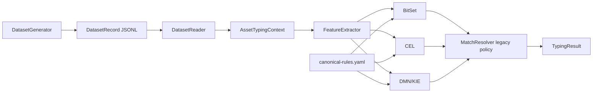
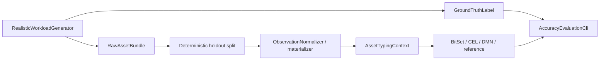

# Подробная программная реализация

[English](IMPLEMENTATION.md) · **Русский**

Эта страница описывает текущий код после завершения `research/realistic-workload-v2`. Стабильный baseline CLI сохранён и обратно совместим; research track добавляет source-shaped workload, независимый ground truth, дополнительные ruleset, консервативный resolver и проверку Software Taxonomy v3.

Верхнеуровневая схема находится в [ARCHITECTURE_RU.md](ARCHITECTURE_RU.md), внутреннее устройство движков — в [ENGINE_IMPLEMENTATION_RU.md](ENGINE_IMPLEMENTATION_RU.md).

## Карта пакетов

```text
src/main/java/ru/itam/typing/
├── cli/
│   └── Main.java
├── data/
│   ├── DatasetGenerator.java
│   └── DatasetReader.java
├── engine/
│   ├── TypingEngine.java
│   ├── FeatureMapTypingEngine.java
│   ├── bitset/BitSetTypingEngine.java
│   ├── cel/CelTypingEngine.java
│   ├── dmn/DmnTypingEngine.java
│   ├── common/MatchResolver.java
│   ├── common/ResolutionPolicy.java
│   └── reference/ReferenceTypingEngine.java
├── features/
│   ├── FeatureExtractor.java
│   └── SoftwareEvidenceClassifier.java
├── model/
│   ├── AssetType.java
│   ├── AssetSubtype.java
│   ├── AssetTypingContext.java
│   ├── DatasetRecord.java
│   ├── RuleMatch.java
│   ├── TypingResult.java
│   └── TypingStatus.java
├── realistic/
│   ├── RealisticWorkloadCli.java
│   ├── RealisticWorkloadGenerator.java
│   ├── RealisticDatasetMaterializer.java
│   ├── ObservationNormalizer.java
│   ├── HoldoutSplitCli.java
│   ├── AccuracyEvaluationCli.java
│   ├── ResearchBenchmarkCli.java
│   ├── RuleSetScaler.java / RuleScaleCli.java
│   ├── SoftwareAmbiguityInjector.java
│   ├── SoftwareTaxonomyV3Generator.java
│   ├── SourceFixtureAdapters.java
│   └── SourceSchemaRegistry.java
└── rules/
    ├── CanonicalRule.java
    ├── RuleLoader.java
    └── RuleSet.java
```

JMH-код находится в `src/jmh/java/ru/itam/typing/bench/`.

## Стабильный baseline path

`ru.itam.typing.cli.Main` сохраняет исходные команды:

- `generate`
- `verify`
- `benchmark`
- `explain`
- `export-dmn`

Baseline path загружает `rules/canonical-rules.yaml`, создаёт общий `FeatureExtractor`, строит BitSet/CEL/DMN с legacy resolver policy по умолчанию и обрабатывает нормализованный JSONL `DatasetRecord`.



Контролируемый baseline v2 сохраняет эту модель исполнения и добавляет более сильный runtime/environment provenance.

## Research workload path

Realistic track специально разделяет наблюдения и эталонные метки.

`RealisticWorkloadGenerator` создаёт source-shaped `RawAssetBundle` и отдельные `GroundTruthLabel`. `HoldoutSplitCli` выполняет детерминированное label-independent разделение 80/20. `RealisticDatasetMaterializer` и `ObservationNormalizer` преобразуют holdout-наблюдения в `AssetTypingContext`.



Генератор не загружает typing rules и не вызывает `FeatureExtractor`; классификатор не загружает размеченный каталог или ground-truth sidecar.

## Входные модели

`AssetTypingContext` остаётся общим входом движков и содержит:

- `assetId`;
- `sources`;
- `sourceObjectKinds`;
- `attributes`;
- `systemParameters`.

Baseline `DatasetRecord` хранит expected labels рядом с context. В research track ожидаемый ответ хранится отдельно как `GroundTruthLabel`.

## Извлечение признаков

`FeatureExtractor` формирует детерминированную boolean feature map, общую для BitSet, CEL и DMN.

Исходная baseline-семантика признаков сохранена для `canonical-rules.yaml`. Текущий extractor дополнительно формирует research-only признаки для `ksc:software_inventory_application`, включая:

- `SOFTWARE_AMBIGUOUS_HINT`;
- `SOFTWARE_CATEGORY_OPERATING_SYSTEM`;
- `SOFTWARE_CATEGORY_OFFICE_SOFTWARE`;
- `SOFTWARE_CATEGORY_BUSINESS_SOFTWARE`;
- `SOFTWARE_CATEGORY_BROWSER`;
- `SOFTWARE_CATEGORY_IDE`;
- `SOFTWARE_CATEGORY_DATABASE_TOOL`;
- `SOFTWARE_CATEGORY_DATABASE_SERVER`;
- `SOFTWARE_CATEGORY_DESIGN_MODELING`;
- `SOFTWARE_CATEGORY_SECURITY_SOFTWARE`;
- `SOFTWARE_CATEGORY_CRYPTO_SOFTWARE`;
- `SOFTWARE_CATEGORY_RUNTIME_PLATFORM`;
- `SOFTWARE_CATEGORY_DEV_TOOL`;
- `SOFTWARE_CATEGORY_UTILITY`;
- `SOFTWARE_CATEGORY_COMMUNICATION`;
- `SOFTWARE_CATEGORY_COMPONENT_AGENT`;
- `SOFTWARE_CATEGORY_APPLICATION_SOFTWARE`.

`SoftwareEvidenceClassifier` определяет одну software-категорию по нормализованным inventory-признакам: названию, семейству, package, пути установки, executable/service и платформе. Если доказательств недостаточно, возвращается `null`, что позволяет ruleset оставить только тип `SOFTWARE`, не выдумывая подтип.

## Загрузка правил

`RuleLoader` загружает YAML в `RuleSet` / `CanonicalRule` и валидирует структуру и rule IDs до создания движков.

Основные ruleset:

- `rules/canonical-rules.yaml` — стабильный baseline;
- сгенерированные scaled rulesets для экспериментов 14/50/100/500 правил;
- `rules/software-taxonomy-v3.yaml` — research taxonomy ПО.

В одном запуске все сравниваемые движки получают один и тот же ruleset.

## Разрешение результата

`MatchResolver` поддерживает явный `ResolutionPolicy`.

Конструкторы по умолчанию используют `LEGACY_MAX_PRIORITY`, сохраняя историческую baseline-семантику. Research runners могут передать `ResolutionPolicy.conservative(window)`; завершённый robustness/calibration track зафиксировал подтверждённое research-значение `80`.

Conservative policy не вводит веса AD/KSC/Nmap или производителей. Она только расширяет набор достаточно сильных противоречащих совпадений, которые учитываются до выдачи уверенного подтипа.

## Verification и acceptance

### Baseline

`verify` сравнивает BitSet/CEL/DMN и проверяет baseline generator labels. PASS требует непустой dataset, ноль engine mismatches и ноль label mismatches.

### Research

`AccuracyEvaluationCli` дополнительно сравнивает результат с отдельным ground truth и независимым `ReferenceTypingEngine`. Research runners проверяют source shape, идентичность deterministic holdout, engine divergences, decision-quality metrics и заранее объявленные gate-критерии.

Большие JSONL и логи остаются ignored. В Git можно сохранять компактные JSON summaries, provenance и SHA-256 manifests.

## Performance paths

В репозитории три уровня измерений:

- baseline application benchmark в `Main`;
- research `END_TO_END` и `ENGINE_ONLY` в `ResearchBenchmarkCli`;
- forked JMH cross-check через Maven profile `-Pjmh`.

Performance-метрики никогда не используются как correctness gate.

## Source-shaped fixtures

`SourceFixtureAdapters` и `SourceSchemaRegistry` проверяют контролируемые формы AD/Nmap/KSC/Zabbix/SIEM. `KscTypedChunkAdapter` обрабатывает особенности typed KSC payload, например числовое представление IPv4.

Эти классы нужны для synthetic/protocol fidelity и не являются live connectors к инфраструктуре заказчика.

## Редактируемые схемы

Исходные baseline verify/benchmark SVG и draw.io сохранены в `docs/diagrams/`. Они документируют стабильный baseline CLI и оставлены для воспроизводимости.

## Вне области проекта

Репозиторий не реализует:

- production ITAM API;
- live source connectors;
- database persistence;
- queues/background scheduling;
- deduplication/entity resolution активов;
- multithreaded production serving;
- заявления о production accuracy.

Итоговые research-результаты и ограничения приведены в [RESEARCH_SUMMARY_RU.md](RESEARCH_SUMMARY_RU.md).