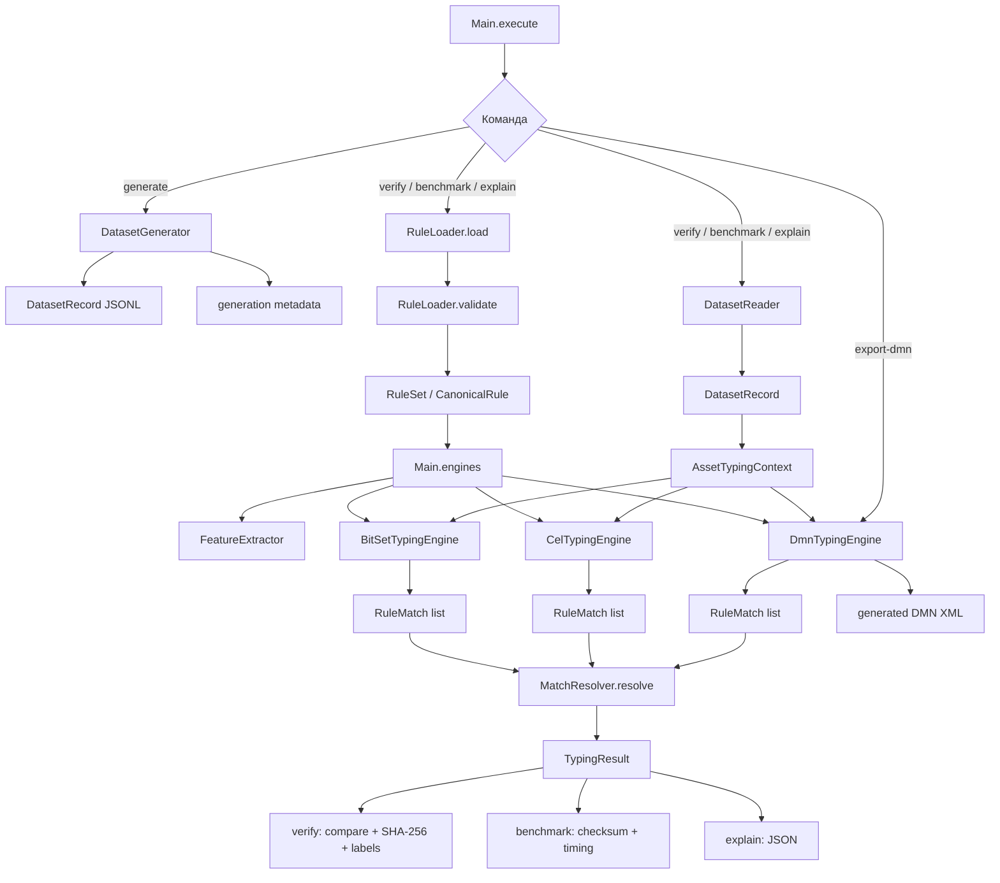
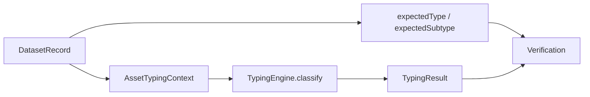
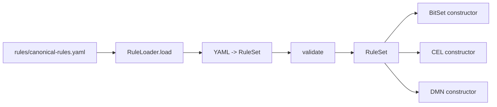
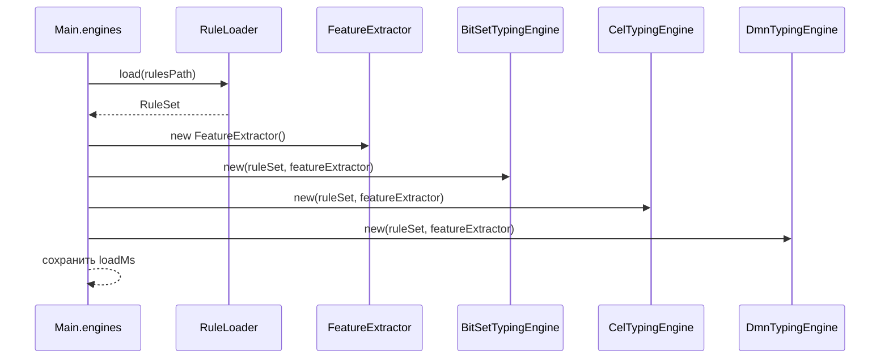
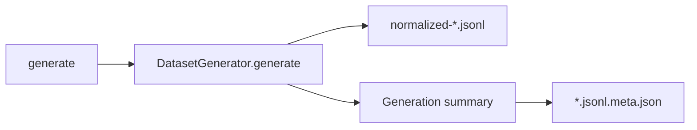
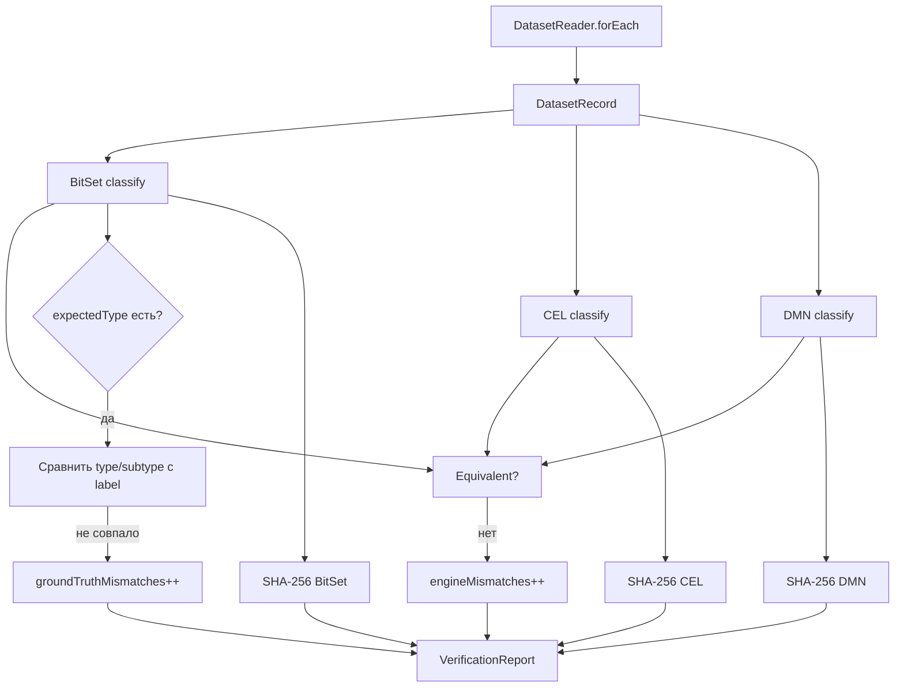
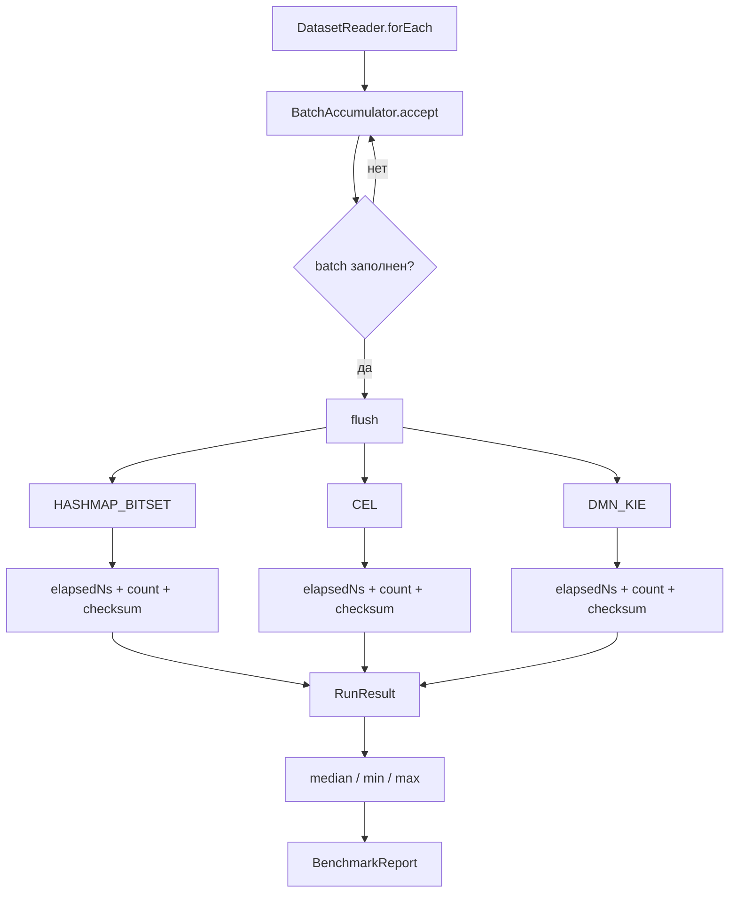

# Подробная программная реализация

[English](IMPLEMENTATION.md) · **Русский**

Эта страница описывает не общую идею эксперимента, а фактический путь выполнения по классам и модулям текущей реализации. Верхнеуровневая архитектура находится в [ARCHITECTURE_RU.md](ARCHITECTURE_RU.md), а внутреннее устройство трёх движков вынесено отдельно в [ENGINE_IMPLEMENTATION_RU.md](ENGINE_IMPLEMENTATION_RU.md).

## Карта пакетов

```text
src/main/java/ru/itam/typing/
├── cli/
│   └── Main.java
├── data/
│   ├── DatasetGenerator.java
│   └── DatasetReader.java
├── engine/
│   ├── TypingEngine.java
│   ├── bitset/BitSetTypingEngine.java
│   ├── cel/CelRuleExpression.java
│   ├── cel/CelTypingEngine.java
│   ├── common/MatchResolver.java
│   ├── dmn/DmnModelGenerator.java
│   └── dmn/DmnTypingEngine.java
├── features/
│   └── FeatureExtractor.java
├── model/
│   ├── AssetType.java
│   ├── AssetSubtype.java
│   ├── AssetTypingContext.java
│   ├── DatasetRecord.java
│   ├── RuleMatch.java
│   ├── TypingResult.java
│   └── TypingStatus.java
└── rules/
    ├── CanonicalRule.java
    ├── RuleLoader.java
    └── RuleSet.java
```

## Полный runtime-поток



`Main` является orchestration layer: разбирает CLI-аргументы, загружает правила, создаёт один `FeatureExtractor` и три движка, читает dataset и формирует отчёты. Интерфейс `TypingEngine` задаёт единый контракт `name()` + `classify(AssetTypingContext)` для всех реализаций.

## Модель входа и результата

`DatasetRecord` состоит из `AssetTypingContext` и ожидаемых `expectedType` / `expectedSubtype`. Контекст содержит:

- `assetId`;
- `sources`;
- `sourceObjectKinds`;
- `attributes`;
- `systemParameters`.

Результат `TypingResult` содержит `assetId`, итоговый `type`, `subtype`, `status` и список `matchedRuleIds`.



## Загрузка и валидация правил

Единственный источник правил — `rules/canonical-rules.yaml`. `RuleLoader` десериализует YAML в `RuleSet`, после чего выполняет валидацию до создания движков.

Проверяется:

- наличие `rulesetVersion`;
- непустой `ruleId`;
- уникальность `ruleId`;
- наличие `targetType`;
- отсутствие признака одновременно в `required` и `forbidden`.

`CanonicalRule` хранит `ruleId`, target type/subtype, `priority`, `required`, `any`, `forbidden` и `enabled`. Null-списки признаков нормализуются в пустые неизменяемые списки.



## Извлечение признаков

Каждый вызов `classify` сам вызывает общий `FeatureExtractor`. Он всегда создаёт карту из 22 известных булевых признаков и выставляет их на основании `sources`, `sourceObjectKinds` и атрибутов контекста.

Примеры фактических преобразований:

- source `ad` → `SRC_AD`;
- `ad:user` → `OBJ_AD_USER`;
- `ad:computer` → `OBJ_AD_COMPUTER`;
- признаки имени/описания service account → `ACCOUNT_SERVICE_HINT`;
- строки ОС → `OS_WINDOWS`, `OS_LINUX`, `OS_SERVER`;
- `ksc.KLHST_WKS_CTYPE` → `KSC_WORKSTATION` / `KSC_SERVER`;
- `nmap.deviceType` → `NMAP_NETWORK_DEVICE` / `NMAP_GENERAL_PURPOSE`;
- признаки security software по display name / publisher → `SECURITY_SOFTWARE_HINT`.

Таким образом, все три движка получают одинаковую семантическую карту признаков. Они отличаются только способом дальнейшего исполнения правил.

## Создание движков

`Main.engines()` выполняет следующую последовательность:



Время загрузки canonical rules и конструкторов каждого движка фиксируется отдельно в `engineLoadMs`. Оно не входит в per-engine classification timing benchmark.

## Команда `generate`

`Main.generate()` вызывает `DatasetGenerator.generate(count, seed, out)`. Генератор записывает JSONL и отдельный sidecar `<dataset>.meta.json` с параметрами генерации.



## Команда `verify`

Verification создаёт все три движка один раз и потоково читает dataset через `DatasetReader.forEach`.

Для каждой записи:

1. выполняются `bitset.classify`, `cel.classify`, `dmn.classify`;
2. сравниваются `type`, `subtype`, `status` и отсортированное множество `matchedRuleIds`;
3. отдельно обновляется SHA-256 digest результата каждого движка;
4. если есть generator label, результат BitSet сравнивается с `expectedType` / `expectedSubtype`;
5. сохраняется до 20 диагностических samples при расхождениях.



`PASS` выдаётся только если dataset не пустой, `engineMismatches == 0` и `groundTruthMismatches == 0`. При `FAIL` команда возвращает exit code `2`.

Важно: label-check непосредственно выполняется по результату BitSet; CEL и DMN проверяются отдельным differential comparison. При PASS это означает, что все три движка совпали между собой, а BitSet совпал с generator labels.

## Команда `benchmark`

Benchmark также создаёт движки один раз. Затем `DatasetReader.first` читает warmup-prefix размером `min(max, batch, 5000)`. Warmup выполняет все три движка, но его время не попадает в measured runs.

Measured run работает через `BatchAccumulator`:



Внутри `flush()` таймер каждого движка охватывает цикл по уже распарсенному batch и включает `engine.classify(record.context())` плюс `resultHash()` и XOR checksum. Парсинг JSONL происходит до этого таймера. Движки исполняются в фиксированном порядке `HASHMAP_BITSET → CEL → DMN_KIE`.

Для каждого measured run сохраняются `count`, `elapsedNs`, `assetsPerSecond`, `nsPerAsset` и checksum. Summary вычисляет медиану throughput и ns/asset, а также min/max throughput.

## Команды `explain` и `export-dmn`

`explain` ищет asset по `assetId`, отдельно выводит его 22 features и результаты всех трёх движков. Это диагностический путь, а не отдельная классификационная реализация.

`export-dmn` создаёт тот же `DmnTypingEngine`, который используется в benchmark/verify, и записывает его `generatedDmn()` в файл. Поэтому экспортируемая таблица соответствует реально загружаемой KIE-модели для того же ruleset.

## Ответственность классов

| Класс | Ответственность |
|:--|:--|
| `Main` | CLI orchestration, engine lifecycle, verify, benchmark, provenance, reports |
| `DatasetGenerator` | детерминированная генерация synthetic dataset |
| `DatasetReader` | потоковое чтение JSONL и чтение warmup-prefix |
| `AssetTypingContext` | нормализованный вход классификации |
| `DatasetRecord` | контекст + expected labels |
| `FeatureExtractor` | преобразование контекста в 22 boolean features |
| `RuleLoader` | загрузка и базовая валидация YAML ruleset |
| `RuleSet` / `CanonicalRule` | canonical in-memory rule model |
| `TypingEngine` | общий интерфейс движков |
| `BitSetTypingEngine` | masks + candidate index + BitSet evaluation |
| `CelRuleExpression` | генерация CEL expression из canonical rule |
| `CelTypingEngine` | compile/cache CEL programs + candidate evaluation |
| `DmnModelGenerator` | генерация DMN XML decision table |
| `DmnTypingEngine` | загрузка/исполнение DMN через Apache KIE |
| `RuleMatch` | промежуточное совпадение правила |
| `MatchResolver` | единая priority/conflict resolution semantics |
| `TypingResult` | итог классификации |

## Что не входит в эту реализацию

Текущий benchmark не содержит live connectors к AD/Nmap/KSC/Zabbix/SIEM, persistence layer, ITAM API, очередей, фонового сервиса, дедупликации активов или многопоточного production serving. Raw source samples используются как иллюстрации форматов, а benchmark работает по нормализованному synthetic JSONL.

Подробности именно по внутреннему устройству **HashMap + BitSet, CEL и DMN/KIE** см. в [ENGINE_IMPLEMENTATION_RU.md](ENGINE_IMPLEMENTATION_RU.md).